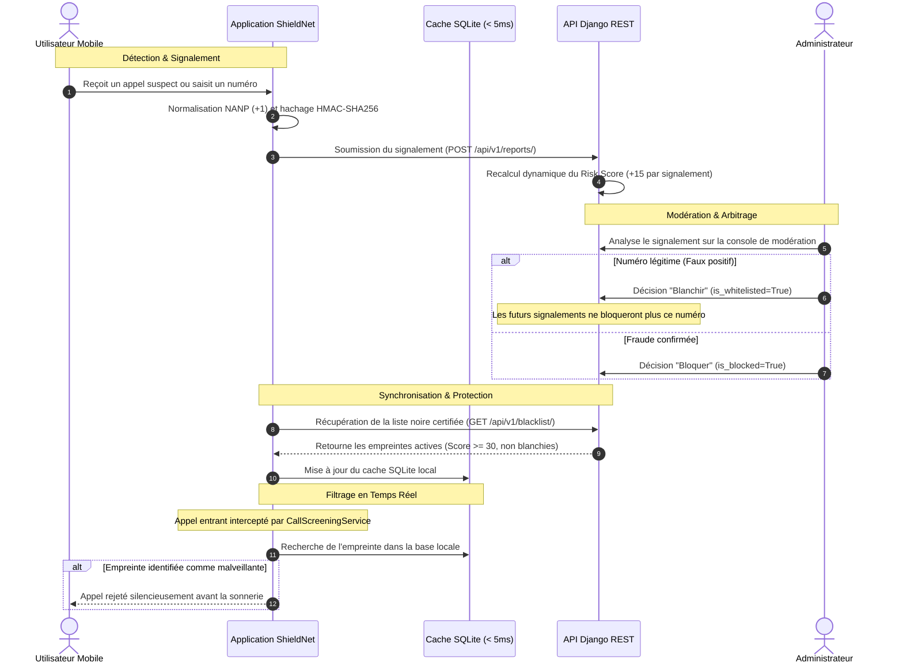

# ShieldNet — Solution Collaborative Anti-Spam (Appels & SMS)

> **Projet de Synthèse en Informatique** — Université du Québec en Outaouais (UQO)  
> *Architecture sécurisée et décentralisée de filtrage des télécommunications pour la zone Amérique du Nord (NANP +1).*

---

## 1. Présentation du Projet

**ShieldNet** est une solution logicielle complète (client mobile natif et API d'arrière-plan sécurisée) conçue pour intercepter, filtrer et neutraliser les appels indésirables, les fraudes téléphoniques, le démarchage agressif et les campagnes de phishing par SMS.

Le système cible spécifiquement la zone nord-américaine (indicatif international `+1` pour le Canada et les États-Unis) selon les normes du Plan de numérotation nord-américain (**NANP**).

### Piliers Technologiques

* **Client Mobile Multiplateforme (Flutter & Dart)** : Interface réactive, gestion d'état déclarative avec Riverpod, et cache persistant SQLite garantissant une interception locale instantanée (< 5 ms), y compris en mode hors-ligne.
* **Interception Native Android (Kotlin)** : Connexion directe avec le sous-système Télécom Android via `CallScreeningService`, permettant le rejet silencieux des appels frauduleux en amont de la première sonnerie.
* **Moteur d'Agrégation et de Modération (Python / Django REST Framework)** : Algorithme de calcul dynamique de réputation (score de risque de 0 à 100) et console d'administration dédiée à la gouvernance humaine des faux positifs.
* **Confidentialité Dès la Conception (Conformité LPRPDE / RGPD)** : Aucun numéro de téléphone en clair n'est transmis sur le réseau ni indexé en base de données. Les numéros sont anonymisés à la source via un hachage cryptographique **HMAC-SHA256** combiné à un sel secret partagé.

---

## 2. Architecture Globale du Dépôt

Le projet s'organise en deux sous-systèmes complémentaires :

```text
Projet synthese/
├── .github/
│   └── workflows/
│       └── ci.yml                    # Pipeline d'intégration continue (Tests Django & Flutter)
├── README.md                         # Documentation technique de référence
├── docker-compose.yml                # Orchestration des conteneurs (Django, PostgreSQL 16, Redis 7)
├── test-all.ps1                      # Script unifié d'assurance qualité (Backend + Mobile)
├── start-dev.ps1                     # Script d'amorçage de l'environnement de développement
│
├── ShieldNet/                        # Client Mobile (Flutter / Dart / Kotlin)
│   ├── .env                          # Configuration d'environnement (URLs, clés API, sels)
│   ├── pubspec.yaml                  # Dépendances (Riverpod, Dio, Sqflite, Google Fonts)
│   ├── android/                      # Module natif Android (CallScreeningService, pont SQLite)
│   ├── lib/
│   │   ├── core/                     # Socle technique (SQLite, HMAC-SHA256, Dio, Thème, Providers)
│   │   ├── features/                 # Clean Architecture par domaine métier :
│   │   │   ├── call_filtering/       # Protection, activité récente et signalement
│   │   │   ├── settings/             # Préférences, diagnostic technique et console admin
│   │   │   └── onboarding/           # Parcours d'accueil et permissions initiales
│   │   ├── l10n/                     # Internationalisation bilingue (Français / Anglais)
│   │   └── main.dart                 # Point d'entrée, cycle de vie et synchronisation
│   └── test/                         # Suite de tests unitaires (NANP, HMAC, linter)
│
└── shieldnet_backend/                # Serveur d'API & Gouvernance (Python / Django REST)
    ├── Dockerfile                    # Image de production conteneurisée (Python 3.12 slim)
    ├── manage.py                     # Utilitaire d'administration Django
    ├── requirements.txt              # Dépendances (Django 5, DRF, SimpleJWT, psycopg2)
    ├── shieldnet_backend/            # Paramètres globaux (settings.py, urls.py, wsgi.py)
    └── shield_api/                   # Modèles de données, logique de score, API REST et tests
```

---

## 3. Cycle de Vie et Logique Métier



---

## 4. Sécurité des Données et Confidentialité

| Mécanisme | Description | Implémentation |
| :--- | :--- | :--- |
| **Normalisation E.164** | Nettoyage des caractères et conversion systématique au format international standardisé (`+1XXXXXXXXXX`). | `crypto_utils.dart` |
| **Hachage HMAC-SHA256** | Transformation irréversible du numéro à l'aide d'un sel cryptographique. Empreintes 100% cohérentes entre Flutter et Kotlin. | `crypto_utils.dart`<br>`ShieldNetCallScreeningService.kt` |
| **Masquage d'Affichage** | Masquage des chiffres intermédiaires dans l'interface et la console (ex: `+1 819 *** **99`) pour éviter toute divulgation. | `database_helper.dart`<br>`models.py` |
| **Contrôle d'Accès API** | En-tête obligatoire `X-API-Key` sur l'ensemble des endpoints mobiles pour restreindre l'usage non autorisé de l'API. | `permissions.py`<br>`api_service.dart` |
| **Protection Anti-Abus** | Limitation de débit (Throttling) et refus des signalements redondants issus d'une même adresse IP. | `views.py` |

---

## 5. Guide d'Installation et de Démarrage

### Prérequis Système
* **Python** : `>= 3.10` (recommandé 3.12)
* **Flutter SDK** : `>= 3.27.x`
* **Android Studio / SDK Android** : API 29+ (Android 10+) requis pour le service natif `CallScreeningService`.

---

### Démarrage de l'API Backend (Django)

Dans le répertoire `shieldnet_backend/` :

```bash
# 1. Création et activation de l'environnement virtuel
python -m venv venv

# Windows :
venv\Scripts\activate
# Linux/macOS :
source venv/bin/activate

# 2. Installation des dépendances
pip install -r requirements.txt

# 3. Application des migrations de schéma
python manage.py migrate

# 4. Exécution de la suite de tests automatisée
python manage.py test shield_api

# 5. Création / initialisation du compte administrateur dédié
python manage.py ensure_admin

# 6. Démarrage du serveur local
python manage.py runserver 0.0.0.0:8000
```

> [!NOTE]
> **Identifiants d'administration unifiés (Web & Mobile) :**
> * **Courriel Administrateur Dédié** : `admin@shieldnet.app` (ou identifiant `admin`)
> * **Mot de passe par défaut** : `admin123` (paramétrable via `ADMIN_PASSWORD` dans `.env`)
> * **Console Web Django Admin** : [http://127.0.0.1:8000/admin/](http://127.0.0.1:8000/admin/)
> * **Documentation OpenAPI / Swagger** : [http://127.0.0.1:8000/api/v1/docs/](http://127.0.0.1:8000/api/v1/docs/)

#### Déploiement Alternatif : Conteneurisation (Docker Compose)
Pour instancier l'infrastructure complète (API Django, base PostgreSQL 16 et cache Redis 7) :
```bash
docker compose up -d --build
```

---

### Démarrage du Client Mobile (Flutter)

Dans le répertoire `ShieldNet/` :

```bash
# 1. Résolution des dépendances
flutter pub get

# 2. Vérification de conformité et tests unitaires
flutter test

# 3. Exécution sur émulateur ou appareil cible
flutter run
```

---

## 6. Matrice des Rôles : Utilisateur vs. Administrateur

| Domaine | Utilisateur Grand Public | Administrateur Système |
| :--- | :--- | :--- |
| **Objectif Principal** | Protection silencieuse et consultation simplifiée de l'état du bouclier. | Supervision, analyse de risque, gouvernance de la liste noire et audit. |
| **Fonctionnalités Clés** | • Activation / désactivation en 1 geste.<br>• Vérification rapide de réputation d'un numéro.<br>• Historique des appels récents avec signalement direct.<br>• Personnalisation des préférences (thème, langue). | • Console dédiée paritaire Web / Mobile (4 onglets).<br>• Gestion CRUD de la liste noire (ajout, suppression, forçage).<br>• Traitement des signalements avec décision de blanchiment.<br>• Outils de diagnostic système (pont natif, checkpoint WAL). |
| **Surface d'Accès** | Interface allégée sans jargon technique. | Accès restreint via jeton JWT (`is_staff=True`). |

---

## 7. Assurance Qualité et Tests Automatisés

Le projet applique une couverture de tests automatisée sur les deux couches :

### Tests Backend Django (`python manage.py test shield_api`) — 12/12 Succès
* `test_process_new_report_creation` : Initialisation du score de risque lors d'un premier signalement.
* `test_repetition_increases_risk_score` : Augmentation dynamique et plafonnement du score lors de signalements récurrents.
* `test_whitelisted_number_stays_unblocked` : Garantie d'intégrité pour les numéros légitimes blanchis.
* `test_reject_request_without_api_key` : Rejet strict des requêtes non autorisées (contrôle d'en-tête `X-API-Key`).
* `test_submit_report_api` : Validation de bout en bout de l'endpoint de signalement.
* `test_check_number_api_spam` : Vérification instantanée de statut par empreinte HMAC.
* `test_blacklist_download_api` : Téléchargement incrémental et filtrage de la liste certifiée.
* `test_user_registration_and_email_login` : Gestion de compte, login par courriel et émission de jetons JWT.
* `test_admin_stats_and_moderation` : Vérification des métriques de supervision et des droits RBAC.
* `test_dedicated_admin_email_login_web_and_mobile` : Validation de l'authentification unifiée de l'administrateur.
* `test_admin_full_mobile_management_endpoints` : Couverture complète des endpoints de gestion mobile.
* `test_database_purge` : Nettoyage et maintenance programmée des entrées obsolètes.

### Tests Frontend Flutter (`flutter test`) — 10/10 Succès (0 avertissement linter)
* `widget_test.dart` : Validation de l'anonymisation SHA-256, reconnaissance du format NANP (+1) et détection des numéros usurpés.
* `crypto_utils_test.dart` : Normalisation E.164, déterminisme HMAC et algorithme de masquage.
* `automated_spam_verifier_test.dart` : Préservation des numéros réguliers, détection des indicatifs surtaxés (1-900) et gestion des codes courts SMS 2FA.

### Intégration Continue (CI/CD GitHub Actions)
Le workflow automatisé défini dans `.github/workflows/ci.yml` valide chaque commit et pull request :
1. **Pipeline Backend** : Initialisation Python 3.12, contrôle de dérive des migrations (`makemigrations --check`), exécution de la suite de tests unitaires.
2. **Pipeline Mobile** : Environnement Java 17 + Flutter stable, analyse statique rigoureuse (`flutter analyze`), exécution des tests avec rapport de couverture.

---

## 8. Mentions Académiques

* **Projet** : Projet de Synthèse de Fin d'Études en Informatique
* **Institution** : Université du Québec en Outaouais (UQO)
* **Département** : Département d'informatique et d'ingénierie
* **Année Universitaire** : 2026
