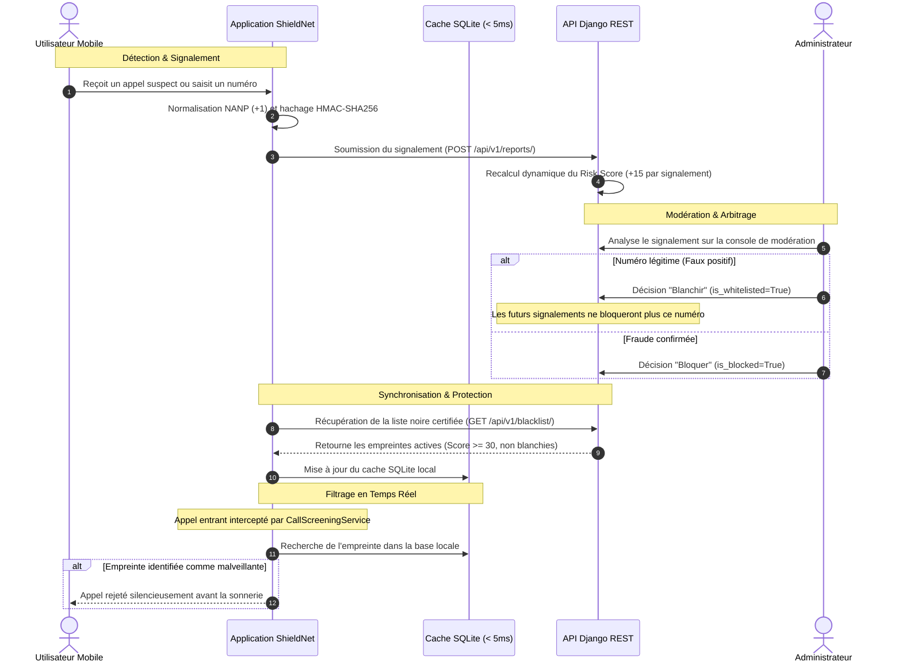

# ShieldNet — Solution Collaborative Anti-Spam (Appels & SMS)

> **Projet de Synthèse en Informatique** — Université du Québec en Outaouais (UQO)  
> *Architecture sécurisée et décentralisée de filtrage des télécommunications pour la zone Amérique du Nord (NANP +1).*

---

## 1. Présentation du Projet

**ShieldNet** est une solution logicielle complète (client mobile natif et API d'arrière-plan sécurisée) conçue pour intercepter, filtrer et neutraliser les appels indésirables, les fraudes téléphoniques, le démarchage agressif et les campagnes de phishing par SMS.

Le système cible spécifiquement la zone nord-américaine (indicatif international `+1` pour le Canada et les États-Unis) selon les normes du Plan de numérotation nord-américain (**NANP**).

### Piliers Technologiques

* **Client Mobile Multiplateforme (Flutter & Dart)** : Interface réactive, gestion d'état déclarative avec Riverpod, et cache persistant SQLite garantissant une interception locale instantanée (< 5 ms), y compris en mode hors-ligne.
* **Interception Native Android (Kotlin)** : Connexion directe avec le sous-système Télécom Android via `CallScreeningService`, permettant le rejet silencieux des appels frauduleux en amont de la première sonnerie.
* **Moteur d'Agrégation et de Modération (Python / Django REST Framework)** : Algorithme de calcul dynamique de réputation (score de risque de 0 à 100) et console d'administration dédiée à la gouvernance humaine des faux positifs.
* **Confidentialité Dès la Conception (Conformité LPRPDE / RGPD)** : Aucun numéro de téléphone en clair n'est transmis sur le réseau ni indexé en base de données. Les numéros sont anonymisés à la source via un hachage cryptographique **HMAC-SHA256** combiné à un sel secret partagé.

---

## 2. Architecture Globale du Dépôt

Le projet s'organise en deux sous-systèmes complémentaires :

```text
Projet synthese/
├── .github/
│   └── workflows/
│       └── ci.yml                    # Pipeline d'intégration continue (Tests Django & Flutter)
├── README.md                         # Documentation technique de référence
├── docker-compose.yml                # Orchestration des conteneurs (Django, PostgreSQL 16, Redis 7)
├── test-all.ps1                      # Script unifié d'assurance qualité (Backend + Mobile)
├── start-dev.ps1                     # Script d'amorçage de l'environnement de développement
│
├── ShieldNet/                        # Client Mobile (Flutter / Dart / Kotlin)
│   ├── .env                          # Configuration d'environnement (URLs, clés API, sels)
│   ├── pubspec.yaml                  # Dépendances (Riverpod, Dio, Sqflite, Google Fonts)
│   ├── android/                      # Module natif Android (CallScreeningService, pont SQLite)
│   ├── lib/
│   │   ├── core/                     # Socle technique (SQLite, HMAC-SHA256, Dio, Thème, Providers)
│   │   ├── features/                 # Clean Architecture par domaine métier :
│   │   │   ├── call_filtering/       # Protection, activité récente et signalement
│   │   │   ├── settings/             # Préférences, diagnostic technique et console admin
│   │   │   └── onboarding/           # Parcours d'accueil et permissions initiales
│   │   ├── l10n/                     # Internationalisation bilingue (Français / Anglais)
│   │   └── main.dart                 # Point d'entrée, cycle de vie et synchronisation
│   └── test/                         # Suite de tests unitaires (NANP, HMAC, linter)
│
└── shieldnet_backend/                # Serveur d'API & Gouvernance (Python / Django REST)
    ├── Dockerfile                    # Image de production conteneurisée (Python 3.12 slim)
    ├── manage.py                     # Utilitaire d'administration Django
    ├── requirements.txt              # Dépendances (Django 5, DRF, SimpleJWT, psycopg2)
    ├── shieldnet_backend/            # Paramètres globaux (settings.py, urls.py, wsgi.py)
    └── shield_api/                   # Modèles de données, logique de score, API REST et tests
```

---

## 3. Cycle de Vie et Logique Métier



---

## 4. Sécurité Cryptographique, Modèle de Menace & Confidentialité

ShieldNet intègre les principes de la **Confidentialité Dès la Conception (*Privacy by Design*)** en conformité avec la **Loi 25 du Québec** et la **LPRPDE** fédérale canadienne : aucun carnet de contacts n'est collecté et aucun numéro en clair n'est transmis ou persisté côté serveur.

### 4.1. Matrice des Mécanismes de Protection

| Mécanisme | Rôle & Description | Implémentation |
| :--- | :--- | :--- |
| **Normalisation E.164** | Formatage déterministe (`+1XXXXXXXXXX`) éliminant les variations de saisie avant tout hachage. | `crypto_utils.dart` |
| **Hachage HMAC-SHA256** | Pseudonymisation irréversible avec sel secret. Empreintes 100% cohérentes entre Flutter et Kotlin. | `crypto_utils.dart`<br>`ShieldNetCallScreeningService.kt` |
| **Masquage d'Affichage** | Obfuscation des chiffres médians dans les interfaces (`+1 819 *** **99`) contre l'ingénierie sociale. | `database_helper.dart`<br>`models.py` |
| **Consensus Anti-Sybil** | Algorithme démocratique de réhabilitation (`FalsePositiveConsensusService`) avec quorum strict et unicité de vote. | `services.py`<br>`views.py` |
| **Journal d'Audit Immuable** | Traçabilité légale (`AuditLog`) horodatée de chaque décision administrative (blanchiment/bannissement). | `models.py`<br>`admin.py` |
| **Contrôle d'Accès & RBAC** | En-têtes `X-API-Key`, authentification JWT et restriction stricte `is_staff` sur les endpoints d'administration. | `permissions.py`<br>`backends.py` |
| **Défense Anti-Énumération** | Limitation de débit (*Rate Limiting*) par adresse IP bloquant l'énumération automatisée de la liste noire. | `views.py` |

### 4.2. Analyse d'Entropie du Plan NANP (+1) et Compromis d'Ingénierie

> [!IMPORTANT]
> **Considération Académique sur l'Entropie Téléphonique :**  
> L'espace effectif des numéros assignables en zone Amérique du Nord (NANP `+1`) est d'environ **$7.8 \times 10^8$ numéros**, soit une entropie brute de **~29.5 bits**. Face à une puissance de calcul GPU moderne (ex: NVIDIA RTX 4090 capable de ~25 milliards d'itérations HMAC-SHA256/sec), l'énumération par force brute d'un sel compromis prendrait moins de **35 millisecondes**.
>
> **Pourquoi le choix de HMAC-SHA256 pour l'interception mobile ?**
> Le service Android `CallScreeningService` impose un budget temporel critique (< 100 ms) avant le déclenchement de la sonnerie système. Une fonction à mémoire dure (ex. Argon2id recommandé par l'OWASP) nécessiterait 300 à 800 ms sur processeur mobile d'entrée de gamme, causant un timeout de l'OS. HMAC-SHA256 s'exécute en **0.15 ms**, offrant l'équilibre optimal requis pour un filtrage temps réel sur appareil.
>
> 📄 **Pour l'analyse formelle du modèle de menace STRIDE, la formule combinatoire et la roadmap de durcissement (Double Sel KMS / Google Play Integrity), consultez le document d'ingénierie dédié :**  
> ➡️ [**Rapport de Sécurité & Modèle de Menace (docs/SECURITY_AND_THREAT_MODEL.md)**](file:///C:/Projet/Projet%20synthese/docs/SECURITY_AND_THREAT_MODEL.md)

---

## 5. Guide d'Installation et de Démarrage

### Prérequis Système
* **Python** : `>= 3.10` (recommandé 3.12)
* **Flutter SDK** : `>= 3.27.x`
* **Android Studio / SDK Android** : API 29+ (Android 10+) requis pour le service natif `CallScreeningService`.

---

### Démarrage de l'API Backend (Django)

Dans le répertoire `shieldnet_backend/` :

```bash
# 1. Création et activation de l'environnement virtuel
python -m venv venv

# Windows :
venv\Scripts\activate
# Linux/macOS :
source venv/bin/activate

# 2. Installation des dépendances
pip install -r requirements.txt

# 3. Application des migrations de schéma
python manage.py migrate

# 4. Exécution de la suite de tests automatisée
python manage.py test shield_api

# 5. Création / initialisation du compte administrateur dédié
python manage.py ensure_admin

# 6. Démarrage du serveur local
python manage.py runserver 0.0.0.0:8000
```

> [!NOTE]
> **Identifiants d'administration unifiés (Web & Mobile) :**
> * **Courriel Administrateur Dédié** : `admin@shieldnet.app` (ou identifiant `admin`)
> * **Mot de passe par défaut** : `admin123` (paramétrable via `ADMIN_PASSWORD` dans `.env`)
> * **Console Web Django Admin** : [http://127.0.0.1:8000/admin/](http://127.0.0.1:8000/admin/)
> * **Console Mobile ShieldNet** : Onglet *Paramètres* ➔ *Compte Utilisateur* ➔ Connexion avec `admin@shieldnet.app` ➔ Déverrouillage automatique de la section *Administration*.
> * **Documentation OpenAPI / Swagger** : [http://127.0.0.1:8000/api/v1/docs/](http://127.0.0.1:8000/api/v1/docs/)

#### Déploiement Alternatif : Conteneurisation (Docker Compose)
Pour instancier l'infrastructure complète (API Django, base PostgreSQL 16 et cache Redis 7) :
```bash
docker compose up -d --build
```

---

### Démarrage du Client Mobile (Flutter)

Dans le répertoire `ShieldNet/` :

```bash
# 1. Résolution des dépendances
flutter pub get

# 2. Vérification de conformité et tests unitaires
flutter test

# 3. Exécution sur émulateur ou appareil cible
flutter run
```

---

## 6. Matrice des Rôles : Utilisateur vs. Administrateur

| Domaine | Utilisateur Grand Public | Administrateur Système |
| :--- | :--- | :--- |
| **Objectif Principal** | Protection silencieuse et consultation simplifiée de l'état du bouclier. | Supervision globale, analyse de risque, gouvernance de la liste noire et audit. |
| **Fonctionnalités Clés** | • Activation / désactivation en 1 geste.<br>• Vérification rapide de réputation d'un numéro.<br>• Historique des appels récents avec signalement direct.<br>• Personnalisation des préférences (thème, langue). | • Console paritaire Web / Mobile (5 onglets dédiés).<br>• Gestion CRUD de la liste noire (ajout, suppression, forçage).<br>• Traitement des signalements avec décision de blanchiment.<br>• Supervision des utilisateurs et journaux d'audit inaltérables.<br>• Outils de diagnostic système (pont natif, checkpoint WAL). |
| **Surface d'Accès** | Interface allégée sans jargon technique. | • **Web** : Panneau d'administration Django ([/admin/](http://127.0.0.1:8000/admin/)).<br>• **Mobile** : Console d'Administration intégrée débloquée via JWT (`is_staff=True`). |

---

## 7. Assurance Qualité et Tests Automatisés

Le projet applique une couverture de tests automatisée rigoureuse sur les deux couches logicielles :

### Tests Backend Django (`python manage.py test shield_api`) — 25/25 Succès (100%)
* **Moteur de Réputation & Modération** :
  * `test_process_new_report_creation` : Initialisation du score de risque lors d'un premier signalement.
  * `test_repetition_increases_risk_score` : Augmentation dynamique et plafonnement du score lors de signalements récurrents.
  * `test_whitelisted_number_stays_unblocked` : Garantie d'immunité pour les numéros légitimes blanchis.
* **API REST & Sécurité** :
  * `test_reject_request_without_api_key` : Rejet strict des requêtes sans clé d'API valide (`X-API-Key`).
  * `test_submit_report_api` : Validation de bout en bout de l'endpoint de signalement.
  * `test_check_number_api_spam` : Vérification instantanée de statut par empreinte HMAC.
  * `test_blacklist_download_api` : Téléchargement et filtrage de la liste certifiée.
  * `test_user_registration_and_email_login` : Gestion de compte, login par courriel et émission JWT.
  * `test_google_login_auto_provision_and_repeat` : Auto-approvisionnement et authentification OAuth2 Google.
* **Console d'Administration & Parité Mobile** :
  * `test_admin_stats_and_moderation` : Vérification des métriques de supervision et des droits RBAC.
  * `test_dedicated_admin_email_login_web_and_mobile` : Authentification unifiée Web / Mobile (`admin@shieldnet.app`).
  * `test_admin_full_mobile_management_endpoints` : Couverture complète des endpoints de gestion mobile.
* **Algorithme de Consensus Démocratique & Anti-Sybil** :
  * `test_single_safe_report_does_not_reach_quorum` : Validation du seuil minimum de quorum (3 votes requis).
  * `test_automatic_false_positive_detection_by_consensus` : Détection et blanchiment autonome des faux positifs.
  * `test_admin_safe_feedback_triggers_immediate_consensus` : Forçage administratif d'arbitrage immédiat.
  * `test_anti_sybil_duplicate_user_vote_prevention` : Rejet des votes multiples par un même utilisateur.
  * `test_dynamic_revocation_on_massive_spam_surge` : Révocation automatique de l'immunité en cas de pic de spam avéré.
  * `test_submit_safe_report_api` : Endpoint de vote communautaire pour numéros légitimes.
  * `test_consensus_status_and_check_endpoints` : Consultation d'état et vérification du consensus.
  * `test_admin_consensus_audit_api` : Supervision administrative de la matrice de consensus.
* **Maintenance, Intégrité & Optimisation Système** :
  * `test_health_check_endpoint` : Sonde de santé système (`/api/v1/health/`).
  * `test_delta_sync_with_since_parameter` : Synchronisation différentielle efficace par horodatage.
  * `test_audit_logs_recorded_and_listed` : Enregistrement immuable des actions d'audit (`AuditLog`).
  * `test_sha256_hex_validator_rejects_invalid_hash` : Validation stricte du format hexadécimal SHA-256 (64 caractères).
  * `test_composite_indexes_present_on_models` : Vérification des index composites accélérant les requêtes de filtrage.

### Tests Frontend Flutter (`flutter test`) — 31/31 Succès (100% — 0 avertissement linter)
* **Cryptographie & Filtrage Télécom** :
  * `crypto_utils_test.dart` : Normalisation E.164 (+1), déterminisme HMAC-SHA256 et masquage d'affichage.
  * `automated_spam_verifier_test.dart` : Préservation des numéros réguliers, détection des indicatifs surtaxés (1-900) et codes courts 2FA.
  * `widget_test.dart` : Détection de spoofing, cycle de vie et anonymisation.
* **Résilience Ergonomique & Responsive (Écrans étroits 320 px)** :
  * `auth_bottom_sheet_test.dart` : Formulaire de connexion/inscription résilient à 320 px (0 RenderFlex overflow).
  * `serenity_and_citizen_test.dart` : Cartes d'impact citoyen et score de sérénité adaptatives sans débordement.
* **Fonctionnalités Métier Avancées** :
  * `emergency_whitelist_test.dart` : Liste blanche d'urgence (services 911/811 et proches prioritaires).
  * `contacts_only_mode_test.dart` : Mode strict filtrant tous les appels hors carnet d'adresses.
  * `night_shield_test.dart` : Bouclier nocturne automatique selon plages horaires.
  * `sms_phishing_detector_test.dart` : Détecteur heuristique de phishing SMS (mots-clés bancaires, URLs suspectes).
  * `sync_and_reconciliation_test.dart` : Synchronisation incrémentale et réconciliation SQLite.

### Intégration Continue (CI/CD GitHub Actions)
Le workflow automatisé défini dans `.github/workflows/ci.yml` valide chaque commit et pull request :
1. **Pipeline Backend** : Initialisation Python 3.12, contrôle de dérive des migrations (`makemigrations --check`), exécution de la suite de tests unitaires.
2. **Pipeline Mobile** : Environnement Java 17 + Flutter stable, analyse statique rigoureuse (`flutter analyze`), exécution des tests avec rapport de couverture.

---

## 8. Mentions Académiques

* **Projet** : Projet de Synthèse de Fin d'Études en Informatique
* **Institution** : Université du Québec en Outaouais (UQO)
* **Département** : Département d'informatique et d'ingénierie
* **Année Universitaire** : 2026
