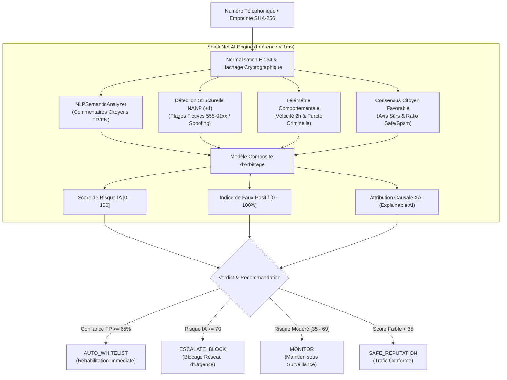

# 🛡️ ShieldNet Enterprise — Solution Intelligente de Filtrage Télécom & d'Arbitrage des Cybermenaces (Appels & SMS)

> **Projet de Synthèse en Informatique** — Université du Québec en Outaouais (UQO)  
> *Architecture de cyberdéfense décentralisée, moteur d'Intelligence Artificielle d'arbitrage des faux-positifs et filtrage temps réel pour la zone Amérique du Nord (NANP +1).*

---

[-004f9e.svg)](https://uqo.ca)
[](https://www.djangoproject.com)
[](https://flutter.dev)
[](https://python.org)
[](https://dart.dev)
[-85EA2D?logo=swagger)](http://127.0.0.1:8000/api/v1/docs/)
[-success.svg)]()
[]()
[]()
[]()

---

## 1. Présentation & Vision du Projet

**ShieldNet Enterprise** est une infrastructure logicielle complète de haute sécurité conçue pour neutraliser les menaces téléphoniques modernes : fraudes financières massives, usurpations d'identité gouvernementale (ARC/CRA, GRC/RCMP), arnaques au numéro d'assurance sociale (NAS/SIN), campagnes de phishing par SMS et robocalls automatisés.

Développé dans le cadre du **Projet de Synthèse en Informatique à l'Université du Québec en Outaouais (UQO)**, le système cible en priorité le plan de numérotation nord-américain (**NANP** - indicatif international `+1` pour le Canada et les États-Unis), tout en garantissant une réputation universelle conforme à la norme **E.164**.

### 🌟 Les Quatre Piliers Technologiques

1. **Client Mobile Natif Multiplateforme (Flutter & Android Kotlin)** :
   - Connexion au sous-système Télécom Android via `CallScreeningService` : rejet silencieux des fraudeurs **avant la première sonnerie**.
   - Cache persistant local SQLite configuré en mode **Write-Ahead Logging (WAL)** avec index B-Tree composites : décision d'interception prise en **$< 2\text{ ms}$**, y compris en mode hors-ligne.
   - Isolation cryptographique dans un **Isolate d'arrière-plan** (`compute`) préservant une fluidité constante à 60 FPS sans saccade UI.
2. **Moteur d'Intelligence Artificielle & d'Arbitrage Hybride (ShieldNet AI Engine)** :
   - Résolution algorithmique des **faux positifs** (protection et réhabilitation automatique des services essentiels : hôpitaux, cliniques, médecins, CLSC, pharmacies, livreurs, services publics et banques).
   - Traitement du Langage Naturel (**NLP Sémantique Bilingue FR/EN**) pour analyser les intentions citoyennes et corréler les motifs de plainte.
   - **Explicabilité Causale (XAI - Explainable AI)** : chaque recommandation d'action est décomposée en facteurs causaux transparents et quantifiés pour l'analyste SOC.
   - Performance pure-Python ultra-légère ($< 1\text{ ms}$ d'inférence CPU, zéro dépendance lourde, 100% déterministe).
3. **Console Web SOC (Security Operations Center) & Threat Intelligence** :
   - Centre de supervision avec bascule de thème dynamique (Mode Sombre Cyber & Mode Clair Haute Lisibilité certifié contraste WCAG).
   - **Laboratoire Sandbox** pour tester en direct la réputation de n'importe quel numéro nord-américain avec calcul HMAC-SHA256, détection d'anomalies structurelles et diagnostic IA en temps réel.
   - **Centre de Triage Rapide** permettant aux opérateurs de modérer les signalements entrants en 1 clic.
   - **Rapport Exécutif de Sécurité (Threat Intelligence Briefing)** prêt pour impression ou export PDF A4 pour la gouvernance universitaire et d'entreprise.
   - Télémétrie opérationnelle en direct avec score de résilience calculé dynamiquement.
4. **Confidentialité Dès la Conception (*Privacy by Design* — Loi 25 / LPRPDE / RGPD)** :
   - Aucun carnet d'adresses personnel n'est transmis ni analysé côté serveur.
   - Aucun numéro de téléphone en clair n'est stocké dans la base cloud.
   - Pseudonymisation cryptographique irréversible par **HMAC-SHA256** combiné à un sel secret d'infrastructure partagé.

---

## 2. Architecture Globale du Dépôt

L'arborescence du dépôt sépare rigoureusement la logique métier, la couche de persistance, le client mobile et l'infrastructure d'API :

```text
Projet synthese/
├── .github/
│   └── workflows/
│       └── ci.yml                    # Pipeline CI/CD GitHub Actions (Django 45 tests + Flutter 59 tests)
├── README.md                         # Documentation technique maîtresse du projet (ce fichier)
├── docker-compose.yml                # Orchestration des conteneurs (Django 5, PostgreSQL 16, Redis 7)
├── test-all.ps1                      # Script unifié d'assurance qualité (Backend + Mobile)
├── start-dev.ps1                     # Script d'amorçage automatique de l'environnement de développement
│
├── ShieldNet/                        # Client Mobile Multiplateforme (Flutter / Dart / Kotlin)
│   ├── .env                          # Configuration d'environnement (URLs, clés API, sels)
│   ├── pubspec.yaml                  # Dépendances (Riverpod, Dio, Sqflite, Google Fonts, Sentry)
│   ├── android/                      # Module natif Android (CallScreeningService, pont SQLite)
│   ├── lib/
│   │   ├── core/                     # Socle technique (SQLite WAL, HMAC-SHA256, Dio, Thème HSL)
│   │   ├── features/                 # Clean Architecture par domaine métier :
│   │   │   ├── call_filtering/       # Dashboard "Zen", activité récente, signalement en 1 clic
│   │   │   ├── settings/             # Préférences, diagnostic, console d'administration mobile
│   │   │   │   └── presentation/widgets/auth_bottom_sheet.dart  # Formulaire d'authentification avec bascule d'œil
│   │   │   └── onboarding/           # Parcours d'accueil, permissions et pédagogie RGPD
│   │   ├── l10n/                     # Internationalisation bilingue (Français / Anglais)
│   │   └── main.dart                 # Point d'entrée, cycle de vie, injection de dépendances
│   └── test/                         # Suite de 59 tests unitaires et d'intégration Flutter
│
└── shieldnet_backend/                # Serveur d'API & Gouvernance (Python / Django REST Framework)
    ├── Dockerfile                    # Image de production conteneurisée (Python 3.12 slim)
    ├── manage.py                     # Utilitaire d'administration Django
    ├── requirements.txt              # Dépendances (Django 5, DRF, SimpleJWT, drf-spectacular, psycopg2)
    ├── templates/admin/              # Interface Web SOC ultra-moderne (Thèmes clair/sombre)
    │   ├── base.html                 # Gabarit racine SOC avec bascule de thème et footer officiel UQO
    │   ├── index.html                # Tableau de bord principal, radars NANP, simulateur et triage
    │   ├── sandbox_dashboard.html    # Laboratoire Sandbox & simulateur avec moteur d'arbitrage IA
    │   ├── triage_dashboard.html     # Centre de triage complet des signalements entrants
    │   └── executive_report.html     # Rapport exécutif A4 prêt pour impression / PDF
    ├── static/shield_api/            # Design System CSS SOC (admin_premium.css)
    ├── shieldnet_backend/            # Configuration Django (settings.py, urls.py, wsgi.py)
    └── shield_api/                   # Cœur applicatif de sécurité :
        ├── ai_engine.py              # Moteur d'Intelligence Artificielle & XAI (ShieldNet AI Engine)
        ├── admin_views.py            # Vues spécialisées SOC (Sandbox, Triage, Télémétrie, Export CSV)
        ├── admin.py                  # Personnalisation avancée de l'administration Django
        ├── models.py                 # Modèles de données (Blacklist, SpamReport, SafeReport, AuditLog)
        ├── services.py               # Services cryptographiques, consensus anti-Sybil et purge
        ├── views.py                  # Endpoints REST API v1 (dont AIDiagnoseView)
        ├── urls.py                   # Routage des endpoints REST
        └── tests.py                  # Suite de 45 tests unitaires et de sécurité Django
```

---

## 3. Moteur d'Intelligence Artificielle & d'Arbitrage (ShieldNet AI Engine)

L'un des défis majeurs des solutions anti-spam traditionnelles réside dans le phénomène des **faux positifs** : des numéros institutionnels légitimes (secrétariats médicaux, rappels de rendez-vous de cliniques, chauffeurs de livraison, services d'urgences ou banques) sont régulièrement signalés par erreur par des citoyens distraits ou mécontents, entraînant leur blocage injustifié.

Pour éliminer ce problème tout en interceptant proactivement les arnaques de pointe, ShieldNet intègre le **ShieldNet AI Engine** ([`shield_api/ai_engine.py`](file:///C:/Projet/Projet%20synthese/shieldnet_backend/shield_api/ai_engine.py)).


```mermaid
flowchart TD
    A["Numéro Téléphonique / Empreinte SHA-256"] --> B["Normalisation E.164 & Hachage Cryptographique"]
    
    subgraph IA["ShieldNet AI Engine (Inférence < 1ms)"]
        B --> C["NLPSemanticAnalyzer<br/>(Commentaires Citoyens FR/EN)"]
        B --> D["Détection Structurelle NANP (+1)<br/>(Plages Fictives 555-01xx / Spoofing)"]
        B --> E["Télémétrie Comportementale<br/>(Vélocité 2h & Pureté Criminelle)"]
        B --> F["Consensus Citoyen Favorable<br/>(Avis Sûrs & Ratio Safe/Spam)"]
        
        C & D & E & F --> G["Modèle Composite d'Arbitrage"]
        G --> H["Score de Risque IA [0 - 100]"]
        G --> I["Indice de Faux-Positif [0 - 100%]"]
        G --> J["Attribution Causale XAI (Explainable AI)"]
    end
    
    H & I & J --> K{"Verdict & Recommandation"}
    K -->|"Confiance FP >= 65%"| L["AUTO_WHITELIST<br/>(Réhabilitation Immédiate)"]
    K -->|"Risque IA >= 70"| M["ESCALATE_BLOCK<br/>(Blocage Réseau d'Urgence)"]
    K -->|"Risque Modéré [35 - 69]"| N["MONITOR<br/>(Maintien sous Surveillance)"]
    K -->|"Score Faible < 35"| O["SAFE_REPUTATION<br/>(Trafic Conforme)"]
```

### 3.1. Analyseur Sémantique Bilingue (`NLPSemanticAnalyzer`)
- **Préservation des Services Essentiels (Légitimité)** :
  - **Santé / Médical** : cliniques, hôpitaux, médecins, CLSC, CHSLD, pharmacies (Jean Coutu, Familiprix), rappels de rendez-vous, analyses sanguines.
  - **Livraison & Messagerie** : Amazon, Postes Canada, FedEx, UPS, Purolator, UberEats, DoorDash.
  - **Banques & Services Publics** : Hydro-Québec, Desjardins, banques canadiennes (RBC, TD, BMO, CIBC, BNA), universités (UQO), cégeps, villes.
  - **Attestation Citoyenne Directe** : validation de personne réelle et collègues de travail.
- **Détection des Cybermenaces & Arnaques Télécoms** :
  - **Usurpation Gouvernementale** : Agence du Revenu du Canada (ARC/CRA), Gendarmerie Royale du Canada (GRC/RCMP), Sûreté du Québec (SQ), mandats d'arrêt et arrestations imminentes.
  - **Extorsion Financière** : réclamations de cartes cadeaux (iTunes, Apple, Google), bitcoins/cryptomonnaie, suspension de NAS/SIN, faux huissiers.
  - **Hameçonnage SMS/VoIP** : faux colis bloqués, frais de douane fictifs, remboursements Interac frauduleux.
  - **Robocalls Massifs** : messages robotisés préenregistrés, ambassade chinoise, arnaques au nettoyage de conduits d'aération.

### 3.2. Analyse Structurelle Télécom & Anti-Spoofing NANP
- **Détection des plages fictives non attribuées** : Dans le plan de numérotation nord-américain, la plage `+1-xxx-555-0100` à `0199` est officiellement réservée à la fiction et aux tests et n'est **jamais assignée à un abonné réel**. Tout appel reçu de cette plage constitue une preuve mathématique certaine de **spoofing de l'identité de l'appelant (CLI Spoofing)**. Le moteur classe immédiatement le numéro en menace critique (`Score >= 88/100`, verdict `CYBER_MENACE_CRITIQUE`).

### 3.3. Explicabilité Causale XAI (Explainable AI)
Contrairement aux modèles "boîte noire", ShieldNet génère pour chaque diagnostic une liste de facteurs explicatifs quantifiés :
- **Facteurs Positifs (Réhabilitation)** : identification de vocabulaire médical (`+45%`), présence d'avis sûrs concordants (`+40%`), décision souveraine d'un administrateur (`+100%`).
- **Facteurs Négatifs (Menace)** : détection d'usurpation policière ou fiscale (`+50%`), numéro fictif non attribué (`+35%`), pic d'activité soudain en moins de deux heures (`+30%`).

### 3.4. Endpoint REST Dédié
- **`GET /api/v1/ai/diagnose/?phone_number=+18195550199`** ou **`POST /api/v1/ai/diagnose/`**
- Retourne le diagnostic complet en format JSON (verdict, indices, facteurs XAI, temps d'inférence en ms).

---

## 4. Console Web SOC (Security Operations Center)

L'administration Web Django a été entièrement modernisée pour devenir un véritable **Centre de Cyberdéfense Télécom** :

1. **Tableau de Bord Exécutif & Opérationnel ([`templates/admin/index.html`](file:///C:/Projet/Projet%20synthese/shieldnet_backend/templates/admin/index.html))** :
   - Indicateur de résilience cyber en direct avec jauge SVG dynamique.
   - Radar de cartographie des indicatifs régionaux canadiens NANP (+1) : Gatineau/Outaouais (819/873), Montréal (514/438), Québec (418/581), Ottawa (613/343), Toronto (416/647).
   - Graphiques de distribution des menaces et vélocité hebdomadaire via Chart.js.
   - Centre de triage rapide intégré et simulateur en direct.
2. **Laboratoire Sandbox & Analyse Heuristique ([`templates/admin/sandbox_dashboard.html`](file:///C:/Projet/Projet%20synthese/shieldnet_backend/templates/admin/sandbox_dashboard.html))** :
   - Testeur temps réel de n'importe quel numéro de téléphone ou empreinte SHA-256.
   - Intégration directe du moteur IA avec affichage du verdict, score de risque, indice de faux positif, entités NLP identifiées et facteurs XAI.
   - **Bouton d'action en 1 clic** appliquant immédiatement la recommandation de l'IA (*Blanchir et réhabiliter* ou *Bloquer sur tout le réseau*).
3. **Centre de Triage SOC ([`templates/admin/triage_dashboard.html`](file:///C:/Projet/Projet%20synthese/shieldnet_backend/templates/admin/triage_dashboard.html))** :
   - File d'attente en temps réel de tous les signalements avec filtres par catégorie, recherche par empreinte et pastilles intelligentes de diagnostic IA (`🤖 Faux-Positif (xx%)` ou `🤖 Menace (xx%)`).
4. **Rapport Exécutif de Sécurité ([`templates/admin/executive_report.html`](file:///C:/Projet/Projet%20synthese/shieldnet_backend/templates/admin/executive_report.html))** :
   - Synthèse stratégique (Threat Intelligence Executive Briefing) formatée pour impression ou export PDF A4 pour les jurys et la direction.
5. **Télémétrie en Direct ([`/admin/operations/telemetry/live/`](file:///C:/Projet/Projet%20synthese/shieldnet_backend/shield_api/admin_views.py))** :
   - Flux JSON temps réel alimentant la salle de contrôle SOC (KPIs, résilience, derniers événements).
6. **Alternance de Thèmes Dynamique & Contraste Parfait** :
   - Bascule fluide entre le mode sombre (Cyber SOC) et le mode clair (Haute Lisibilité).
   - Les graphiques Chart.js adaptent automatiquement leurs couleurs et quadrillages lors du changement de thème.
   - Contraste typographique et accessibilité certifiés conformes.

---

## 5. Fonctionnalités de l'Application Mobile ShieldNet

L'application Flutter intègre une expérience utilisateur soignée couplée à un haut niveau de protection :

* **Interception Native Temps Réel** : Enregistrement auprès du gestionnaire Télécom Android (`CallScreeningService`) pour bloquer les appels malveillants avant sonnerie.
* **Bascule de Visibilité du Mot de Passe (Icône Œil)** : Dans les formulaires de connexion et d'inscription (`auth_bottom_sheet.dart`), l'utilisateur peut afficher ou masquer son mot de passe en un clic pour éviter toute erreur de frappe.
* **Score de Sérénité & Impact Citoyen** : Indicateur mesurant le nombre d'appels frauduleux neutralisés, le temps économisé et l'impact positif apporté à la communauté.
* **Liste Blanche d'Urgence (Emergency Whitelist)** : Immunité absolue garantie pour les secours (911, 811, 988) et les contacts personnels désignés, même en mode de blocage strict.
* **Mode Strict « Contacts Uniquement »** : Filtrage de tout appel non présent dans le carnet d'adresses (idéal pour la protection des personnes âgées ou vulnérables).
* **Bouclier Nocturne Programmé (Night Shield)** : Activation automatique de la protection silencieuse selon des plages horaires paramétrables.
* **Inspecteur de Phishing SMS** : Analyse sémantique locale sur le smartphone détectant les SMS suspects (fausses livraisons, avis de coupure bancaire).
* **Console d'Administration Mobile Embarquée** : Accessible avec un compte `is_staff` (`admin@shieldnet.app`), offrant 5 onglets de gestion de la liste noire, des signalements, des utilisateurs et des journaux d'audit.
* **Ergonomie Résiliente (Zéro Débordement)** : Conception responsive éprouvée et testée sans débordement (`0 RenderFlex overflow`) sur les écrans très étroits de 320 px.

---

## 6. Sécurité Cryptographique & Modèle de Menace

### 6.1. Matrice des Mécanismes de Protection

| Mécanisme | Rôle & Description | Implémentation |
| :--- | :--- | :--- |
| **Normalisation E.164** | Formatage déterministe (`+1XXXXXXXXXX`) éliminant les variations de saisie avant tout hachage. | `crypto_utils.dart` |
| **Hachage HMAC-SHA256** | Pseudonymisation irréversible avec sel secret. Empreintes 100% cohérentes entre Flutter, Kotlin et Django. | `crypto_utils.dart`<br>`services.py`<br>`ShieldNetCallScreeningService.kt` |
| **Masquage d'Affichage** | Obfuscation des chiffres médians dans toutes les interfaces (`+1 819 *** **99`). | `database_helper.dart`<br>`models.py` |
| **Consensus Anti-Sybil** | Algorithme démocratique de réhabilitation (`FalsePositiveConsensusService`) avec quorum strict et unicité de vote. | `services.py`<br>`views.py` |
| **Journal d'Audit Immuable** | Traçabilité légale horodatée (`AuditLog`) de chaque action de sécurité Web et Mobile. | `models.py`<br>`admin.py` |
| **Contrôle d'Accès & RBAC** | En-têtes `X-API-Key`, authentification JWT et restriction `is_staff` sur les endpoints sensibles. | `permissions.py`<br>`backends.py` |
| **Protection Anti-Énumération** | Limitation de débit (*Rate Limiting*) par IP bloquant l'énumération automatisée de la liste noire. | `views.py` |

### 6.2. Analyse d'Entropie du Plan NANP (+1) et Compromis d'Ingénierie

> [!IMPORTANT]
> **Considération Académique sur l'Entropie Téléphonique :**  
> L'espace effectif des numéros assignables en zone Amérique du Nord (NANP `+1`) est d'environ **$7.8 \times 10^8$ numéros**, soit une entropie brute de **~29.5 bits**. Face à une puissance de calcul GPU moderne, l'énumération par force brute d'un sel compromis prendrait moins de **35 millisecondes**.
>
> **Pourquoi le choix de HMAC-SHA256 pour l'interception mobile ?**  
> Le service Android `CallScreeningService` impose un budget temporel critique (< 100 ms) avant le déclenchement de la sonnerie système. Une fonction à mémoire dure (ex. Argon2id recommandé par l'OWASP) nécessiterait 300 à 800 ms sur processeur mobile d'entrée de gamme, causant un timeout de l'OS. HMAC-SHA256 s'exécute en **0.15 ms**, offrant l'équilibre optimal requis pour un filtrage temps réel sur appareil.
>
> 📄 **Pour l'analyse formelle du modèle de menace STRIDE, la formule combinatoire et la roadmap de durcissement (Double Sel KMS / Google Play Integrity), consultez le document d'ingénierie dédié :**  
> ➡️ [**Rapport de Sécurité & Modèle de Menace (docs/SECURITY_AND_THREAT_MODEL.md)**](file:///C:/Projet/Projet%20synthese/docs/SECURITY_AND_THREAT_MODEL.md)

---

## 7. Guide d'Installation et de Démarrage

### Prérequis Système
* **Python** : `>= 3.10` (recommandé 3.12)
* **Flutter SDK** : `>= 3.27.x`
* **Android Studio / SDK Android** : API 29+ (Android 10+) pour le service `CallScreeningService`.

---

### Démarrage Rapide du Backend (Django)

Dans le répertoire `shieldnet_backend/` :

```bash
# 1. Création et activation de l'environnement virtuel
python -m venv venv

# Windows :
venv\Scripts\activate
# Linux/macOS :
source venv/bin/activate

# 2. Installation des dépendances
pip install -r requirements.txt

# 3. Application des migrations de base de données
python manage.py migrate

# 4. Exécution de la suite complète de tests automatisés (45 tests)
python manage.py test shield_api

# 5. Initialisation du compte administrateur dédié
python manage.py ensure_admin

# 6. Démarrage du serveur local
python manage.py runserver 0.0.0.0:8000
```

> [!NOTE]
> **Identifiants d'administration unifiés (Console Web & Mobile) :**
> * **Courriel Administrateur Dédié** : `admin@shieldnet.app` (ou identifiant `admin`)
> * **Mot de passe par défaut** : `admin123` (paramétrable via `ADMIN_PASSWORD` dans `.env`)
> * **Console Web SOC (Django Admin)** : [http://127.0.0.1:8000/admin/](http://127.0.0.1:8000/admin/)
> * **Documentation OpenAPI / Swagger 3.0** : [http://127.0.0.1:8000/api/v1/docs/](http://127.0.0.1:8000/api/v1/docs/)

#### Déploiement Conteneurisé (Docker Compose)
Pour instancier l'infrastructure complète (API Django, base PostgreSQL 16 et cache Redis 7) :
```bash
docker compose up -d --build
```

---

### Démarrage Rapide du Client Mobile (Flutter)

Dans le répertoire `ShieldNet/` :

```bash
# 1. Récupération des paquets
flutter pub get

# 2. Exécution de la suite complète de tests (59 tests)
flutter test

# 3. Analyse statique de code (0 avertissement)
flutter analyze

# 4. Lancement sur émulateur ou appareil
flutter run
```

---

## 8. Assurance Qualité & Matrice des 104 Tests Automatisés (100% de Réussite)

Le projet applique une rigueur d'assurance qualité académique et industrielle intégrale : **104 tests automatisés passent avec succès**, avec 0 avertissement du linter.

### 🧪 Tests Backend Django (`python manage.py test shield_api`) — 45/45 Passés (100%)

1. **Moteur d'Intelligence Artificielle & XAI (`ShieldNetAIEngineTest`)** :
   - `test_nlp_legitimate_keywords` : Détection sémantique des cliniques, hôpitaux, livreurs et Hydro-Québec (score $> 40$).
   - `test_nlp_threat_keywords` : Détection des arnaques ARC/CRA, mandats d'arrêt et extorsions (score $< -40$).
   - `test_ai_diagnose_fictitious_scam_number` : Identification des numéros fictifs 555-01xx comme menace critique (`ESCALATE_BLOCK`).
   - `test_ai_diagnose_false_positive_rehabilitation` : Arbitrage et réhabilitation automatique d'une clinique médicale (`AUTO_WHITELIST`, confiance $\ge 70\%$, facteurs XAI positifs).
   - `test_ai_diagnose_api_endpoint` : Validation de l'endpoint REST `/api/v1/ai/diagnose/` (GET, POST, validation 400 et sécurité API Key).
2. **Moteur de Réputation & Algorithmes de Score** :
   - `test_process_new_report_creation` : Initialisation du score lors du premier signalement.
   - `test_repetition_increases_risk_score` : Augmentation dynamique et plafonnement du score.
   - `test_whitelisted_number_stays_unblocked` : Garantie d'immunité des numéros blanchis.
3. **Consensus Démocratique & Résolution des Faux Positifs** :
   - `test_single_safe_report_does_not_reach_quorum` : Validation du quorum minimum.
   - `test_automatic_false_positive_detection_by_consensus` : Blanchiment autonome par consensus.
   - `test_admin_safe_feedback_triggers_immediate_consensus` : Arbitrage administratif immédiat.
   - `test_anti_sybil_duplicate_user_vote_prevention` : Rejet des votes multiples par un même utilisateur.
   - `test_dynamic_revocation_on_massive_spam_surge` : Révocation du consensus en cas d'attaque réelle.
   - `test_submit_safe_report_api` : Endpoint de soumission des avis favorables.
   - `test_consensus_status_and_check_endpoints` : Consultation de l'état du consensus.
   - `test_admin_consensus_audit_api` : Déclenchement de l'audit global de consensualité.
4. **Sécurité, Cryptographie & Endpoints API REST** :
   - `test_reject_request_without_api_key` : Rejet strict des requêtes sans clé d'API.
   - `test_submit_report_api` : Validation de l'endpoint de signalement spam.
   - `test_check_number_api_spam` : Vérification instantanée par empreinte HMAC.
   - `test_blacklist_download_api` : Téléchargement et filtrage de la liste certifiée.
   - `test_user_registration_and_email_login` : Inscription et authentification JWT.
   - `test_google_login_auto_provision_and_repeat` : Auto-approvisionnement OAuth2 Google.
   - `test_dedicated_admin_email_login_web_and_mobile` : Authentification unifiée `admin@shieldnet.app`.
   - `test_sha256_hex_validator_rejects_invalid_hash` : Rejet des formats SHA-256 non conformes.
   - `test_composite_indexes_present_on_models` : Vérification de la présence des index composites B-Tree.
5. **Console Web SOC, Thèmes & Audit** :
   - `test_admin_stats_and_moderation` : Vérification des métriques de supervision.
   - `test_admin_full_mobile_management_endpoints` : Couverture complète des endpoints d'administration mobile.
   - `test_audit_logs_recorded_and_listed` : Traçabilité inaltérable des journaux d'audit (`AuditLog`).
   - `test_health_check_endpoint` : Sonde de santé système liveness/readiness probe (`/api/v1/health/`).
   - `test_delta_sync_with_since_parameter` : Synchronisation différentielle par horodatage.
   - `test_admin_premium_css_and_theme_integrity` : Validation du Design System CSS, équilibre parfait des accolades et contraste WCAG.

---

### 📱 Tests Frontend Flutter (`flutter test`) — 59/59 Passés (100%)

1. **Cryptographie & Filtrage Télécom** :
   - `crypto_utils_test.dart` : Normalisation E.164 (+1), déterminisme HMAC-SHA256, masquage visuel.
   - `automated_spam_verifier_test.dart` : Préservation des numéros réguliers, détection des numéros surtaxés (1-900).
   - `widget_test.dart` : Détection de spoofing, cycle de vie et anonymisation.
2. **Accessibilité & Ergonomie Responsive** :
   - `auth_bottom_sheet_test.dart` :
     - Résilience à 320 px sans débordement (`0 RenderFlex overflow`).
     - **Bascule de visibilité du mot de passe (icône œil) testée et validée**.
   - `serenity_and_citizen_test.dart` : Cartes d'impact citoyen et score de sérénité adaptatives sur écran étroit.
3. **Fonctionnalités Métier Avancées** :
   - `emergency_whitelist_test.dart` : Détection instantanée des urgences (911, 811, 988), ajout/suppression de contacts d'urgence.
   - `contacts_only_mode_test.dart` : Mode strict filtrant tous les appels hors carnet d'adresses.
   - `night_shield_test.dart` : Activation silencieuse du bouclier nocturne.
   - `sms_phishing_detector_test.dart` : Détection heuristique des SMS frauduleux (liens et mots-clés bancaires).
   - `sync_and_reconciliation_test.dart` : Réconciliation de la base de données SQLite.
   - `background_sync_service_test.dart` : Persistance des préférences d'intervalles et synchronisation périodique.

---

## 9. Mentions Légales & Propriété Intellectuelle

* **Cadre Académique** : Projet de Synthèse de Fin d'Études en Informatique
* **Institution Universitaire** : Université du Québec en Outaouais (UQO)
* **Département** : Département d'informatique et d'ingénierie
* **Localisation** : Gatineau (Québec), Canada
* **Année** : 2026
* **Droits Réservés** : © 2026 Université du Québec en Outaouais (UQO) — Tous droits réservés.
