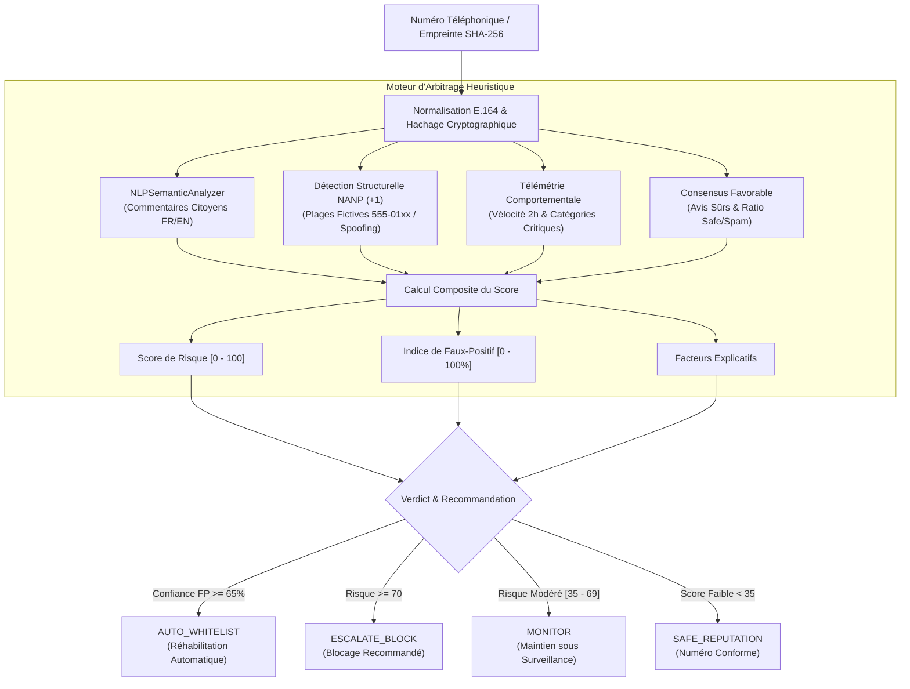

# ShieldNet — Filtrage d'Appels & SMS Indésirables

**Projet de Synthèse en Informatique** — Université du Québec en Outaouais (UQO)  
**Session** : Hiver / Printemps 2026  
**Équipe** : Projet ShieldNet  
**Technologies** : Flutter (client mobile Android) • Django REST Framework (backend d'API) • SQLite (WAL) • PostgreSQL • Docker

---

## 1. Présentation du Projet

**ShieldNet** est une application développée dans le cadre du cours de Projet de Synthèse en Informatique à l'**Université du Québec en Outaouais (UQO)**. Elle combine une application mobile Flutter (Android) et une API backend Django pour identifier et filtrer les appels et SMS indésirables : fraudes financières, usurpations institutionnelles (ARC/CRA, Revenu Québec), arnaques au numéro d'assurance sociale (NAS) et démarchage abusif.

Le système est conçu spécifiquement pour le plan de numérotation nord-américain (**NANP** - indicatif `+1` pour le Canada et les États-Unis) selon la norme **E.164**.

### Objectifs et caractéristiques principales

* **Filtrage natif sur appareil** : Utilisation du composant Android `CallScreeningService` pour intercepter les appels suspects avant le premier son de sonnerie.
* **Fonctionnement autonome hors-ligne** : Base de données locale SQLite optimisée en mode WAL (*Write-Ahead Logging*) permettant une décision en moins de 2 millisecondes sans dépendre d'une connexion réseau active.
* **Respect de la vie privée (Loi 25 du Québec)** :
  - Aucun carnet d'adresses personnel n'est téléversé ni transmis au serveur.
  - Aucun numéro de téléphone en clair n'est stocké dans la base centrale.
  - Les numéros signalés sont pseudonymisés via **HMAC-SHA256** avec un sel secret d'infrastructure.
* **Gestion des faux positifs** : Module de scoring heuristique et lexical permettant d'identifier les services légitimes signalés par erreur (hôpitaux, CLSC, cliniques, livreurs, banques) et consensus communautaire pour réhabiliter automatiquement les numéros légitimes.
* **Console d'administration** : Interface Web Django pour la modération des signalements, la consultation des métriques et le test unitaire de numéros suspects.

---

## 2. Architecture Globale du Dépôt

L'arborescence du dépôt sépare rigoureusement la logique métier, la couche de persistance, le client mobile et l'infrastructure d'API :

```text
Projet synthese/
├── Jenkinsfile                       # Pipeline CI/CD Jenkins déclaratif (Django 61 tests + Flutter 69 tests + build APK)
├── README.md                         # Documentation technique maîtresse du projet (ce fichier)
├── docker-compose.yml                # Orchestration des conteneurs (Django 5, PostgreSQL 16, Redis 7)
├── docker-compose.jenkins.yml        # Serveur d'intégration continue Jenkins LTS conteneurisé
├── test-all.ps1                      # Script unifié d'assurance qualité (Backend + Mobile)
├── start-dev.ps1                     # Script d'amorçage automatique de l'environnement de développement
├── docs/                             # Documentation d'ingénierie et académique (UQO) :
│   ├── ARCHITECTURE_ET_CONCEPTION.md # Spécification Clean Architecture, diagrammes UML & flux critiques
│   ├── DEPLOIEMENT_ET_CI_CD.md       # Manuel d'exploitation (Runbook), Docker & pipeline Jenkins CI/CD
│   └── SECURITY_AND_THREAT_MODEL.md  # Modèle de menace STRIDE, analyse d'entropie NANP (+1) & Loi 25
│
├── ShieldNet/                        # Client Mobile Multiplateforme (Flutter / Dart / Kotlin)
│   ├── .env                          # Configuration d'environnement (URLs, clés API, sels)
│   ├── pubspec.yaml                  # Dépendances (Riverpod, Dio, Sqflite, Google Fonts, Sentry)
│   ├── android/                      # Module natif Android (CallScreeningService, pont SQLite)
│   ├── lib/
│   │   ├── core/                     # Socle technique (SQLite WAL, HMAC-SHA256, Dio, Thème HSL)
│   │   ├── features/                 # Clean Architecture par domaine métier :
│   │   │   ├── call_filtering/       # Dashboard "Zen", activité récente, audit batch, contestation
│   │   │   ├── settings/             # Préférences, diagnostic, console d'administration mobile
│   │   │   │   └── presentation/widgets/auth_bottom_sheet.dart  # Formulaire d'authentification avec bascule d'œil
│   │   │   └── onboarding/           # Parcours d'accueil, permissions et pédagogie RGPD
│   │   ├── l10n/                     # Internationalisation bilingue (Français / Anglais)
│   │   └── main.dart                 # Point d'entrée, cycle de vie, injection de dépendances
│   └── test/                         # Suite de 69 tests unitaires et d'intégration Flutter
│
└── shieldnet_backend/                # Serveur d'API & Gouvernance (Python / Django REST Framework)
    ├── Dockerfile                    # Image de production conteneurisée (Python 3.12 slim)
    ├── manage.py                     # Utilitaire d'administration Django
    ├── requirements.txt              # Dépendances (Django 5, DRF, SimpleJWT, drf-spectacular, psycopg2)
    ├── templates/admin/              # Interface Web SOC ultra-moderne (Thèmes clair/sombre)
    │   ├── base.html                 # Gabarit racine SOC avec bascule de thème et footer officiel UQO
    │   ├── index.html                # Tableau de bord principal, radars NANP, simulateur et triage
    │   ├── sandbox_dashboard.html    # Laboratoire Sandbox & simulateur avec moteur d'arbitrage IA
    │   ├── triage_dashboard.html     # Centre de triage complet des signalements entrants
    │   └── executive_report.html     # Rapport exécutif A4 prêt pour impression / PDF
    ├── static/shield_api/            # Design System CSS SOC (admin_premium.css)
    ├── shieldnet_backend/            # Configuration Django (settings.py, urls.py, wsgi.py)
    └── shield_api/                   # Cœur applicatif de sécurité :
        ├── ai_engine.py              # Moteur d'Intelligence Artificielle & XAI (ShieldNet AI Engine)
        ├── admin_views.py            # Vues spécialisées SOC (Sandbox, Triage, Télémétrie, Export CSV)
        ├── admin.py                  # Personnalisation avancée de l'administration Django
        ├── models.py                 # Modèles de données (Blacklist, SpamReport, SafeReport, AuditLog)
        ├── services.py               # Services cryptographiques, consensus anti-Sybil, STIR/SHAKEN
        ├── views.py                  # Endpoints REST API v1 (dont AIDiagnose, BatchCheck, Metrics)
        ├── urls.py                   # Routage des endpoints REST
```

### Dossiers d'Ingénierie & Spécifications Approfondies

Pour une analyse exhaustive des composantes d'ingénierie, trois documents de référence sont centralisés dans le répertoire `docs/` :

| Document | Objet & Thématiques Couvertes |
|---|---|
| [**Architecture & Conception UML**](file:///C:/Projet/Projet%20synthese/docs/ARCHITECTURE_ET_CONCEPTION.md) | Découpage Clean Architecture, diagramme de composants, diagramme de classes UML, principes SOLID et 4 diagrammes de séquence des flux critiques. |
| [**Déploiement & Pipeline CI/CD**](file:///C:/Projet/Projet%20synthese/docs/DEPLOIEMENT_ET_CI_CD.md) | Manuel d'exploitation (Runbook), Docker Compose, configuration Gunicorn/Nginx, pipeline Jenkins en 6 étapes et plans de continuité (PCA/PRA). |
| [**Sécurité, Modèle de Menace & Loi 25**](file:///C:/Projet/Projet%20synthese/docs/SECURITY_AND_THREAT_MODEL.md) | Modèle de menace formel STRIDE, analyse d'entropie mathématique du plan NANP (+1), compromis temps réel HMAC vs Argon2 et conformité Loi 25 / RGPD. |

---

## 3. Système d'Arbitrage et Détection des Faux Positifs

L'un des défis majeurs des solutions anti-spam réside dans le risque des **faux positifs** : des numéros institutionnels légitimes (secrétariats médicaux, rappels de rendez-vous de cliniques, chauffeurs de livraison, services d'urgence ou banques) peuvent être signalés par erreur par des utilisateurs, risquant d'entraîner leur blocage injustifié.

Pour répondre à cette problématique, ShieldNet implémente un module de classification heuristique et lexicale ([`shield_api/ai_engine.py`](file:///C:/Projet/Projet%20synthese/shieldnet_backend/shield_api/ai_engine.py)).


```mermaid
flowchart TD
    A["Numéro Téléphonique / Empreinte SHA-256"] --> B["Normalisation E.164 & Hachage Cryptographique"]
    
    subgraph Arbitrage["Moteur d'Arbitrage Heuristique"]
        B --> C["NLPSemanticAnalyzer<br/>(Commentaires Citoyens FR/EN)"]
        B --> D["Détection Structurelle NANP (+1)<br/>(Plages Fictives 555-01xx / Spoofing)"]
        B --> E["Télémétrie Comportementale<br/>(Vélocité 2h & Catégories Critiques)"]
        B --> F["Consensus Favorable<br/>(Avis Sûrs & Ratio Safe/Spam)"]
        
        C & D & E & F --> G["Calcul Composite du Score"]
        G --> H["Score de Risque [0 - 100]"]
        G --> I["Indice de Faux-Positif [0 - 100%]"]
        G --> J["Facteurs Explicatifs"]
    end
    
    H & I & J --> K{"Verdict & Recommandation"}
    K -->|"Confiance FP >= 65%"| L["AUTO_WHITELIST<br/>(Réhabilitation Automatique)"]
    K -->|"Risque >= 70"| M["ESCALATE_BLOCK<br/>(Blocage Recommandé)"]
    K -->|"Risque Modéré [35 - 69]"| N["MONITOR<br/>(Maintien sous Surveillance)"]
    K -->|"Score Faible < 35"| O["SAFE_REPUTATION<br/>(Numéro Conforme)"]
```

### 3.1. Analyseur Sémantique Bilingue (`NLPSemanticAnalyzer`)
- **Préservation des Services Essentiels (Légitimité)** :
  - **Santé / Médical** : cliniques, hôpitaux, médecins, CLSC, CHSLD, pharmacies (Jean Coutu, Familiprix), rappels de rendez-vous, analyses sanguines.
  - **Livraison & Messagerie** : Amazon, Postes Canada, FedEx, UPS, Purolator, UberEats, DoorDash.
  - **Banques & Services Publics** : Hydro-Québec, Desjardins, banques canadiennes (RBC, TD, BMO, CIBC, BNA), universités (UQO), cégeps, villes.
  - **Attestation Citoyenne Directe** : validation de personne réelle et collègues de travail.
- **Détection des Cybermenaces & Arnaques Télécoms** :
  - **Usurpation Gouvernementale** : Agence du Revenu du Canada (ARC/CRA), Gendarmerie Royale du Canada (GRC/RCMP), Sûreté du Québec (SQ), mandats d'arrêt et arrestations imminentes.
  - **Extorsion Financière** : réclamations de cartes cadeaux (iTunes, Apple, Google), bitcoins/cryptomonnaie, suspension de NAS/SIN, faux huissiers.
  - **Hameçonnage SMS/VoIP** : faux colis bloqués, frais de douane fictifs, remboursements Interac frauduleux.
  - **Robocalls Massifs** : messages robotisés préenregistrés, ambassade chinoise, arnaques au nettoyage de conduits d'aération.

### 3.2. Analyse Structurelle Télécom & Anti-Spoofing NANP
- **Détection des plages fictives non attribuées** : Dans le plan de numérotation nord-américain, la plage `+1-xxx-555-0100` à `0199` est officiellement réservée à la fiction et aux tests et n'est **jamais assignée à un abonné réel**. Tout appel reçu de cette plage constitue une preuve mathématique certaine de **spoofing de l'identité de l'appelant (CLI Spoofing)**. Le moteur classe immédiatement le numéro en menace critique (`Score >= 88/100`, verdict `CYBER_MENACE_CRITIQUE`).

### 3.3. Intégration du Standard Télécom STIR/SHAKEN (FCC / CRTC)
ShieldNet intègre les niveaux d'attestation cryptographique certifiés par les opérateurs télécoms nord-américains :
- **Attestation A (Pleine)** : L'opérateur source certifie l'identité de l'abonné et son droit d'utiliser le numéro affiché. Le moteur applique une réduction de score (`-30 points`) et injecte un facteur XAI certifié positif.
- **Attestation B (Partielle)** : L'origine client est connue mais le numéro spécifique n'est pas garanti (autocommutateurs d'entreprises, centres d'appels légitimes).
- **Attestation C (Passerelle)** : L'appel provient d'une passerelle VoIP internationale non authentifiée sans validation d'origine. Le moteur majore le score de risque (`+25 points`) et signale l'anomalie d'usurpation potentielle.

### 3.4. Explicabilité Causale XAI (Explainable AI)
Contrairement aux modèles "boîte noire", ShieldNet génère pour chaque diagnostic une liste de facteurs explicatifs quantifiés :
- **Facteurs Positifs (Réhabilitation)** : identification de vocabulaire médical (`+45%`), attestation STIR/SHAKEN niveau A (`+30%`), présence d'avis sûrs concordants (`+40%`), décision souveraine d'un administrateur (`+100%`).
- **Facteurs Négatifs (Menace)** : détection d'usurpation policière ou fiscale (`+50%`), numéro fictif non attribué (`+35%`), attestation STIR/SHAKEN niveau C (`+25%`), pic d'activité soudain en moins de deux heures (`+30%`).

### 3.5. Endpoints REST d'Arbitrage et d'Analyse
- **`GET /api/v1/ai/diagnose/?phone_number=+18195550199&attestation=A`** ou **`POST /api/v1/ai/diagnose/`** : Diagnostic unifié explicable.
- **`POST /api/v1/check/batch/`** : Vérification groupée haute performance (jusqu'à 100 numéros en une seule requête SQL indexée).
- **`GET /api/v1/metrics/`** : Télémétrie et métriques opérationnelles au format standard OpenMetrics / Prometheus.

---

## 4. Console Web d'Administration & Modération (Django)

L'administration Web Django a été aménagée pour offrir à l'équipe du projet une console d'exploitation claire :

1. **Tableau de Bord Principal ([`templates/admin/index.html`](file:///C:/Projet/Projet%20synthese/shieldnet_backend/templates/admin/index.html))** :
   - Indicateurs globaux (numéros en liste noire, avis favorables, comptes utilisateurs).
   - Répartition géographique des signalements selon les indicatifs régionaux canadiens NANP (+1) : Gatineau/Outaouais (819/873), Montréal (514/438), Québec (418/581), Ottawa (613/343), Toronto (416/647).
   - Graphiques de distribution des catégories et suivi temporel via Chart.js.
2. **Simulateur & Analyse Heuristique ([`templates/admin/sandbox_dashboard.html`](file:///C:/Projet/Projet%20synthese/shieldnet_backend/templates/admin/sandbox_dashboard.html))** :
   - Testeur permettant de soumettre un numéro ou une empreinte pour observer le calcul du score, la détection lexicale, l'impact STIR/SHAKEN et la recommandation d'action.
   - Bouton de modération rapide pour appliquer la décision directement en base.
3. **Centre de Triage Complet ([`templates/admin/triage_dashboard.html`](file:///C:/Projet/Projet%20synthese/shieldnet_backend/templates/admin/triage_dashboard.html))** :
   - File de révision en direct des signalements récents avec pastilles d'arbitrage IA, filtrage par catégorie et action en 1 clic.
   - *Architecture durcie* : Intégration globale de `ShieldNetAIEngine` garantissant le chargement instantané de la console complète sans crash serveur.
4. **Rapport Récapitulatif ([`templates/admin/executive_report.html`](file:///C:/Projet/Projet%20synthese/shieldnet_backend/templates/admin/executive_report.html))** :
   - Document de synthèse imprimable résumant l'état de la base et les statistiques pour la présentation du projet.
5. **Observabilité OpenMetrics & Export Sécurisé** :
   - Exposition de l'endpoint `/api/v1/metrics/` compatible Prometheus et Grafana.
   - Export CSV protégé contre les attaques par injection de formules Excel (CWE-1236).
6. **Thèmes Clair / Sombre** :
   - Bascule d'affichage pour le confort visuel, avec adaptation automatique des couleurs des graphiques.

---

## 5. Fonctionnalités de l'Application Mobile ShieldNet

L'application Flutter intègre les fonctionnalités nécessaires à la protection quotidienne :

* **Interception native** : Enregistrement auprès du gestionnaire Télécom Android (`CallScreeningService`) pour bloquer les appels malveillants avant sonnerie.
* **Audit Rapide du Journal d'Appels** : Fonctionnalité d'audit instantané dans l'onglet *« Appels Récents »* exécutant un scan réseau groupé (Batch Check) pour identifier immédiatement les fraudeurs passés inaperçus.
* **Contestation Interactive des Faux-Positifs** : Fiche détaillée au toucher sur n'importe quel numéro bloqué dans l'onglet *« Numéros Bloqués »*, permettant de déposer une contestation citoyenne (santé, livraison, proche, service) et de déclencher la réhabilitation par consensus.
* **Niveau de protection paramétrable** : Évaluation de la configuration de l'appareil (filtrage activé, base locale synchronisée, verrouillage biométrique).
* **Liste blanche prioritaire (Urgence)** : Immunité garantie pour les services essentiels (911, 811, 988) et les contacts médicaux ou personnels désignés.
* **Mode « Contacts Uniquement »** : Filtrage des numéros absents du carnet d'adresses (recommandé pour les personnes vulnérables aux démarchages agressifs).
* **Bouclier Nocturne** : Plage horaire configurable pour filtrer silencieusement les appels durant la nuit.
* **Inspecteur de SMS** : Analyse locale des messages reçus pour détecter les liens suspects et les arnaques de livraison ou bancaires.
* **Console d'administration mobile** : Accessible aux utilisateurs avec statut administrateur (`is_staff`) pour modérer la liste noire directement depuis le téléphone.
* **Interface responsive** : Mise en page testée sans débordement sur petits écrans (320 px de large).

---

## 6. Sécurité Cryptographique & Modèle de Menace

### 6.1. Matrice des Mécanismes de Protection

| Mécanisme | Rôle & Description | Implémentation |
| :--- | :--- | :--- |
| **Normalisation E.164** | Formatage déterministe (`+1XXXXXXXXXX`) éliminant les variations de saisie avant tout hachage. | `crypto_utils.dart` |
| **Hachage HMAC-SHA256** | Pseudonymisation irréversible avec sel secret. Empreintes 100% cohérentes entre Flutter, Kotlin et Django. | `crypto_utils.dart`<br>`services.py`<br>`ShieldNetCallScreeningService.kt` |
| **Masquage d'Affichage** | Obfuscation des chiffres médians dans toutes les interfaces (`+1 819 *** **99`). | `database_helper.dart`<br>`models.py` |
| **Consensus Anti-Sybil** | Algorithme démocratique de réhabilitation (`FalsePositiveConsensusService`) avec quorum strict et unicité de vote. | `services.py`<br>`views.py` |
| **Journal d'Audit Immuable** | Traçabilité légale horodatée (`AuditLog`) de chaque action de sécurité Web et Mobile. | `models.py`<br>`admin.py` |
| **Contrôle d'Accès & RBAC** | En-têtes `X-API-Key`, authentification JWT et restriction `is_staff` sur les endpoints sensibles. | `permissions.py`<br>`backends.py` |
| **Anti-Timing Attack (CWE-208)** | Comparaison en temps constant (`hmac.compare_digest`) neutralisant les attaques par canal auxiliaire sur les clés API. | `permissions.py` |
| **Anti-Injection CSV (CWE-1236)** | Neutralisation stricte des formules malveillantes Excel (`=`, `+`, `-`, `@`) lors des exports du SOC (`sanitize_csv_cell`). | `admin_views.py` |
| **Anti-ReDoS (Déni de Service Regex)** | Expressions régulières sans chevauchement polynomial pour l'analyse des liens SMS suspects. | `sms_phishing_detector.dart` |
| **Sécurisation OAuth2 / Anti-Usurpation** | Blocage absolu de la connexion sociale Google vers des comptes administrateurs (`is_staff` / `is_superuser`). | `views.py` |
| **Protection Anti-Énumération** | Unification des messages d'erreur d'authentification et limitation de débit (*Rate Limiting*) par IP. | `serializers.py`<br>`views.py` |
| **Bornage de Charge Utile (Anti-DoS)** | Bounded inputs stricts (commentaires $\le 1000$ caractères, numéros $\le 32$ caractères). | `serializers.py`<br>`views.py` |

### 6.2. Analyse d'Entropie du Plan NANP (+1) et Compromis d'Ingénierie

> [!IMPORTANT]
> **Considération Académique sur l'Entropie Téléphonique :**  
> L'espace effectif des numéros assignables en zone Amérique du Nord (NANP `+1`) est d'environ **$7.8 \times 10^8$ numéros**, soit une entropie brute de **~29.5 bits**. Face à une puissance de calcul GPU moderne, l'énumération par force brute d'un sel compromis prendrait moins de **35 millisecondes**.
>
> **Pourquoi le choix de HMAC-SHA256 pour l'interception mobile ?**  
> Le service Android `CallScreeningService` impose un budget temporel critique (< 100 ms) avant le déclenchement de la sonnerie système. Une fonction à mémoire dure (ex. Argon2id recommandé par l'OWASP) nécessiterait 300 à 800 ms sur processeur mobile d'entrée de gamme, causant un timeout de l'OS. HMAC-SHA256 s'exécute en **0.15 ms**, offrant l'équilibre optimal requis pour un filtrage temps réel sur appareil.
>
> **Pour l'analyse formelle du modèle de menace STRIDE, la formule combinatoire et la roadmap de durcissement (Double Sel KMS / Google Play Integrity), consultez le document d'ingénierie dédié :**  
> [**Rapport de Sécurité & Modèle de Menace (docs/SECURITY_AND_THREAT_MODEL.md)**](file:///C:/Projet/Projet%20synthese/docs/SECURITY_AND_THREAT_MODEL.md)

---

## 7. Guide d'Installation et de Démarrage

### Prérequis Système
* **Python** : `>= 3.10` (recommandé 3.12)
* **Flutter SDK** : `>= 3.27.x`
* **Android Studio / SDK Android** : API 29+ (Android 10+) pour le service `CallScreeningService`.

---

### Démarrage Rapide du Backend (Django)

Dans le répertoire `shieldnet_backend/` :

```bash
# 1. Création et activation de l'environnement virtuel
python -m venv venv

# Windows :
venv\Scripts\activate
# Linux/macOS :
source venv/bin/activate

# 2. Installation des dépendances
pip install -r requirements.txt

# 3. Application des migrations de base de données
python manage.py migrate

# 4. Exécution de la suite complète de tests automatisés (45 tests)
python manage.py test shield_api

# 5. Initialisation du compte administrateur dédié
python manage.py ensure_admin

# 6. Démarrage du serveur local
python manage.py runserver 0.0.0.0:8000
```

> [!NOTE]
> **Identifiants d'administration unifiés (Console Web & Mobile) :**
> * **Courriel Administrateur Dédié** : `admin@shieldnet.app` (ou identifiant `admin`)
> * **Mot de passe par défaut** : `admin123` (paramétrable via `ADMIN_PASSWORD` dans `.env`)
> * **Console Web SOC (Django Admin)** : [http://127.0.0.1:8000/admin/](http://127.0.0.1:8000/admin/)
> * **Documentation OpenAPI / Swagger 3.0** : [http://127.0.0.1:8000/api/v1/docs/](http://127.0.0.1:8000/api/v1/docs/)

#### Déploiement Conteneurisé (Docker Compose)
Pour instancier l'infrastructure complète (API Django, base PostgreSQL 16 et cache Redis 7) :
```bash
docker compose up -d --build
```

---

### Démarrage Rapide du Client Mobile (Flutter)

Dans le répertoire `ShieldNet/` :

```bash
# 1. Récupération des paquets
flutter pub get

# 2. Exécution de la suite complète de tests (59 tests)
flutter test

# 3. Analyse statique de code (0 avertissement)
flutter analyze

# 4. Lancement sur émulateur ou appareil
flutter run
```

---

## 8. Assurance Qualité & Matrice des 130 Tests Automatisés (100% de Réussite)

Le projet applique une rigueur d'assurance qualité académique et industrielle intégrale : **130 tests automatisés passent avec succès**, avec 0 avertissement du linter (`flutter analyze`).

### Tests Backend Django (`python manage.py test shield_api`) — 61/61 Passés (100%)

1. **Moteur d'Intelligence Artificielle & XAI (`ShieldNetAIEngineTest`)** :
   - `test_nlp_legitimate_keywords` : Détection sémantique des cliniques, hôpitaux, livreurs et Hydro-Québec (score $> 40$).
   - `test_nlp_threat_keywords` : Détection des arnaques ARC/CRA, mandats d'arrêt et extorsions (score $< -40$).
   - `test_ai_diagnose_fictitious_scam_number` : Identification des numéros fictifs 555-01xx comme menace critique (`ESCALATE_BLOCK`).
   - `test_ai_diagnose_false_positive_rehabilitation` : Arbitrage et réhabilitation automatique d'une clinique médicale (`AUTO_WHITELIST`, confiance $\ge 70\%$, facteurs XAI positifs).
   - `test_ai_diagnose_api_endpoint` : Validation de l'endpoint REST `/api/v1/ai/diagnose/` (GET, POST, validation 400 et sécurité API Key).
   - `test_stir_shaken_attestation_evaluations` : Évaluation heuristique et diagnostic explicable intégrant les attestations télécoms A, B et C.
2. **Vérification Groupée & Télémétrie Opérationnelle** :
   - `test_batch_check_numbers_success` : Vérification groupée instantanée (`POST /api/v1/check/batch/`) avec résolution SQL optimisée.
   - `test_batch_check_validation_rules` : Rejet strict des listes vides, hashes SHA-256 non conformes et dépassements du plafond de 100 requêtes.
   - `test_prometheus_metrics_endpoint` : Validation du format OpenMetrics standard (`text/plain; version=0.0.4`) et cohérence des jauges.
3. **Moteur de Réputation & Algorithmes de Score** :
   - `test_process_new_report_creation` : Initialisation du score lors du premier signalement.
   - `test_repetition_increases_risk_score` : Augmentation dynamique et plafonnement du score.
   - `test_whitelisted_number_stays_unblocked` : Garantie d'immunité des numéros blanchis.
4. **Consensus Démocratique & Résolution des Faux Positifs** :
   - `test_single_safe_report_does_not_reach_quorum` : Validation du quorum minimum.
   - `test_automatic_false_positive_detection_by_consensus` : Blanchiment autonome par consensus.
   - `test_admin_safe_feedback_triggers_immediate_consensus` : Arbitrage administratif immédiat.
   - `test_anti_sybil_duplicate_user_vote_prevention` : Rejet des votes multiples par un même utilisateur.
   - `test_dynamic_revocation_on_massive_spam_surge` : Révocation du consensus en cas d'attaque réelle.
   - `test_submit_safe_report_api` : Endpoint de soumission des avis favorables.
   - `test_consensus_status_and_check_endpoints` : Consultation de l'état du consensus.
   - `test_admin_consensus_audit_api` : Déclenchement de l'audit global de consensualité.
5. **Sécurité, Cryptographie & Durcissement OWASP** :
   - `test_reject_request_without_api_key` : Rejet strict des requêtes sans clé d'API.
   - `test_timing_attack_mitigation` : Comparaison `hmac.compare_digest` à temps constant sur les clés API (CWE-208).
   - `test_csv_export_neutralizes_formula_injection` : Neutralisation des injections de formules Excel dans les exports CSV (CWE-1236).
   - `test_admin_account_takeover_prevention` : Interdiction aux comptes staff/superuser de se connecter par OAuth non vérifié.
   - `test_user_enumeration_prevention` : Uniformisation des messages d'authentification contre l'énumération de comptes.
   - `test_comment_payload_size_enforced` : Bounded inputs stricts (1000 caractères max) contre les attaques par déni de service.
   - `test_submit_report_api` : Validation de l'endpoint de signalement spam avec transmission des commentaires.
   - `test_check_number_api_spam` : Vérification instantanée par empreinte HMAC.
   - `test_blacklist_download_api` : Téléchargement et filtrage de la liste certifiée.
   - `test_user_registration_and_email_login` : Inscription et authentification JWT.
   - `test_google_login_auto_provision_and_repeat` : Auto-approvisionnement OAuth2 Google.
   - `test_dedicated_admin_email_login_web_and_mobile` : Authentification unifiée `admin@shieldnet.app`.
   - `test_sha256_hex_validator_rejects_invalid_hash` : Rejet des formats SHA-256 non conformes.
   - `test_composite_indexes_present_on_models` : Vérification de la présence des index composites B-Tree.
6. **Console Web SOC, Thèmes & Audit** :
   - `test_admin_triage_dashboard_view` : Fiabilisation complète de la console de triage avec chargement global de `ShieldNetAIEngine`.
   - `test_admin_stats_and_moderation` : Vérification des métriques de supervision.
   - `test_admin_full_mobile_management_endpoints` : Couverture complète des endpoints d'administration mobile.
   - `test_audit_logs_recorded_and_listed` : Traçabilité inaltérable des journaux d'audit (`AuditLog`).
   - `test_health_check_endpoint` : Sonde de santé système liveness/readiness probe (`/api/v1/health/`).
   - `test_delta_sync_with_since_parameter` : Synchronisation différentielle par horodatage.
   - `test_admin_premium_css_and_theme_integrity` : Validation du Design System CSS, équilibre parfait des accolades et contraste WCAG.

---

### Tests Frontend Flutter (`flutter test`) — 69/69 Passés (100%)

1. **Réseau, Synchronisation & Batch Check (`api_service_test.dart`)** :
   - Synchronisation différentielle Delta et complète avec SQLite.
   - Signalement de spam unitaire avec persistance locale immédiate.
   - **Vérification groupée (`checkNumbersBatch`)** : Gestion de liste vide sans requête, traitement et mapping des résultats multiples, résilience aux pannes réseau.
   - **Contestation citoyenne (`submitSafeReport`)** : Soumission directe par `phoneHash` et `maskedNumber` avec prise en compte du consensus.
2. **Cryptographie & Filtrage Télécom** :
   - `crypto_utils_test.dart` : Normalisation E.164 (+1), déterminisme HMAC-SHA256, masquage visuel.
   - `automated_spam_verifier_test.dart` : Préservation des numéros réguliers, détection des numéros surtaxés (1-900).
   - `widget_test.dart` : Détection de spoofing, cycle de vie et anonymisation.
3. **Accessibilité & Ergonomie Responsive** :
   - `auth_bottom_sheet_test.dart` : Résilience à 320 px sans débordement (`0 RenderFlex overflow`) et bascule de visibilité du mot de passe (icône œil).
   - `serenity_and_citizen_test.dart` : Cartes d'impact citoyen et score de sérénité adaptatives sur écran étroit.
4. **Fonctionnalités Métier & Détection Locale** :
   - `emergency_whitelist_test.dart` : Détection instantanée des urgences (911, 811, 988), ajout/suppression de contacts d'urgence.
   - `contacts_only_mode_test.dart` : Mode strict filtrant tous les appels hors carnet d'adresses.
   - `night_shield_test.dart` : Activation silencieuse du bouclier nocturne.
   - `sms_phishing_detector_test.dart` : Détection heuristique des SMS frauduleux (liens et mots-clés bancaires) avec regex anti-ReDoS.
   - `sync_and_reconciliation_test.dart` : Réconciliation de la base de données SQLite.
   - `background_sync_service_test.dart` : Persistance des préférences d'intervalles et synchronisation périodique.

---

## 9. Mentions Légales & Propriété Intellectuelle

* **Cadre Académique** : Projet de Synthèse de Fin d'Études en Informatique
* **Institution Universitaire** : Université du Québec en Outaouais (UQO)
* **Département** : Département d'informatique et d'ingénierie
* **Localisation** : Gatineau (Québec), Canada
* **Année** : 2026
* **Droits Réservés** : © 2026 Université du Québec en Outaouais (UQO) — Tous droits réservés.
