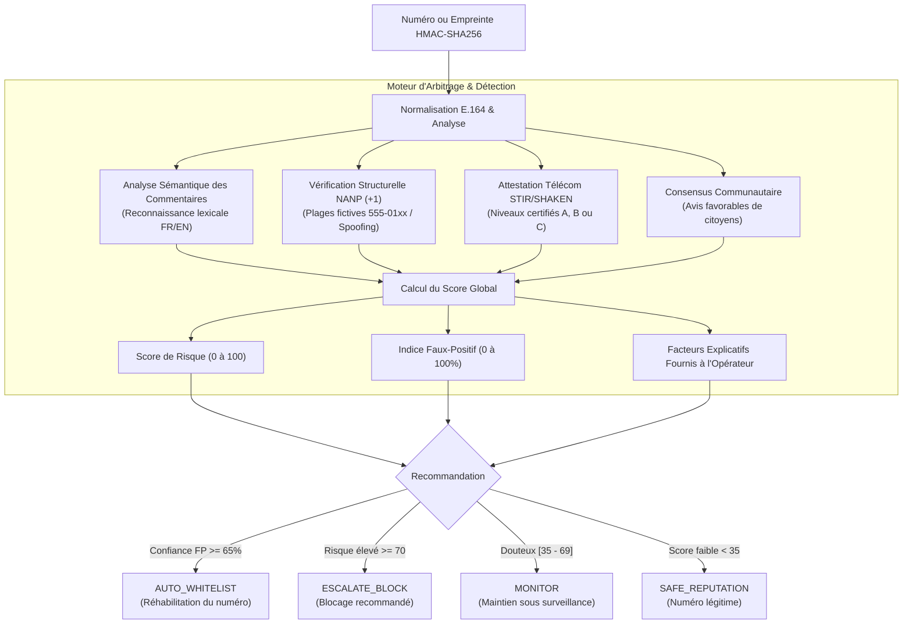

# ShieldNet — Filtrage d'Appels & SMS Indésirables

**Projet de Synthèse en Informatique** — Université du Québec en Outaouais (UQO)  
**Session** : Hiver / Printemps 2026  
**Auteurs** : Équipe étudiante ShieldNet  
**Stack** : Flutter (Android natif) • Django REST Framework • SQLite (WAL) • PostgreSQL • Docker

---

## 1. À propos du projet

Bienvenue sur le dépôt de **ShieldNet**, développé dans le cadre de notre projet de synthèse de fin de baccalauréat à l'**Université du Québec en Outaouais (UQO)**.

Le point de départ de ce projet est simple : la majorité des applications anti-spam commerciales (comme Truecaller ou Hiya) fonctionnent en siphonnant les carnets d'adresses de leurs utilisateurs sur des serveurs distants. Dans le contexte de la **Loi 25 du Québec** et des normes canadiennes de protection de la vie privée, cette approche pose d'évidents problèmes de confidentialité.

Notre objectif avec ShieldNet était de concevoir un système qui filtre les appels et SMS indésirables (démarchage agressif, fraudes bancaires, arnaques au NAS ou fausses alertes Revenu Québec / ARC) **directement sur l'appareil de l'utilisateur**, sans jamais transmettre ses contacts personnels ni stocker de numéros en clair.

Le système cible le plan de numérotation nord-américain (**NANP**, indicatif `+1` pour le Canada et les États-Unis) au format international **E.164**.

### Ce que fait ShieldNet en pratique

* **Interception téléphonique locale (< 2 ms)** : Grâce au composant Android `CallScreeningService`, le téléphone interroge une base SQLite locale configurée en mode WAL (*Write-Ahead Logging*). La décision de bloquer ou de laisser sonner est prise avant le premier coup de sonnerie, même sans connexion Internet.
* **Confidentialité et Loi 25** :
  - Aucun contact du carnet d'adresses n'est extrait ni transmis.
  - Aucun numéro de téléphone en clair n'est stocké dans la base centrale.
  - Les signalements utilisent une empreinte cryptographique **HMAC-SHA256** calculée sur le téléphone avec un sel d'infrastructure.
* **Gestion des faux positifs** : Bloquer les spammeurs est utile, mais bloquer par erreur l'appel d'un hôpital, d'une clinique ou d'un livreur Amazon est inacceptable. Nous avons donc mis en place un module d'arbitrage (analyse lexicale des signalements, prise en compte des attestations STIR/SHAKEN et consensus communautaire pour réhabiliter les numéros légitimes).
* **Console d'administration** : Une interface web sous Django permet à l'équipe de modérer les signalements, de tester des numéros dans un bac à sable (sandbox) et de suivre les métriques du système.

---

## 2. Structure du Dépôt

Voici l'organisation générale des fichiers dans le projet :

```text
Projet synthese/
├── Jenkinsfile                       # Pipeline d'intégration continue (validation des 130 tests et compilation APK)
├── README.md                         # Présentation générale du projet (ce fichier)
├── docker-compose.yml                # Environnement Docker (Django 5, PostgreSQL 16, Redis 7)
├── docker-compose.jenkins.yml        # Serveur Jenkins local conteneurisé
├── test-all.ps1                      # Script pour lancer tous les tests (backend et mobile) d'un coup
├── start-dev.ps1                     # Script de démarrage rapide pour le développement
├── docs/                             # Rapports d'ingénierie détaillés :
│   ├── ARCHITECTURE_ET_CONCEPTION.md # Clean Architecture, diagrammes de classes UML et séquences temporelles
│   ├── DEPLOIEMENT_ET_CI_CD.md       # Guide de déploiement en production, Docker et pipeline Jenkins
│   └── SECURITY_AND_THREAT_MODEL.md  # Modèle de menace STRIDE, analyse d'entropie NANP (+1) et Loi 25
│
├── ShieldNet/                        # Application mobile (Flutter / Dart / Kotlin)
│   ├── .env                          # Configuration locale (URL de l'API, clés de test)
│   ├── android/                      # Module natif Android (CallScreeningService, pont SQLite direct)
│   ├── lib/
│   │   ├── core/                     # Socle technique (SQLite WAL, HMAC-SHA256, client HTTP Dio)
│   │   ├── features/                 # Organisation par domaine métier (Clean Architecture) :
│   │   │   ├── call_filtering/       # Filtrage des appels, historique récent, audit groupé et contestation
│   │   │   ├── settings/             # Paramètres, console d'administration mobile et diagnostic
│   │   │   └── onboarding/           # Écrans d'accueil et explications sur la confidentialité
│   │   └── main.dart                 # Point d'entrée de l'application
│   └── test/                         # 69 tests unitaires et de widgets Flutter
│
└── shieldnet_backend/                # Serveur d'API & Console d'administration (Python / Django)
    ├── Dockerfile                    # Image de production (Python 3.12 slim)
    ├── manage.py                     # Commandes d'administration Django
    ├── requirements.txt              # Dépendances Python (Django 5, DRF, SimpleJWT, psycopg2)
    ├── templates/admin/              # Interface web d'administration
    │   ├── index.html                # Tableau de bord principal, radars NANP et modération
    │   ├── sandbox_dashboard.html    # Simulateur de test de numéros
    │   ├── triage_dashboard.html     # Centre de triage des signalements récents
    │   └── executive_report.html     # Rapport de synthèse imprimable
    ├── shieldnet_backend/            # Configuration générale Django (settings, urls, wsgi)
    └── shield_api/                   # Logique métier et API REST :
        ├── ai_engine.py              # Moteur d'arbitrage sémantique et explicabilité des décisions
        ├── admin_views.py            # Vues personnalisées de modération (Sandbox, Triage, Export CSV)
        ├── models.py                 # Modèles de données (Blacklist, SpamReport, SafeReport, AuditLog)
        ├── services.py               # Services cryptographiques et consensus communautaire
        ├── views.py                  # Endpoints de l'API REST v1
        └── tests.py                  # 61 tests unitaires et de sécurité Django
```

### Dossiers d'Ingénierie Spécialisés

Si vous souhaitez examiner les détails de conception en profondeur, trois dossiers de référence sont centralisés dans [`docs/`](file:///C:/Projet/Projet%20synthese/docs/) :

| Document | Contenu & Thématiques |
|---|---|
| [**Architecture & Conception UML**](file:///C:/Projet/Projet%20synthese/docs/ARCHITECTURE_ET_CONCEPTION.md) | Découpage en couches, diagramme de composants, diagramme de classes UML, respect des principes SOLID et les 4 flux critiques détaillés sous forme de diagrammes de séquence. |
| [**Déploiement & Pipeline CI/CD**](file:///C:/Projet/Projet%20synthese/docs/DEPLOIEMENT_ET_CI_CD.md) | Configuration serveur (Gunicorn, Nginx, PostgreSQL), conteneurisation Docker Compose, pipeline Jenkins en 6 étapes et tolérance aux pannes hors-ligne. |
| [**Sécurité, Modèle de Menace & Loi 25**](file:///C:/Projet/Projet%20synthese/docs/SECURITY_AND_THREAT_MODEL.md) | Modèle de menace STRIDE, analyse d'entropie du plan NANP (+1), justification du compromis temps réel HMAC face à Argon2, et conformité aux exigences de la Loi 25 québécoise. |

---

## 3. Comment fonctionne l'arbitrage des faux positifs ?

Dans un système anti-spam, le plus grand danger n'est pas de laisser passer un appel indésirable de temps en temps, mais de **bloquer un appel important** (secrétariat médical, rappel de rendez-vous d'hôpital, pharmacie, chauffeur de livraison ou banque).

Pour éviter cela, nous avons développé un moteur d'arbitrage dans [`shield_api/ai_engine.py`](file:///C:/Projet/Projet%20synthese/shieldnet_backend/shield_api/ai_engine.py) :


```mermaid
flowchart TD
    A["Numéro ou Empreinte HMAC-SHA256"] --> B["Normalisation E.164 & Analyse"]
    
    subgraph Moteur["Moteur d'Arbitrage & Détection"]
        B --> C["Analyse Sémantique des Commentaires<br/>(Reconnaissance lexicale FR/EN)"]
        B --> D["Vérification Structurelle NANP (+1)<br/>(Plages fictives 555-01xx / Spoofing)"]
        B --> E["Attestation Télécom STIR/SHAKEN<br/>(Niveaux certifiés A, B ou C)"]
        B --> F["Consensus Communautaire<br/>(Avis favorables de citoyens)"]
        
        C & D & E & F --> G["Calcul du Score Global"]
        G --> H["Score de Risque (0 à 100)"]
        G --> I["Indice Faux-Positif (0 à 100%)"]
        G --> J["Facteurs Explicatifs Fournis à l'Opérateur"]
    end
    
    H & I & J --> K{"Recommandation"}
    K -->|"Confiance FP >= 65%"| L["AUTO_WHITELIST<br/>(Réhabilitation du numéro)"]
    K -->|"Risque élevé >= 70"| M["ESCALATE_BLOCK<br/>(Blocage recommandé)"]
    K -->|"Douteux [35 - 69]"| N["MONITOR<br/>(Maintien sous surveillance)"]
    K -->|"Score faible < 35"| O["SAFE_REPUTATION<br/>(Numéro légitime)"]
```

### 1. Analyse du vocabulaire des signalements
Quand des usagers signalent un numéro, ils laissent souvent un court texte. Notre analyseur repère automatiquement deux grandes familles :
* **Services essentiels à protéger** : hôpitaux, cliniques, CLSC, CHSLD, médecins, pharmacies (Jean Coutu, Familiprix), livreurs (Amazon, Postes Canada, FedEx, UPS, UberEats), banques (Desjardins, RBC, TD, BMO, CIBC) ou institutions (Hydro-Québec, UQO, collèges, municipalités).
* **Menaces avérées** : fausses menaces d'arrestation (ARC/CRA, GRC/RCMP, police), demandes de cartes-cadeaux ou de cryptomonnaies, faux remboursements Interac, suspension de numéro d'assurance sociale (NAS/SIN) ou robocalls automatisés.

### 2. Détection du spoofing sur les plages fictives NANP
En Amérique du Nord, les numéros compris entre `+1-xxx-555-0100` et `0199` sont réservés à la fiction et ne sont **jamais assignés à un abonné réel**. Si un appelant affiche ce type de numéro, c'est obligatoirement une usurpation de l'identité de l'appelant (*CLI Spoofing*). Le moteur le détecte immédiatement et lui attribue un score de risque critique.

### 3. Support du protocole STIR/SHAKEN
Le moteur prend en compte le niveau d'attestation transmis par les opérateurs téléphoniques :
* **Attestation A** : L'opérateur certifie l'identité du client et son droit à utiliser le numéro affiché. Le risque est fortement réduit.
* **Attestation B** : Le client est connu de l'opérateur, mais le numéro précis n'est pas validé.
* **Attestation C** : L'appel transite par une passerelle internationale ou VoIP sans aucune authentification d'origine. Le score de risque est alors augmenté.

### 4. Explications claires pour chaque décision
Plutôt qu'un score opaque sans justification, le moteur fournit les raisons concrètes qui ont motivé sa note (par exemple : *« +45% vocabulaire médical détecté »*, *« +30% attestation STIR/SHAKEN niveau A »*, ou *« +35% numéro fictif non attribué »*).

---

## 4. Console Web d'Administration

L'interface web Django a été organisée pour permettre à un administrateur de superviser la plateforme :

1. **Tableau de bord principal** : Indicateurs clés (numéros bloqués, avis favorables, comptes actifs), répartition par indicatifs régionaux canadiens (819/873 Outaouais, 514/438 Montréal, 418/581 Québec, 613/343 Ottawa, 416/647 Toronto) et graphiques de tendances.
2. **Laboratoire Sandbox** : Permet de saisir n'importe quel numéro pour visualiser son hachage HMAC, son format E.164, son analyse sémantique et la recommandation du moteur. Un bouton permet d'appliquer la décision en base en un clic.
3. **Centre de triage en direct** : Liste les derniers signalements avec les pastilles de diagnostic et permet de bloquer ou blanchir un numéro rapidement.
4. **Export CSV protégé** : Neutralisation systématique des formules Excel potentiellement malveillantes (`=`, `+`, `-`, `@`) pour éviter les attaques par injection CSV lors des exports.
5. **Observabilité** : Un endpoint compatible Prometheus (`/api/v1/metrics/`) expose l'état du système et de la base de données.

---

## 5. Fonctionnalités de l'Application Mobile

L'application Flutter apporte plusieurs outils pour le quotidien de l'utilisateur :

* **Filtrage automatique** : Bloque les appels malveillants avant sonnerie grâce au service Android `CallScreeningService`.
* **Audit de l'historique récent (Scan rapide)** : Permet en un clic d'analyser les 50 derniers appels du journal téléphonique via l'endpoint de vérification groupée (*batch check*).
* **Fiche et contestation de faux positifs** : En touchant un numéro bloqué, l'utilisateur peut consulter sa fiche et soumettre une contestation citoyenne (service de santé, livraison, proche, erreur) pour déclencher sa réhabilitation.
* **Immunité des urgences** : Les numéros d'urgence (911, 811, 988) et les contacts favoris définis par l'utilisateur ne sont jamais bloqués.
* **Mode « Contacts uniquement »** : Idéal pour les personnes vulnérables recevant beaucoup de démarchage, ce mode filtre automatiquement tous les numéros absents du répertoire.
* **Bouclier nocturne** : Permet de définir une plage horaire pour filtrer silencieusement les appels durant la nuit.
* **Inspecteur de SMS** : Analyse le texte d'un SMS suspect copié dans le presse-papier pour repérer les faux liens bancaires et les messages de livraison frauduleux, 100% hors-ligne.
* **Console d'administration mobile** : Pour les comptes avec statut `is_staff`, une console intégrée à 5 onglets permet de modérer la base directement depuis le téléphone.

---

## 6. Sécurité & Choix Techniques

### Pourquoi HMAC-SHA256 au lieu d'Argon2 sur mobile ?

Le plan de numérotation nord-américain (+1) comprend environ 780 millions de numéros possibles, ce qui correspond à une entropie de base d'environ 30 bits. Face à une carte graphique moderne, un simple hash SHA-256 sans sel peut être inversé très rapidement.

Pour protéger la vie privée, nous appliquons un **HMAC-SHA256** avec un sel secret d'infrastructure. Pourquoi ne pas avoir choisi une fonction à coût mémoire élevé comme **Argon2id** ?

> **La contrainte du temps réel sur Android :**  
> Quand un appel arrive, le composant système `CallScreeningService` donne à l'application un délai très court (moins de 100 à 200 millisecondes) pour répondre. Si l'application tarde, Android abandonne le filtrage et fait sonner le téléphone.  
> * **HMAC-SHA256** s'exécute en **0.15 ms** sur mobile, permettant une décision totale en moins de 2 ms avec SQLite.  
> * **Argon2id** prendrait entre **350 et 800 ms** sur un téléphone d'entrée de gamme, ce qui provoquerait un échec systématique du filtrage.

Pour l'analyse théorique complète, les calculs d'entropie et la formule combinatoire, consultez [**docs/SECURITY_AND_THREAT_MODEL.md**](file:///C:/Projet/Projet%20synthese/docs/SECURITY_AND_THREAT_MODEL.md).

### Durcissement de l'application

* **Comparaison à temps constant (`hmac.compare_digest`)** sur les clés d'API pour empêcher les attaques par canal auxiliaire (*timing attacks*, CWE-208).
* **Protection anti-usurpation OAuth** : Les comptes ayant des privilèges administrateur (`is_staff` / `is_superuser`) ne peuvent pas être connectés via un simple compte Google tiers.
* **Messages d'erreur uniformisés** à l'authentification pour éviter l'énumération des comptes existants.
* **Taille des charges utiles bornée** (commentaires limités à 1000 caractères, numéros à 32 caractères) pour éviter les abus de mémoire.
* **Expressions régulières sans chevauchement** pour l'analyse des SMS (protection contre le déni de service ReDoS).

---

## 7. Guide d'Installation & Démarrage

### Prérequis

* **Python** 3.10 ou supérieur (testé avec Python 3.12)
* **Flutter SDK** 3.27 ou supérieur
* **Android SDK** API 29+ (Android 10+) pour le composant `CallScreeningService`

---

### Démarrer le Backend (Django)

Dans le dossier `shieldnet_backend/` :

```bash
# 1. Créer et activer l'environnement virtuel
python -m venv venv

# Windows :
venv\Scripts\activate
# Linux / macOS :
source venv/bin/activate

# 2. Installer les dépendances
pip install -r requirements.txt

# 3. Appliquer les migrations de base de données
python manage.py migrate

# 4. Lancer les tests unitaires (61 tests)
python manage.py test shield_api

# 5. Créer le compte administrateur initial
python manage.py ensure_admin

# 6. Démarrer le serveur local
python manage.py runserver 0.0.0.0:8000
```

* **Console d'administration** : [http://127.0.0.1:8000/admin/](http://127.0.0.1:8000/admin/)  
  *Courriel* : `admin@shieldnet.app` | *Mot de passe* : `admin123`
* **Documentation OpenAPI / Swagger** : [http://127.0.0.1:8000/api/v1/docs/](http://127.0.0.1:8000/api/v1/docs/)

#### Déploiement avec Docker Compose
Si vous préférez lancer toute l'infrastructure (API Django, PostgreSQL 16 et Redis) en conteneurs :
```bash
docker compose up -d --build
```

---

### Démarrer l'Application Mobile (Flutter)

Dans le dossier `ShieldNet/` :

```bash
# 1. Récupérer les paquets Dart
flutter pub get

# 2. Lancer les tests unitaires et de widgets (69 tests)
flutter test

# 3. Vérifier le code avec l'analyseur
flutter analyze

# 4. Lancer sur votre émulateur ou téléphone
flutter run
```

---

## 8. Assurance Qualité & Tests Automatisés (130 Tests, 100% Réussite)

La fiabilité du projet est vérifiée par une suite de **130 tests automatisés** qui couvrent les cas limites et préviennent les régressions :

### Tests Backend Django (61 tests)
* **Moteur d'arbitrage et détection** : validation lexicale des services légitimes et des menaces, détection des numéros fictifs 555-01xx, réhabilitation de cliniques et gestion des attestations STIR/SHAKEN.
* **Vérification groupée et métriques** : vérification par lot de 1 à 100 numéros (`POST /api/v1/check/batch/`) et conformité du format OpenMetrics pour Prometheus (`GET /api/v1/metrics/`).
* **Algorithme de score et consensus** : calcul du score progressif, quorum minimum pour réhabiliter un numéro, rejet des votes multiples par un même utilisateur et révocation en cas d'attaque réelle.
* **Sécurité & conformité OWASP** : comparaison `compare_digest` à temps constant, assainissement des cellules CSV, blocage OAuth sur les comptes staff, uniformisation des retours de connexion et validation stricte du format hexadécimal SHA-256.
* **Console d'administration et synchronisation** : bon chargement du tableau de bord de triage, filtres de dates sur les synchronisations différentielles (*Delta sync*) et validation du CSS.

### Tests Frontend Flutter (69 tests)
* **Réseau et synchronisation** : synchronisation complète et différentielle avec SQLite, signalement de spam et vérification groupée d'appels récents avec gestion des pannes réseau.
* **Cryptographie et filtrage** : déterminisme du hachage HMAC-SHA256, normalisation E.164, détection des indicatifs surtaxés (1-900) et masquage visuel des numéros.
* **Ergonomie et responsive** : formulaire d'authentification testé sans débordement sur petits écrans (320 px de large) et bascule de visibilité du mot de passe.
* **Fonctions de protection** : immunité de la liste blanche d'urgence (911, 811, 988), mode strict contacts uniquement, bouclier nocturne et détecteur de phishing SMS durci contre le ReDoS.

---

## 9. Mentions Académiques

* **Projet** : Projet de Synthèse en Informatique
* **Établissement** : Université du Québec en Outaouais (UQO)
* **Département** : Département d'informatique et d'ingénierie
* **Localisation** : Gatineau (Québec), Canada
* **Année** : 2026
