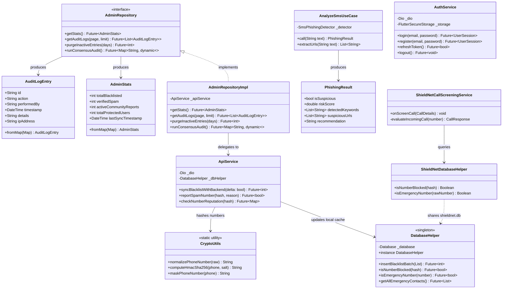

# 🏛️ Architecture Logicielle & Spécification UML — ShieldNet

Ce document constitue la **spécification architecturale officielle** du système **ShieldNet**, conçu dans le cadre du projet de synthèse (Génie Logiciel & Cybersécurité). Il détaille l'organisation des couches logicielles, les diagrammes de composants et le modèle de classes UML conforme aux principes **SOLID** et **Clean Architecture**.

---

## 1. Vue d'Ensemble des Couches (Clean Architecture)

Le système ShieldNet applique une séparation stricte des responsabilités selon le patron *Clean Architecture* (Uncle Bob) adapté à Flutter et aux modules natifs Android :

```mermaid
graph TD
    subgraph Presentation_Layer ["Couche Présentation (lib/features/*/presentation)"]
        UI_Pages["Pages (Dashboard, Settings, SmsInspector, AdminConsole)"]
        UI_Widgets["Widgets Modulaires (ZenShieldCard, ActionHub, Tabs)"]
        Controllers["Contrôleurs d'État / Notifiers (Riverpod)"]
    end

    subgraph Domain_Layer ["Couche Domaine (lib/features/*/domain) - Pure Dart"]
        UseCases["Use Cases (AnalyzeSmsUseCase, CheckNumberUseCase)"]
        Entities["Entités Métier (AdminStats, AuditLogEntry, PhishingResult)"]
        RepoInterfaces["Interfaces Abstraites (AdminRepository)"]
    end

    subgraph Data_Layer ["Couche Données (lib/features/*/data)"]
        RepoImpl["Implémentations Référentielles (AdminRepositoryImpl)"]
        DataSources["Sources de Données (ApiService, DatabaseHelper)"]
        DTOs["Modèles de Transfert de Données (BlacklistedNumber)"]
    end

    subgraph Core_Layer ["Socle Transverse (lib/core)"]
        Crypto["Sécurité (CryptoUtils HMAC-SHA256)"]
        Network["Réseau (Dio, ApiClient, AuthInterceptor)"]
        Database["Base SQLite Locale (DatabaseHelper)"]
        Services["Services d'Arrière-Plan (BackgroundSyncService)"]
    end

    subgraph Native_Android ["Module Natif Android (android/app/src/main/kotlin)"]
        CallScreening["ShieldNetCallScreeningService (Telecom OS < 2ms)"]
        NativeDB["ShieldNetDatabaseHelper (SQLite Partagé)"]
    end

    subgraph Backend_Django ["Serveur Cloud Sécurisé (Django REST Framework)"]
        DjangoAPI["Endpoints REST (/api/v1/blacklist, /check, /auth)"]
        DjangoDB["PostgreSQL / SQLite (Modération, Consensus, AuditLog)"]
    end

    UI_Widgets --> UI_Pages
    UI_Pages --> Controllers
    Controllers --> UseCases
    UseCases --> RepoInterfaces
    UseCases --> Entities
    RepoImpl ..|> RepoInterfaces
    RepoImpl --> DataSources
    DataSources --> Core_Layer
    Core_Layer -. Partage SQLite .-> Native_Android
    DataSources -. HTTPS + HMAC .-> Backend_Django
```

---

## 2. Diagramme de Composants Système

Le découpage matériel et logique garantit que l'interception téléphonique critique s'exécute à 100% hors-ligne et en temps réel sans jamais bloquer l'interface utilisateur Flutter.

```mermaid
componentDiagram
    package "Périphérique Mobile Android" {
        [Android Telecom Framework] as Telecom
        component "Moteur Natif Kotlin" {
            [ShieldNetCallScreeningService] as ScreenService
            [Native SQLite Helper] as NativeDB
        }
        database "SQLite Database (shieldnet.db)" as LocalDB
        
        component "Application Flutter" {
            [Riverpod State Management] as StateMgr
            [Dashboard & UI Views] as UI
            [Crypto Engine (HMAC-SHA256)] as CryptoEngine
            [BackgroundSyncService] as SyncMgr
        }
    }

    package "Serveur Central ShieldNet" {
        component "Django REST Backend" {
            [Authentication & JWT] as AuthAPI
            [Blacklist Delta Engine] as DeltaAPI
            [Community Consensus Engine] as ConsensusAPI
            [Audit Trail Manager] as AuditAPI
        }
        database "Base Centrale (PostgreSQL)" as CentralDB
    }

    Telecom --> ScreenService : Incomming Call Intent
    ScreenService --> NativeDB : Query Hash (< 2ms)
    NativeDB --> LocalDB : Read Index
    LocalDB <-- DatabaseHelper : Write/Sync (Dart)
    
    UI --> StateMgr : User Action
    StateMgr --> CryptoEngine : Hash Number
    SyncMgr --> DeltaAPI : GET /blacklist/?since=t (Background)
    DeltaAPI --> CentralDB : Query Updates
    ConsensusAPI --> CentralDB : Update Reputation
    AuditAPI --> CentralDB : Immutable Logging
```

---

## 3. Diagramme de Classes UML (Modèle Métier & Architecture)

Ce diagramme décrit les relations d'héritage, d'implémentation et de dépendance entre les principaux éléments du domaine et de l'infrastructure :



---

## 4. Justification des Choix Architecturaux (SOLID & Cybersécurité)

| Principe | Application Concrète dans ShieldNet |
|---|---|
| **Single Responsibility (SRP)** | Découpage des écrans monolithiques en composants autonomes (`ZenShieldCard`, `ActionHubRow`, `AdminAuditTab`) et des Use Cases unitaires (`AnalyzeSmsUseCase`). |
| **Open/Closed (OCP)** | Système de règles d'interception modulaire : l'ajout d'une règle (ex: filtrage basé sur l'IA locale ou whitelist contacts) se fait sans modifier le coeur de la base de données. |
| **Liskov Substitution (LSP)** | L'interface `AdminRepository` peut être substituée par une implémentation mock (`MockAdminRepository`) dans les tests automatisés sans briser aucun composant UI. |
| **Interface Segregation (ISP)** | Séparation des interfaces de gestion : `AdminRepository` ne contient aucune méthode d'authentification ou d'inspection SMS. |
| **Dependency Inversion (DIP)** | Les StateNotifiers et Use Cases dépendent des abstractions (`AdminRepository`), injectées via les providers Riverpod. |
| **Privacy by Design** | Le hachage cryptographique **HMAC-SHA256** est appliqué avant toute sortie du terminal mobile ; aucune métadonnée personnelle (numéro de téléphone, nom) n'est jamais stockée ou transmise en clair. |
