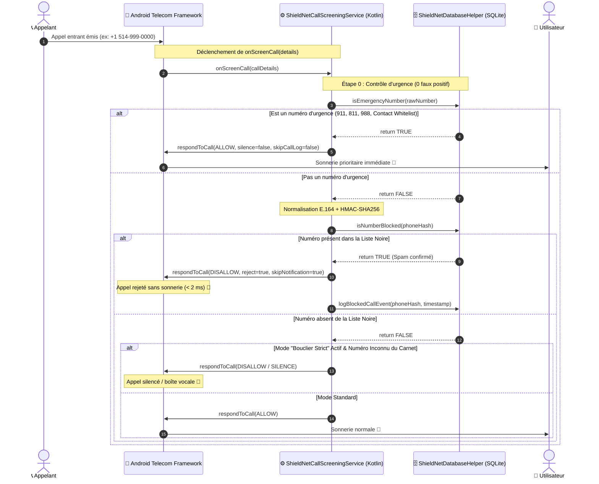
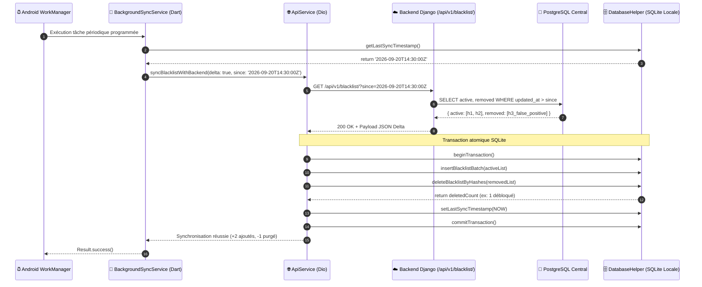
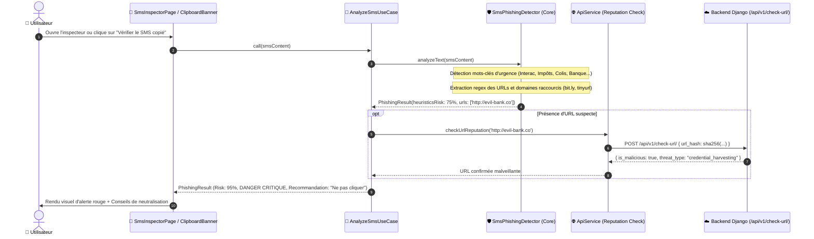
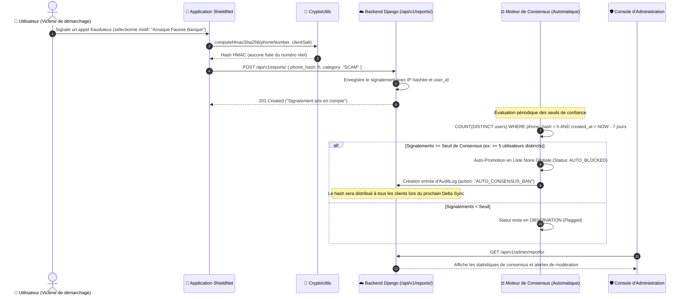

# ⏱️ Diagrammes de Séquence des Flux Critiques — ShieldNet

Ce document détaille les flux temporels et décisionnels des 4 processus critiques du système **ShieldNet**. Chaque diagramme illustre les interactions chronologiques entre l'utilisateur, l'OS Android, le runtime Flutter, le module natif Kotlin et le backend central Django.

---

## Scénario 1 : Interception d'Appel Entrant en Temps Réel (< 2 ms)

Ce flux représente l'exigence de performance la plus stricte du projet : évaluer l'appel et répondre à l'OS Android avant le premier son de sonnerie, avec la garantie absolue de ne jamais bloquer une urgence.

---

## Scénario 2 : Synchronisation Différentielle (Delta Sync) & Purge Locale

Ce flux illustre la synchronisation d'arrière-plan périodique pilotée par `Workmanager` et `BackgroundSyncService`. Il démontre l'optimisation réseau (téléchargement uniquement des deltas temporels) et la purge automatique des faux-positifs débloqués par les administrateurs.

---

## Scénario 3 : Analyse & Détection de Phishing SMS (Inspecteur SMS)

Ce flux décrit le traitement sécurisé et asynchrone d'un SMS copié par l'utilisateur ou détecté dans le presse-papier, implémentant le use case `AnalyzeSmsUseCase`.

---

## Scénario 4 : Signalement Collaboratif & Algorithme de Consensus Anti-Fraude

Ce flux détaille la modération communautaire décentralisée : comment un numéro suspect signalé par plusieurs utilisateurs indépendants est automatiquement promu en liste noire globale par consensus sans risque de manipulation par un acteur malveillant unique.

