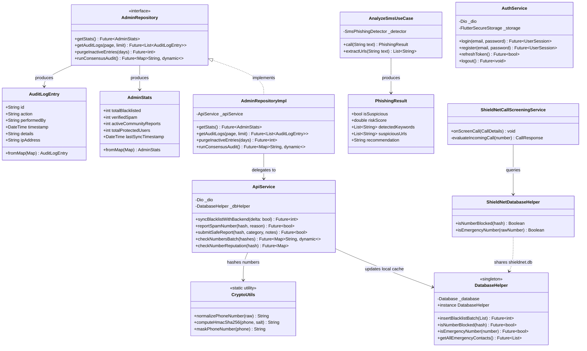
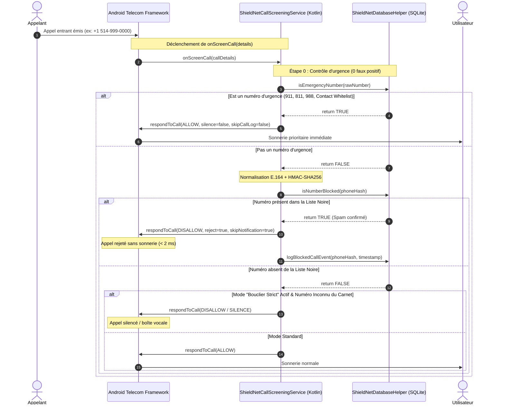
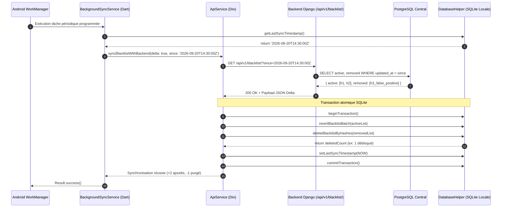
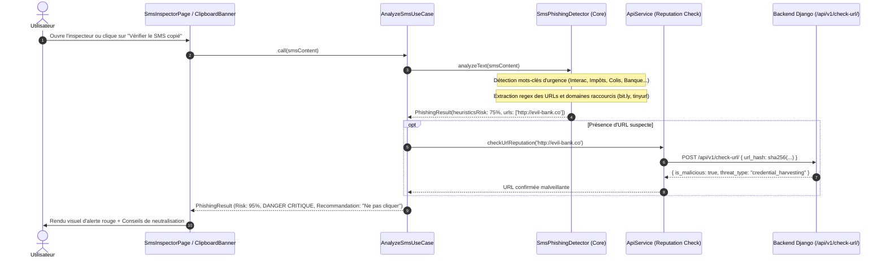
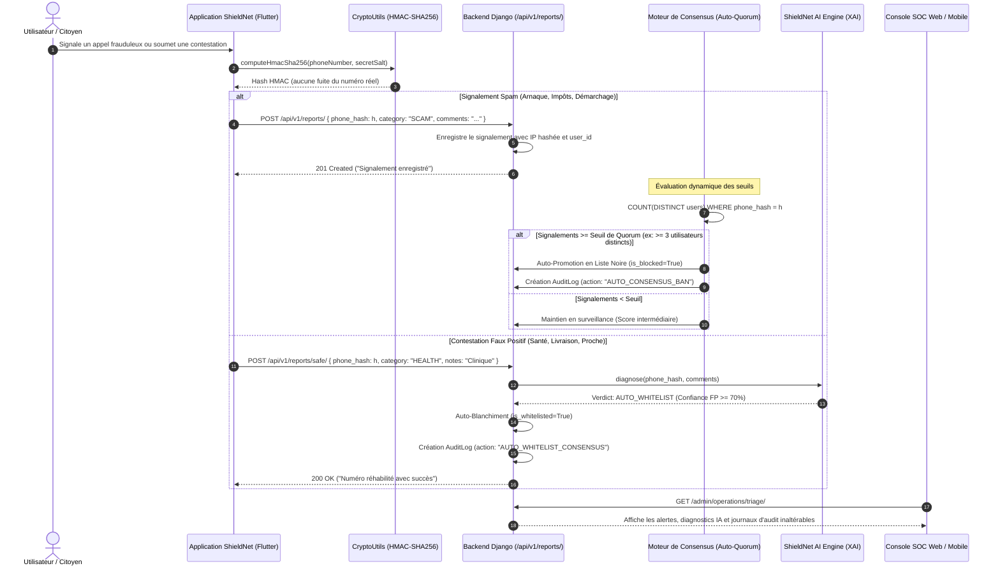

# Architecture Logicielle, Spécification UML & Flux Critiques — ShieldNet

> **Document de Référence Technique & Académique**  
> **Projet de Synthèse en Informatique** — Université du Québec en Outaouais (UQO)  
> **Composant** : Spécification d'Architecture, Modélisation UML & Diagrammes de Séquence  
> **Auteur** : Équipe ShieldNet  
> **Date** : 2026

---

## 1. Vue d'Ensemble des Couches (Clean Architecture)

Le système **ShieldNet** applique une séparation stricte des responsabilités selon le patron architectural **Clean Architecture** (Robert C. Martin / Uncle Bob), adapté à la fois au client Flutter/Dart, aux modules natifs Android (Kotlin) et au backend sécurisé Django REST Framework :

```mermaid
graph TD
    subgraph Presentation_Layer ["Couche Présentation (lib/features/*/presentation)"]
        UI_Pages["Pages (Dashboard, Settings, SmsInspector, AdminConsole)"]
        UI_Widgets["Widgets Modulaires (ZenShieldCard, ActionHub, Tabs)"]
        Controllers["Contrôleurs d'État / Notifiers (Riverpod)"]
    end

    subgraph Domain_Layer ["Couche Domaine (lib/features/*/domain) - Pure Dart"]
        UseCases["Use Cases (AnalyzeSmsUseCase, CheckNumberUseCase)"]
        Entities["Entités Métier (AdminStats, AuditLogEntry, PhishingResult)"]
        RepoInterfaces["Interfaces Abstraites (AdminRepository)"]
    end

    subgraph Data_Layer ["Couche Données (lib/features/*/data)"]
        RepoImpl["Implémentations Référentielles (AdminRepositoryImpl)"]
        DataSources["Sources de Données (ApiService, DatabaseHelper)"]
        DTOs["Modèles de Transfert de Données (BlacklistedNumber)"]
    end

    subgraph Core_Layer ["Socle Transverse (lib/core)"]
        Crypto["Sécurité (CryptoUtils HMAC-SHA256)"]
        Network["Réseau (Dio, ApiClient, AuthInterceptor)"]
        Database["Base SQLite Locale (DatabaseHelper)"]
        Services["Services d'Arrière-Plan (BackgroundSyncService)"]
    end

    subgraph Native_Android ["Module Natif Android (android/app/src/main/kotlin)"]
        CallScreening["ShieldNetCallScreeningService (Telecom OS < 2ms)"]
        NativeDB["ShieldNetDatabaseHelper (SQLite Partagé)"]
    end

    subgraph Backend_Django ["Serveur Cloud Sécurisé (Django REST Framework)"]
        DjangoAPI["Endpoints REST (/api/v1/blacklist, /check, /auth)"]
        DjangoDB["PostgreSQL / SQLite (Modération, Consensus, AuditLog)"]
    end

    UI_Widgets --> UI_Pages
    UI_Pages --> Controllers
    Controllers --> UseCases
    UseCases --> RepoInterfaces
    UseCases --> Entities
    RepoImpl ..|> RepoInterfaces
    RepoImpl --> DataSources
    DataSources --> Core_Layer
    Core_Layer -. Partage SQLite .-> Native_Android
    DataSources -. HTTPS + HMAC .-> Backend_Django
```

---

## 2. Diagramme de Composants Système

Le découpage matériel et logique garantit que l'interception téléphonique critique s'exécute à **100% hors-ligne et en temps réel (< 2 ms)** sans jamais bloquer le fil d'exécution de l'interface utilisateur Flutter.

```mermaid
componentDiagram
    package "Périphérique Mobile Android" {
        [Android Telecom Framework] as Telecom
        component "Moteur Natif Kotlin" {
            [ShieldNetCallScreeningService] as ScreenService
            [Native SQLite Helper] as NativeDB
        }
        database "SQLite Database (shieldnet.db)" as LocalDB
        
        component "Application Flutter" {
            [Riverpod State Management] as StateMgr
            [Dashboard & UI Views] as UI
            [Crypto Engine (HMAC-SHA256)] as CryptoEngine
            [BackgroundSyncService] as SyncMgr
        }
    }

    package "Serveur Central ShieldNet" {
        component "Django REST Backend" {
            [Authentication & JWT] as AuthAPI
            [Blacklist Delta Engine] as DeltaAPI
            [Community Consensus Engine] as ConsensusAPI
            [Audit Trail Manager] as AuditAPI
            [ShieldNet AI Engine / XAI] as AIEngine
        }
        database "Base Centrale (PostgreSQL)" as CentralDB
    }

    Telecom --> ScreenService : Incoming Call Intent
    ScreenService --> NativeDB : Query Hash (< 2ms)
    NativeDB --> LocalDB : Read Index (WAL mode)
    LocalDB <-- DatabaseHelper : Write/Sync (Dart)
    
    UI --> StateMgr : User Action
    StateMgr --> CryptoEngine : Hash Number
    SyncMgr --> DeltaAPI : GET /blacklist/?since=t (Background)
    DeltaAPI --> CentralDB : Query Updates
    ConsensusAPI --> CentralDB : Update Reputation
    AuditAPI --> CentralDB : Immutable Logging
    AIEngine --> CentralDB : Explainable Diagnostics
```

---

## 3. Diagramme de Classes UML (Modèle Métier & Architecture)

Ce diagramme décrit les relations d'héritage, d'implémentation et de dépendance entre les principaux éléments du domaine, des données et de l'infrastructure :



---

## 4. Justification des Choix Architecturaux (SOLID & Cybersécurité)

| Principe | Application Concrète dans ShieldNet |
|---|---|
| **Single Responsibility (SRP)** | Découpage des écrans monolithiques en composants autonomes (`ZenShieldCard`, `ActionHubRow`, `AdminAuditTab`) et des Use Cases unitaires (`AnalyzeSmsUseCase`). |
| **Open/Closed (OCP)** | Système de règles d'interception modulaire : l'ajout d'une règle (ex: filtrage IA local, détection STIR/SHAKEN ou whitelist contacts) se fait sans modifier le cœur de la base de données. |
| **Liskov Substitution (LSP)** | L'interface `AdminRepository` peut être substituée par une implémentation mock (`MockAdminRepository`) dans les tests automatisés sans modifier aucun composant UI. |
| **Interface Segregation (ISP)** | Séparation des interfaces de gestion : `AdminRepository` ne contient aucune méthode d'authentification ou d'inspection SMS. |
| **Dependency Inversion (DIP)** | Les StateNotifiers et Use Cases dépendent des abstractions (`AdminRepository`), injectées via les providers Riverpod. |
| **Privacy by Design** | Le hachage cryptographique **HMAC-SHA256** est appliqué avant toute sortie du terminal mobile ; aucune métadonnée personnelle (numéro de téléphone, nom) n'est jamais stockée ou transmise en clair. |

---

## 5. Diagrammes de Séquence des Flux Critiques

### Scénario 1 : Interception d'Appel Entrant en Temps Réel (< 2 ms)

Ce flux représente l'exigence de performance la plus stricte du projet : évaluer l'appel et répondre à l'OS Android avant le premier son de sonnerie, avec la garantie absolue de ne jamais bloquer une urgence.



---

### Scénario 2 : Synchronisation Différentielle (Delta Sync) & Purge Locale

Ce flux illustre la synchronisation d'arrière-plan périodique pilotée par `Workmanager` et `BackgroundSyncService`. Il démontre l'optimisation réseau (téléchargement uniquement des deltas temporels) et la purge automatique des faux-positifs débloqués par les administrateurs.



---

### Scénario 3 : Analyse & Détection de Phishing SMS (Inspecteur SMS)

Ce flux décrit le traitement sécurisé et asynchrone d'un SMS copié par l'utilisateur ou détecté dans le presse-papier, implémentant le use case `AnalyzeSmsUseCase`.



---

### Scénario 4 : Signalement Collaboratif, Modération & Consensus Anti-Fraude

Ce flux détaille la modération communautaire décentralisée : comment un numéro suspect signalé par plusieurs utilisateurs indépendants est automatiquement promu en liste noire globale par consensus sans risque de manipulation par un acteur malveillant unique, et comment les contestations citoyennes permettent de réhabiliter les services légitimes.


