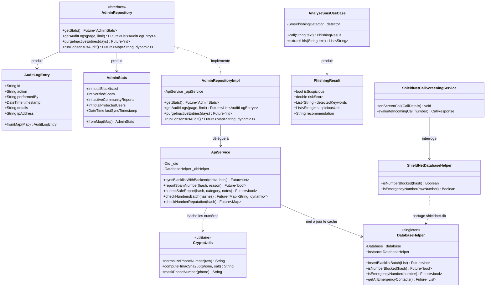
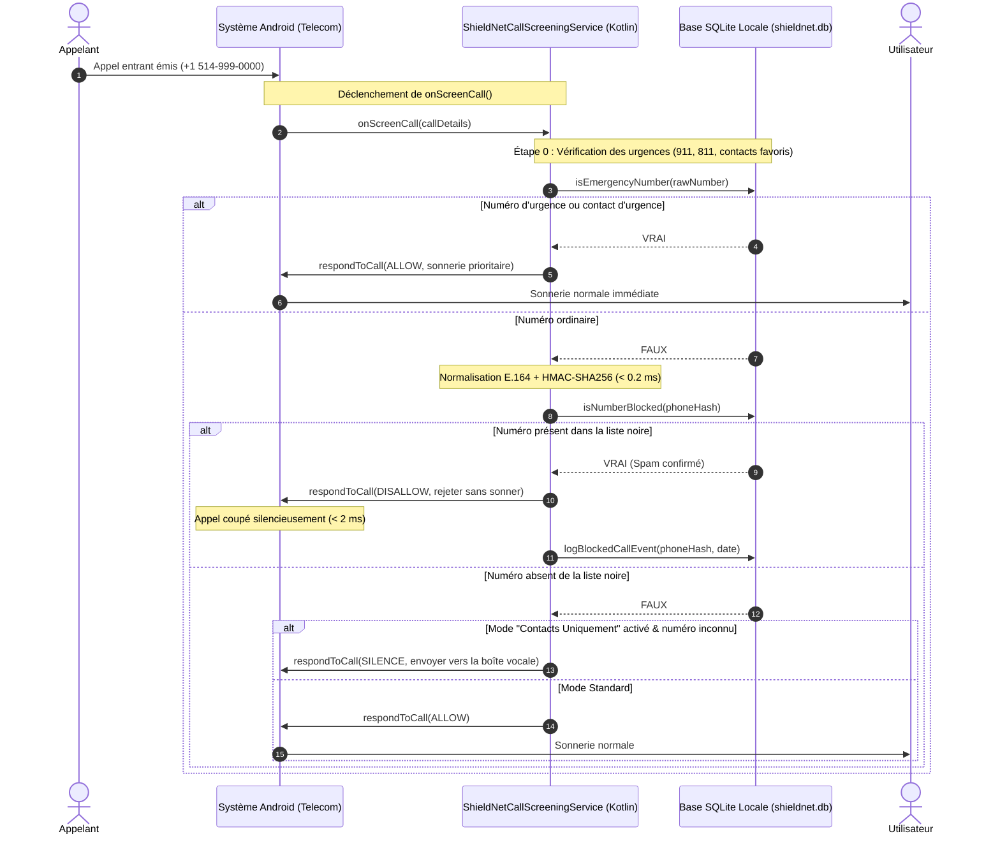
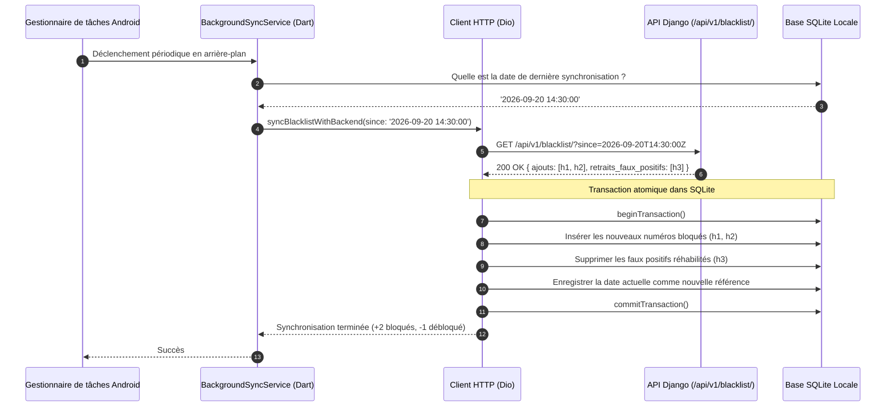
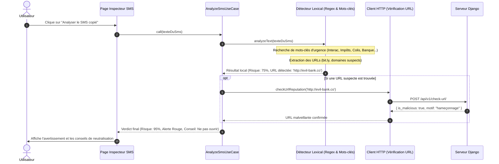

# Architecture Logicielle, Modélisation UML & Flux Critiques — ShieldNet

**Projet de Synthèse en Informatique** — Université du Québec en Outaouais (UQO)  
**Équipe** : Projet ShieldNet  
**Session** : 2026  

---

## 1. Pourquoi cette architecture ? (Clean Architecture)

L'un des défis majeurs de ShieldNet était de faire communiquer harmonieusement trois environnements techniques distincts :
1. Une interface utilisateur réactive en **Flutter (Dart)**.
2. Un service natif **Android (Kotlin)** qui s'exécute au niveau du système d'exploitation pour intercepter les appels en moins de 2 millisecondes.
3. Une API serveur sécurisée en **Django REST Framework** pour la centralisation des signalements et la résolution des faux positifs.

Pour éviter que ces différentes parties ne s'emmêlent, nous avons adopté les principes de la **Clean Architecture** (Robert C. Martin). L'idée est simple : la logique métier ne doit jamais dépendre directement des détails techniques (que ce soit la base SQLite, le réseau HTTP Dio ou le framework Android).

```mermaid
graph TD
    subgraph Presentation_Layer ["Couche Présentation (lib/features/*/presentation)"]
        UI_Pages["Pages (Dashboard, Settings, SmsInspector, AdminConsole)"]
        UI_Widgets["Widgets Réutilisables (Cartes, Boutons, Onglets)"]
        Controllers["Gestion d'état (Riverpod Notifiers)"]
    end

    subgraph Domain_Layer ["Couche Domaine (lib/features/*/domain) - Purement Dart"]
        UseCases["Cas d'Utilisation (AnalyzeSmsUseCase, CheckNumberUseCase)"]
        Entities["Entités Métier (AdminStats, AuditLogEntry, PhishingResult)"]
        RepoInterfaces["Contrats d'Interfaces (AdminRepository, BlacklistRepository)"]
    end

    subgraph Data_Layer ["Couche Données (lib/features/*/data)"]
        RepoImpl["Implémentations (AdminRepositoryImpl)"]
        DataSources["Sources de Données (ApiService, DatabaseHelper)"]
        DTOs["Modèles de Données (BlacklistedNumber)"]
    end

    subgraph Core_Layer ["Socle Commun (lib/core)"]
        Crypto["Cryptographie (HMAC-SHA256, masquage de numéros)"]
        Network["Client HTTP (Dio, intercepteurs de sécurité)"]
        Database["Gestionnaire SQLite (DatabaseHelper en mode WAL)"]
        Services["Services d'Arrière-Plan (BackgroundSyncService)"]
    end

    subgraph Native_Android ["Module Natif Android (android/app/src/main/kotlin)"]
        CallScreening["ShieldNetCallScreeningService (Interception Telecom)"]
        NativeDB["ShieldNetDatabaseHelper (Lecture SQLite directe)"]
    end

    subgraph Backend_Django ["Serveur Backend (Django REST Framework)"]
        DjangoAPI["API REST (/api/v1/blacklist, /check, /reports)"]
        DjangoDB["Base de Données (PostgreSQL / SQLite)"]
    end

    UI_Widgets --> UI_Pages
    UI_Pages --> Controllers
    Controllers --> UseCases
    UseCases --> RepoInterfaces
    UseCases --> Entities
    RepoImpl ..|> RepoInterfaces
    RepoImpl --> DataSources
    DataSources --> Core_Layer
    Core_Layer -. Partage SQLite .-> Native_Android
    DataSources -. HTTPS + HMAC .-> Backend_Django
```

Grâce à cette séparation :
* Si nous voulons changer la bibliothèque HTTP ou la base de données, les cas d'utilisation métier ne changent pas d'une seule ligne.
* Pour les tests unitaires, nous pouvons remplacer n'importe quel dépôt par un faux (*mock*) sans jamais avoir besoin d'allumer le serveur backend.

---

## 2. Diagramme de Composants

Le diagramme ci-dessous illustre comment le téléphone et le serveur interagissent. La contrainte la plus importante était de garantir que le téléphone puisse filtrer les appels même s'il est en mode avion ou dans une zone sans réseau :

```mermaid
componentDiagram
    package "Téléphone Android de l'Utilisateur" {
        [Android Telecom Framework] as Telecom
        component "Service Natif Kotlin" {
            [ShieldNetCallScreeningService] as ScreenService
            [Pont SQLite Natif] as NativeDB
        }
        database "Base Locale (shieldnet.db en mode WAL)" as LocalDB
        
        component "Application Flutter" {
            [Gestionnaire d'État Riverpod] as StateMgr
            [Interface Utilisateur] as UI
            [Module Cryptographique HMAC] as CryptoEngine
            [Synchronisation d'Arrière-Plan] as SyncMgr
        }
    }

    package "Serveur Central ShieldNet" {
        component "API Django REST" {
            [Authentification JWT] as AuthAPI
            [Moteur de Synchronisation Delta] as DeltaAPI
            [Moteur de Consensus Communautaire] as ConsensusAPI
            [Journal d'Audit Immuable] as AuditAPI
            [Moteur d'Arbitrage & Explicabilité] as AIEngine
        }
        database "Base de Données Centrale" as CentralDB
    }

    Telecom --> ScreenService : Appel entrant détecté
    ScreenService --> NativeDB : Vérification du hash (< 2 ms)
    NativeDB --> LocalDB : Lecture de l'index B-Tree
    LocalDB <-- StateMgr : Mise à jour des règles (Dart)
    
    UI --> StateMgr : Action de l'utilisateur
    StateMgr --> CryptoEngine : Hachage du numéro
    SyncMgr --> DeltaAPI : GET /blacklist/?since=t (tâche périodique)
    DeltaAPI --> CentralDB : Lecture des nouveautés
    ConsensusAPI --> CentralDB : Réhabilitation des faux positifs
    AuditAPI --> CentralDB : Traçabilité des décisions
    AIEngine --> CentralDB : Diagnostics argumentés
```

---

## 3. Diagramme de Classes UML

Voici les classes principales qui structurent le client mobile et leurs relations :



---

## 4. Application Concrète des Principes SOLID

Dans le cadre du cours de génie logiciel, nous avons tenu à appliquer rigoureusement les principes **SOLID** :

| Principe | Comment nous l'avons appliqué dans ShieldNet |
|---|---|
| **Responsabilité Unique (SRP)** | Chaque classe a un seul rôle. Par exemple, `CryptoUtils` ne s'occupe que de hacher et normaliser, tandis que `AnalyzeSmsUseCase` s'occupe uniquement d'analyser le texte des SMS sans se soucier de l'interface graphique. |
| **Ouvert / Fermé (OCP)** | Le système de filtrage est ouvert aux extensions : pour ajouter une nouvelle règle de filtrage (ex: vérification STIR/SHAKEN ou liste blanche d'urgence), nous n'avons pas besoin de modifier la logique de la base de données. |
| **Substitution de Liskov (LSP)** | L'interface abstraite `AdminRepository` peut être remplacée par `MockAdminRepository` dans nos tests unitaires sans qu'aucun widget d'affichage ne se rende compte de la différence. |
| **Ségrégation des Interfaces (ISP)** | Nous avons évité les interfaces « fourre-tout ». L'interface d'administration est séparée de celle de gestion des SMS ou de l'authentification. |
| **Inversion des Dépendances (DIP)** | Les contrôleurs d'affichage ne dépendent jamais directement de l'implémentation SQLite ou réseau. Ils dépendent uniquement d'abstractions injectées via les *providers* Riverpod. |

---

## 5. Les 4 Flux Critiques du Système

Voici le déroulement chronologique des quatre opérations clés de ShieldNet :

### Scénario 1 : Interception d'un appel entrant en moins de 2 ms

C'est l'exigence de performance la plus stricte du projet : nous devons décider quoi faire de l'appel avant que le téléphone ne sonne, tout en ayant l'assurance absolue de ne **jamais bloquer un appel d'urgence** :



---

### Scénario 2 : Synchronisation incrémentale (Delta Sync)

Pour ne pas surcharger la connexion mobile de l'utilisateur, l'application ne télécharge pas l'intégralité de la base à chaque fois. Elle demande uniquement les modifications survenues depuis son dernier passage :



---

### Scénario 3 : Analyse d'un SMS suspect dans l'Inspecteur

Ce flux décrit ce qui se passe quand l'utilisateur copie un SMS douteux et ouvre l'inspecteur :



---

### Scénario 4 : Signalement citoyen et réhabilitation par consensus

Ce flux montre comment la communauté participe : comment plusieurs signalements permettent de bloquer automatiquement un spammeur sans intervention humaine, et comment les contestations permettent de débloquer un numéro légitime :

```mermaid
sequenceDiagram
    autonumber
    actor Citoyen as Utilisateur (Citoyen)
    participant App as Application ShieldNet
    participant Crypto as Module HMAC-SHA256
    participant Backend as API Django (/api/v1/reports/)
    participant Consensus as Moteur de Consensus
    participant Admin as Console Web d'Administration

    Citoyen->>App: Dépose un signalement (Spam ou Contestation)
    App->>Crypto: Hache le numéro avec le sel secret
    Crypto-->>App: Empreinte HMAC (le vrai numéro ne quitte jamais le téléphone)
    
    alt Cas 1 : Signalement d'un spam (Arnaque, Démarchage)
        App->>Backend: POST /api/v1/reports/ { phone_hash: h, categorie: "ARNAQUE" }
        Backend-->>App: Signalement enregistré
        
        Note over Consensus: Vérification du nombre d'usagers distincts
        Consensus->>Consensus: Combien d'usagers différents ont signalé ce hash ?
        alt Plus de 3 usagers distincts
            Consensus->>Backend: Bloquer automatiquement le numéro
            Consensus->>Backend: Ajouter une ligne au journal d'audit (AUTO_BAN)
            Note over Backend: Le numéro sera propagé à tous les téléphones au prochain sync
        else Moins de 3 usagers
            Consensus->>Backend: Conserver le numéro sous surveillance
        end
    else Cas 2 : Contestation citoyenne (Faux positif de clinique, livreur...)
        App->>Backend: POST /api/v1/reports/safe/ { phone_hash: h, categorie: "SANTE" }
        Note over Consensus: Évaluation de l'arbitrage
        Consensus->>Backend: Réhabilitation du numéro (is_whitelisted = True)
        Consensus->>Backend: Trace dans le journal d'audit (AUTO_WHITELIST)
        Backend-->>App: Numéro réhabilité avec succès
    end
    
    Admin->>Backend: Consulte le centre de triage pour superviser les décisions
```


