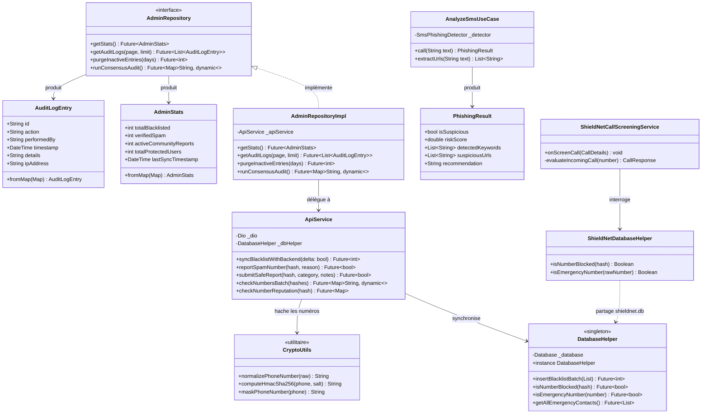
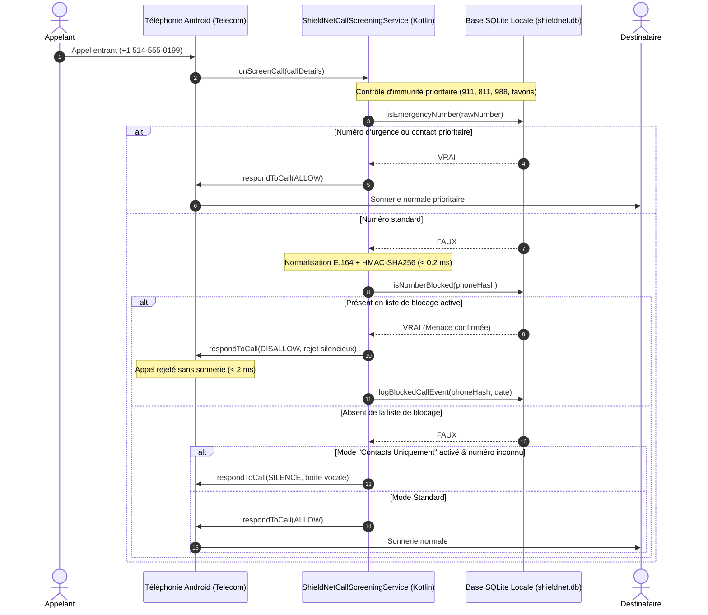
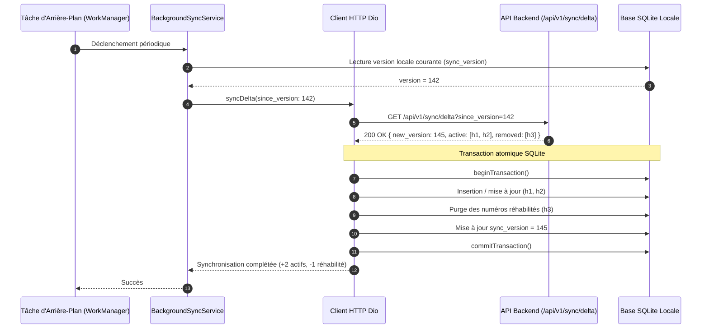
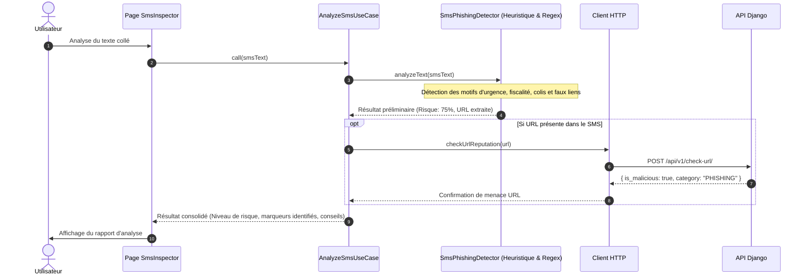
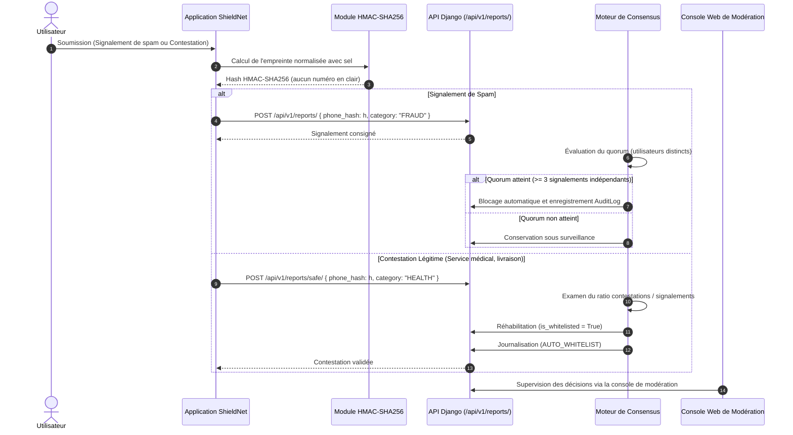

# Architecture Logicielle, Modélisation UML & Spécifications d'Ingénierie — ShieldNet

Spécification technique de l'architecture logicielle, des flux de données critiques et des interactions entre les composants du système **ShieldNet**.

---

## 1. Principes d'Architecture (Clean Architecture & Séparation des Responsabilités)

ShieldNet intègre trois environnements d'exécution distincts répondant à des contraintes opérationnelles différentes :

1. **Client Mobile (Flutter / Dart)** : Interface utilisateur réactive, gestion d'état déclarative via Riverpod et communication réseau résiliente (Dio avec gestion hors-ligne).
2. **Module Natif Android (Kotlin)** : Service d'arrière-plan de niveau système d'exploitation (`CallScreeningService`) soumis à une contrainte de latence stricte (< 100 ms) pour l'interception temps réel.
3. **Serveur Backend (Django / Python)** : API REST distribuée, moteur d'arbitrage contextuel, gestion des droits RBAC et journal d'audit immuable.

Pour assurer la maintenabilité et l'indépendance vis-à-vis des bibliothèques externes, le code client adopte les préceptes de la **Clean Architecture** :

```mermaid
graph TD
    subgraph Presentation_Layer ["Couche Présentation (lib/features/*/presentation)"]
        UI_Pages["Pages (Dashboard, Settings, SmsInspector, AdminConsole)"]
        UI_Widgets["Widgets Réutilisables (Cartes, Boutons, Onglets)"]
        Controllers["Gestion d'état (Riverpod Notifiers)"]
    end

    subgraph Domain_Layer ["Couche Domaine (lib/features/*/domain) - Purement Dart"]
        UseCases["Cas d'Utilisation (AnalyzeSmsUseCase, CheckNumberUseCase)"]
        Entities["Entités Métier (AdminStats, AuditLogEntry, PhishingResult)"]
        RepoInterfaces["Contrats d'Interfaces (AdminRepository, BlacklistRepository)"]
    end

    subgraph Data_Layer ["Couche Données (lib/features/*/data)"]
        RepoImpl["Implémentations (AdminRepositoryImpl, BlacklistRepositoryImpl)"]
        DataSources["Sources de Données (ApiService, DatabaseHelper)"]
        DTOs["Modèles de Données (BlacklistedNumber)"]
    end

    subgraph Core_Layer ["Socle Commun (lib/core)"]
        Crypto["Cryptographie (HMAC-SHA256, masquage E.164)"]
        Network["Client HTTP (Dio, SSL Pinning, intercepteurs)"]
        Database["Gestionnaire SQLite (DatabaseHelper en mode WAL)"]
        Services["Services d'Arrière-Plan & File Hors-Ligne (OfflineSyncService)"]
    end

    subgraph Native_Android ["Module Natif Android (android/app/src/main/kotlin)"]
        CallScreening["ShieldNetCallScreeningService (Interception Telecom)"]
        NativeDB["ShieldNetDatabaseHelper (Lecture SQLite directe)"]
    end

    subgraph Backend_Django ["Serveur Backend (Django REST Framework)"]
        DjangoAPI["API REST (/api/v1/sync/delta, /check, /reports)"]
        DjangoDB["Base de Données (PostgreSQL / SQLite)"]
    end

    UI_Widgets --> UI_Pages
    UI_Pages --> Controllers
    Controllers --> UseCases
    UseCases --> RepoInterfaces
    UseCases --> Entities
    RepoImpl ..|> RepoInterfaces
    RepoImpl --> DataSources
    DataSources --> Core_Layer
    Core_Layer -. Partage SQLite .-> Native_Android
    DataSources -. HTTPS + HMAC .-> Backend_Django
```

### Avantages de la Découplage
- **Isolement des Règles Métier** : La logique de calcul du score de sérénité, de détection de phishing ou d'arbitrage ne dépend d'aucun framework graphique ou pilote de base de données.
- **Testabilité Exhaustive** : Remplacement aisé des sources de données par des simulacres (*mocks*) dans la suite de 86 tests automatisés Flutter.

---

## 2. Diagramme de Composants Système

Le système est conçu pour fonctionner de manière autonome en mode déconnecté (*Offline-First*), tout en maintenant une synchronisation différentielle efficace avec l'infrastructure centrale :

```mermaid
componentDiagram
    package "Terminel Mobile Android (Utilisateur)" {
        [Android Telecom Framework] as Telecom
        component "Module Natif Kotlin" {
            [ShieldNetCallScreeningService] as ScreenService
            [Pont SQLite Natif] as NativeDB
        }
        database "Base Locale (shieldnet.db WAL)" as LocalDB
        
        component "Application Client Flutter" {
            [Gestionnaire d'État Riverpod] as StateMgr
            [Interface Utilisateur] as UI
            [Moteur Cryptographique HMAC] as CryptoEngine
            [File Hors-Ligne & Sync] as OfflineQueue
        }
    }

    package "Infrastructure Serveur ShieldNet" {
        component "API Django REST" {
            [Authentification JWT & RBAC] as AuthAPI
            [Moteur de Sync Différentielle] as DeltaAPI
            [Moteur de Consensus Communautaire] as ConsensusAPI
            [Journal d'Audit Immuable] as AuditAPI
            [Moteur d'Arbitrage & Explicabilité] as AIEngine
        }
        database "Base de Données Centrale" as CentralDB
    }

    Telecom --> ScreenService : Appel entrant détecté
    ScreenService --> NativeDB : Vérification du hash (< 2 ms)
    NativeDB --> LocalDB : Consultation index B-Tree
    LocalDB <-- StateMgr : Mise à jour des règles (Dart)
    
    UI --> StateMgr : Action utilisateur
    StateMgr --> CryptoEngine : Hachage normalisé du numéro
    OfflineQueue --> DeltaAPI : GET /sync/delta?since_version=v (périodique)
    DeltaAPI --> CentralDB : Lecture des deltas et tombstones
    ConsensusAPI --> CentralDB : Quorum de réhabilitation
    AuditAPI --> CentralDB : Traçabilité des décisions
    AIEngine --> CentralDB : Scoring contextuel et STIR/SHAKEN
```

---

## 3. Diagramme de Classes UML (Client Mobile)

Structure des classes et interfaces principales du client mobile :



---

## 4. Application des Principes d'Ingénierie SOLID

L'ensemble de la base de code applique rigoureusement les principes de conception orientée objet :

| Principe | Application concrète dans ShieldNet |
|---|---|
| **Responsabilité Unique (SRP)** | Chaque composant assume un rôle unique. `CryptoUtils` se consacre exclusivement aux transformations cryptographiques, tandis que `AnalyzeSmsUseCase` isole l'évaluation heuristique des messages sans dépendance UI. |
| **Ouvert / Fermé (OCP)** | Le système de filtrage accepte de nouvelles règles d'arbitrage (ex: seuils STIR/SHAKEN, plages régionales) par extension de stratégies sans altérer le schéma SQLite sous-jacent. |
| **Substitution de Liskov (LSP)** | Les abstractions de référentiel (`AdminRepository`, `BlacklistRepository`) sont interchangeables avec des doubles de test (`MockAdminRepository`) sans modifier le comportement des contrôleurs d'affichage. |
| **Ségrégation des Interfaces (ISP)** | Les interfaces client sont modulées par domaine fonctionnel (administration, filtrage d'appels, analyse SMS) évitant les contrats monolithiques. |
| **Inversion des Dépendances (DIP)** | Les contrôleurs d'état consomment des abstractions de cas d'utilisation injectées par Riverpod, éliminant tout couplage direct avec les pilotes HTTP ou disques. |

---

## 5. Flux Opérationnels Critiques

### 5.1. Interception d'un Appel Entrant (< 2 ms)
Contrainte de latence absolue pour garantir la non-interruption du service télécom et l'immunité intégrale des numéros d'urgence :



---

### 5.2. Synchronisation Différentielle (Delta Sync)
Minimisation de la bande passante et des écritures disques par transmission exclusive des deltas et des suppressions (tombstones) :



---

### 5.3. Analyse Heuristique de SMS dans l'Inspecteur
Évaluation locale du contenu textuel sans exfiltration de données personnelles :



---

### 5.4. Signalement Collaboratif & Réhabilitation par Consensus
Gestion décentralisée de la réputation évitant les abus et protégeant les services essentiels :

