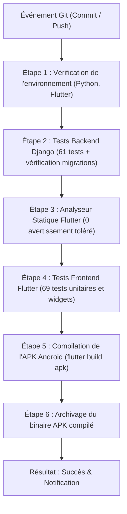

# Guide de Déploiement, Exploitation & Pipeline CI/CD — ShieldNet

**Projet de Synthèse en Informatique** — Université du Québec en Outaouais (UQO)  
**Auteurs** : Équipe étudiante ShieldNet  
**Session** : 2026  

---

## 1. Vue d'ensemble de l'infrastructure

Ce document détaille la mise en production du serveur backend, l'automatisation des tests avec Jenkins et les commandes utiles pour la maintenance quotidienne.

Pour l'environnement de production, nous avons choisi une stack éprouvée :

| Composant | Rôle | Pourquoi ce choix ? |
|---|---|---|
| **Django 5 & DRF** | API REST & Administration | Framework robuste, ORM puissant et gestion intégrée des utilisateurs et des permissions. |
| **Gunicorn** | Serveur d'applications WSGI | Gère efficacement les requêtes concurrentes avec plusieurs processus travailleurs (*workers*). |
| **Nginx** | Serveur web frontal (Reverse Proxy) | Gère le chiffrement TLS 1.3 (HTTPS), sert les fichiers statiques et protège l'application. |
| **PostgreSQL 16** | Base de données centrale | Fiabilité ACID et excellentes performances sur les index B-Tree pour retrouver les hashes HMAC. |
| **Redis 7** | Cache et limitation de débit | Permet de brider le nombre de requêtes par IP pour éviter le moissonnage abusif (*scraping*). |
| **Jenkins LTS** | Intégration continue (CI/CD) | Exécute automatiquement les 130 tests et compile l'APK Android à chaque modification. |

---

## 2. Configuration des Variables d'Environnement (.env)

Avant de lancer le serveur, les paramètres de configuration doivent être définis dans le fichier `shieldnet_backend/.env` :

```ini
# Configuration générale
DEBUG=False
SECRET_KEY=cle_secrete_django_a_generer_aleatoirement_pour_la_production
ALLOWED_HOSTS=api.shieldnet.uqo.ca,127.0.0.1,localhost

# Base de données (PostgreSQL en production)
DB_ENGINE=django.db.backends.postgresql
DB_NAME=shieldnet_prod
DB_USER=shieldnet_admin
DB_PASSWORD=mot_de_passe_robuste_postgresql
DB_HOST=127.0.0.1
DB_PORT=5432

# Sel secret pour le hachage HMAC-SHA256 (doit correspondre à celui de l'application mobile)
HMAC_SECRET_SALT=ShieldNet_Secret_Token_UQO_2026

# Sécurité des jetons JWT
JWT_ACCESS_TOKEN_LIFETIME_MINUTES=15
JWT_REFRESH_TOKEN_LIFETIME_DAYS=7
ADMIN_PASSWORD=admin123

# Sécurité HTTPS
SECURE_SSL_REDIRECT=True
SESSION_COOKIE_SECURE=True
CSRF_COOKIE_SECURE=True
SECURE_HSTS_SECONDS=31536000
CORS_ALLOWED_ORIGINS=https://admin.shieldnet.uqo.ca
```

---

## 3. Comment déployer le backend ?

### Méthode 1 : Avec Docker Compose (Recommandé)

C'est la méthode la plus simple et la plus rapide :

1. **Lancer les conteneurs :**
   ```bash
   docker compose up -d --build
   ```

2. **Appliquer les migrations et rassembler les fichiers statiques :**
   ```bash
   docker compose exec web python manage.py migrate --noinput
   docker compose exec web python manage.py collectstatic --noinput
   ```

3. **Créer ou vérifier le compte administrateur :**
   ```bash
   docker compose exec web python manage.py ensure_admin
   ```

---

### Méthode 2 : Installation manuelle sur un serveur Linux (Ubuntu/Debian)

1. **Installer les paquets système :**
   ```bash
   sudo apt update && sudo apt install -y python3-venv python3-pip postgresql nginx certbot python3-certbot-nginx
   ```

2. **Créer l'environnement virtuel et installer les dépendances :**
   ```bash
   cd /var/www/shieldnet_backend
   python3 -m venv venv
   source venv/bin/activate
   pip install --upgrade pip
   pip install -r requirements.txt
   ```

3. **Appliquer les migrations et collecter les statiques :**
   ```bash
   python manage.py migrate
   python manage.py collectstatic --noinput
   ```

4. **Créer le service systemd (`/etc/systemd/system/shieldnet.service`) :**
   ```ini
   [Unit]
   Description=ShieldNet Gunicorn Daemon
   After=network.target postgresql.service

   [Service]
   User=www-data
   Group=www-data
   WorkingDirectory=/var/www/shieldnet_backend
   ExecStart=/var/www/shieldnet_backend/venv/bin/gunicorn \
             --workers 3 \
             --bind 127.0.0.1:8000 \
             --access-logfile /var/log/shieldnet/access.log \
             --error-logfile /var/log/shieldnet/error.log \
             shieldnet_backend.wsgi:application

   Restart=always

   [Install]
   WantedBy=multi-user.target
   ```

5. **Démarrer le service :**
   ```bash
   sudo systemctl daemon-reload
   sudo systemctl enable shieldnet
   sudo systemctl start shieldnet
   ```

6. **Configurer le reverse proxy Nginx (`/etc/nginx/sites-available/shieldnet`) :**
   ```nginx
   server {
       server_name api.shieldnet.uqo.ca;

       location /static/ {
           alias /var/www/shieldnet_backend/staticfiles/;
       }

       location / {
           proxy_pass http://127.0.0.1:8000;
           proxy_set_header Host $host;
           proxy_set_header X-Real-IP $remote_addr;
           proxy_set_header X-Forwarded-For $proxy_add_x_forwarded_for;
           proxy_set_header X-Forwarded-Proto $scheme;
       }
   }
   ```

---

## 4. Pipeline d'Intégration Continue (Jenkins)

Pour être certains qu'aucun changement de code ne casse l'application, nous avons écrit un [`Jenkinsfile`](file:///C:/Projet/Projet%20synthese/Jenkinsfile) déclaratif. À chaque proposition de fusion (*pull request*) ou commit sur la branche principale, le serveur Jenkins déroule automatiquement 6 étapes :



### Ce que vérifie chaque étape :
1. **Environnement** : Détecte dynamiquement si l'agent tourne sous Linux ou Windows et valide les versions de Python et de Flutter.
2. **Backend Django** : Vérifie qu'il n'y a aucune migration manquante (`makemigrations --check`) et lance les 61 tests unitaires.
3. **Linter Flutter** : Lance `flutter analyze` pour garantir qu'aucune erreur de syntaxe ou avertissement n'est laissé de côté.
4. **Tests Flutter** : Exécute les 69 tests du client mobile (chiffrement, calcul du score, détection de phishing SMS, formulaires sans débordement).
5. **Compilation Android** : Compile l'application mobile en binaire autonome (`.apk`).
6. **Archivage** : Sauvegarde le fichier `.apk` directement sur Jenkins pour permettre à n'importe quel membre de l'équipe de l'installer en un clic sur son téléphone de test.

### Démarrer le serveur Jenkins en local
Un fichier `docker-compose.jenkins.yml` est fourni à la racine :

```bash
# 1. Lancer le conteneur Jenkins
docker compose -f docker-compose.jenkins.yml up -d

# 2. Lire le mot de passe administrateur initial
docker exec shieldnet_jenkins cat /var/jenkins_home/secrets/initialAdminPassword

# 3. Ouvrir dans votre navigateur : http://localhost:8080
# 4. Créer un projet Pipeline en pointant vers le dépôt Git et le fichier 'Jenkinsfile'
```

---

## 5. Commandes Utiles pour l'Exploitation

### Vérifier la disponibilité du serveur
```bash
# Sonde HTTP simple
curl -I http://127.0.0.1:8000/api/v1/health/

# Métriques temps réel pour Prometheus
curl http://127.0.0.1:8000/api/v1/metrics/
```

### Nettoyage et maintenance périodique
```bash
# Purge des signalements inactifs de plus de 90 jours
python manage.py purge_stale_reports --days=90

# Exécution de l'audit de consensus (réhabilitation automatique)
python manage.py run_consensus_engine
```

---

## 6. Que se passe-t-il en cas de panne réseau ou serveur ?

Un point fort de l'architecture de ShieldNet réside dans son approche **Offline-First** :

* **Même si le serveur backend tombe en panne ou que la connexion Internet est coupée**, les téléphones continuent de bloquer les numéros malveillants à 100% grâce à leur copie locale SQLite (`shieldnet.db`).
* Dès que la connexion est rétablie, l'application reprend sa synchronisation différentielle en tâche de fond sans aucune intervention de l'usager.
* Une sauvegarde quotidienne de la base centrale PostgreSQL peut être programmée simplement avec `pg_dump` :
  ```bash
  pg_dump -U shieldnet_admin shieldnet_prod | gzip > /backups/shieldnet_$(date +%Y%m%d).sql.gz
  ```
