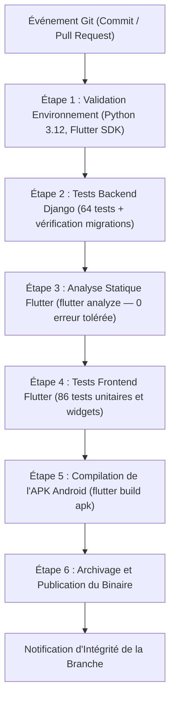

# Guide de Déploiement, Exploitation & Pipeline CI/CD — ShieldNet

Spécification des procédures d'infrastructure, de conteneurisation, de déploiement en production et d'automatisation des tests continus pour la plateforme **ShieldNet**.

---

## 1. Architecture d'Infrastructure & Composants de Production

L'infrastructure serveur est dimensionnée pour assurer une haute disponibilité, une faible latence de réponse (< 50 ms sur les vérifications de réputation) et une séparation étanche des couches logicielles :

| Composant | Rôle Technique | Justification Opérationnelle |
|---|---|---|
| **Django 5 & DRF** | API REST & Administration | Framework mature, ORM performant, gestion fine des permissions RBAC et modèle de données transactionnel. |
| **Gunicorn** | Serveur d'applications WSGI | Gestion des processus travailleurs concurrents (*workers*) avec recyclage automatique de mémoire. |
| **Nginx** | Reverse Proxy & Terminaison TLS | Chiffrement TLS 1.3 (HTTPS), distribution optimisée des fichiers statiques et isolation de Gunicorn. |
| **PostgreSQL 16** | Base de données relationnelle | Conformité ACID, index B-Tree optimisés sur les empreintes HMAC de 64 caractères hexadécimaux. |
| **Redis 7** | Cache en mémoire & Limitation de débit | Limitation dynamique du taux de requêtes par adresse IP et gestion des verrous distribués. |
| **Jenkins LTS** | Moteur d'intégration continue | Orchestration automatique du pipeline de validation (150 tests, analyse statique, build d'APK). |

---

## 2. Configuration des Variables d'Environnement (.env)

Avant initialisation des services, le fichier `shieldnet_backend/.env` doit être renseigné avec des paramètres sécurisés :

```ini
# Paramètres généraux d'exécution
DEBUG=False
SECRET_KEY=generer_une_cle_secrete_django_robuste_pour_la_production
ALLOWED_HOSTS=api.shieldnet.app,127.0.0.1,localhost

# Base de données PostgreSQL
DB_ENGINE=django.db.backends.postgresql
DB_NAME=shieldnet_prod
DB_USER=shieldnet_admin
DB_PASSWORD=mot_de_passe_robuste_postgresql
DB_HOST=127.0.0.1
DB_PORT=5432

# Sel cryptographique partagé (doit correspondre à la configuration client mobile)
HMAC_SECRET_SALT=sel_cryptographique_hmac_sha256_long_et_securise

# Durée de validité des jetons d'authentification
JWT_ACCESS_TOKEN_LIFETIME_MINUTES=15
JWT_REFRESH_TOKEN_LIFETIME_DAYS=7
ADMIN_PASSWORD=mot_de_passe_administrateur_initial

# Durcissement des en-têtes HTTP & Cookies de session
SECURE_SSL_REDIRECT=True
SESSION_COOKIE_SECURE=True
CSRF_COOKIE_SECURE=True
SECURE_HSTS_SECONDS=31536000
CORS_ALLOWED_ORIGINS=https://admin.shieldnet.app
```

---

## 3. Procédures de Déploiement

### Déploiement Conteneurisé avec Docker Compose (Recommandé)

1. **Démarrage des services d'infrastructure :**
   ```bash
   docker compose up -d --build
   ```

2. **Application des schémas relationnels et collecte des actifs statiques :**
   ```bash
   docker compose exec web python manage.py migrate --noinput
   docker compose exec web python manage.py collectstatic --noinput
   ```

3. **Provisionnement des comptes d'administration initiaux :**
   ```bash
   docker compose exec web python manage.py ensure_admin
   docker compose exec web python manage.py ensure_manager
   ```

---

### Déploiement Natif sur Hôte Linux (Ubuntu / Debian LTS)

1. **Installation des dépendances système :**
   ```bash
   sudo apt update && sudo apt install -y python3-venv python3-pip postgresql nginx certbot python3-certbot-nginx
   ```

2. **Création de l'environnement virtuel Python :**
   ```bash
   cd /var/www/shieldnet_backend
   python3 -m venv venv
   source venv/bin/activate
   pip install --upgrade pip
   pip install -r requirements.txt
   ```

3. **Application des migrations et génération des statiques :**
   ```bash
   python manage.py migrate
   python manage.py collectstatic --noinput
   ```

4. **Configuration du service systemd (`/etc/systemd/system/shieldnet.service`) :**
   ```ini
   [Unit]
   Description=ShieldNet Gunicorn Application Server
   After=network.target postgresql.service

   [Service]
   User=www-data
   Group=www-data
   WorkingDirectory=/var/www/shieldnet_backend
   ExecStart=/var/www/shieldnet_backend/venv/bin/gunicorn \
             --workers 3 \
             --bind 127.0.0.1:8000 \
             --access-logfile /var/log/shieldnet/access.log \
             --error-logfile /var/log/shieldnet/error.log \
             shieldnet_backend.wsgi:application

   Restart=always

   [Install]
   WantedBy=multi-user.target
   ```

5. **Activation du service système :**
   ```bash
   sudo systemctl daemon-reload
   sudo systemctl enable shieldnet
   sudo systemctl start shieldnet
   ```

6. **Configuration du reverse proxy Nginx (`/etc/nginx/sites-available/shieldnet`) :**
   ```nginx
   server {
       server_name api.shieldnet.app;

       location /static/ {
           alias /var/www/shieldnet_backend/staticfiles/;
       }

       location / {
           proxy_pass http://127.0.0.1:8000;
           proxy_set_header Host $host;
           proxy_set_header X-Real-IP $remote_addr;
           proxy_set_header X-Forwarded-For $proxy_add_x_forwarded_for;
           proxy_set_header X-Forwarded-Proto $scheme;
       }
   }
   ```

---

## 4. Pipeline d'Intégration Continue (Jenkins)

L'automatisation des tests et de la compilation est formalisée dans le fichier déclaratif `Jenkinsfile`. Tout commit ou pull request déclenche l'exécution des 6 étapes de qualification logicielle :



### Détail des Étapes de Contrôle :
1. **Environnement** : Détection multi-plateforme (Linux/Windows) et vérification des binaires de développement.
2. **Backend Django** : Validation de l'intégrité des migrations (`makemigrations --check`) et passage de la suite de 64 tests (`python manage.py test shield_api`).
3. **Analyse Statique Dart** : Contrôle du respect des règles du linter officiel avec blocage en cas d'avertissement non résolu.
4. **Tests Frontend** : Exécution des 86 tests Flutter vérifiant l'interception, le chiffrement HMAC, la synchronisation hors-ligne et l'absence de régression d'overflow UI.
5. **Compilation** : Production du package Android autonome (`app-release.apk`).
6. **Archivage** : Mise à disposition des artefacts compilés pour déploiement ou validation en recette.

### Démarrage de l'Instance Jenkins Locale
```bash
docker compose -f docker-compose.jenkins.yml up -d
docker exec shieldnet_jenkins cat /var/jenkins_home/secrets/initialAdminPassword
```
Accès console : `http://localhost:8080`

---

## 5. Exploitation & Télémétrie Opérationnelle

### Diagnostic de Disponibilité
```bash
# Vérification d'état HTTP
curl -I http://127.0.0.1:8000/api/v1/health/

# Collecte des métriques d'observabilité (Prometheus)
curl http://127.0.0.1:8000/api/v1/metrics/
```

### Tâches de Maintenance Planifiée
```bash
# Purge des signalements inactifs (durée de rétention maximale : 90 jours)
python manage.py purge_stale_reports --days=90

# Exécution du moteur d'audit de consensus
python manage.py run_consensus_audit
```

---

## 6. Résilience & Continuité d'Activité

Le modèle architectural repose sur le principe d'autonomie locale (*Offline-First*) :
- En cas d'indisponibilité du serveur central ou de rupture de connexion Internet, le client mobile continue d'assurer le filtrage temps réel via sa base SQLite embarquée.
- Dès rétablissement de la connectivité réseau, la synchronisation différentielle rattrape les deltas sans interruption de service pour l'utilisateur final.
- Sauvegarde quotidienne automatisée de la base de données :
  ```bash
  pg_dump -U shieldnet_admin shieldnet_prod | gzip > /backups/shieldnet_$(date +%Y%m%d).sql.gz
  ```