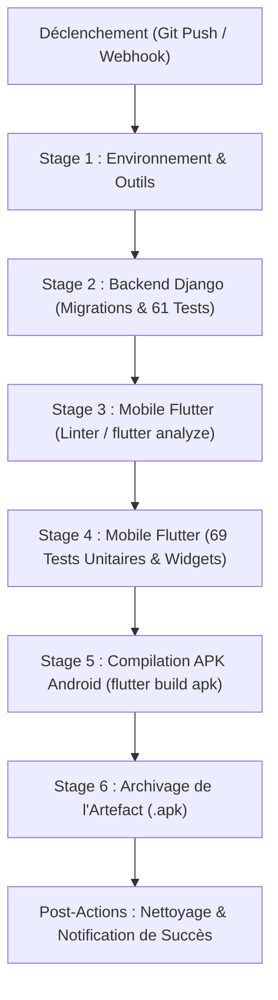

# Guide de Déploiement, Exploitation & Pipeline CI/CD — ShieldNet

> **Document de Référence Technique & Académique**  
> **Projet de Synthèse en Informatique** — Université du Québec en Outaouais (UQO)  
> **Composant** : Déploiement Production, Runbook d'Exploitation & Automatisation Jenkins  
> **Auteur** : Équipe ShieldNet  
> **Date** : 2026

---

## 1. Architecture & Stack Technique de Production

L'infrastructure serveur ShieldNet repose sur une architecture conteneurisée et hautement disponible conforme aux standards de l'industrie :

| Composant | Technologie | Rôle en Production |
|---|---|---|
| **Framework Web** | Django 5 / Django REST Framework (DRF) | API REST sécurisée, ORM, Système de Permissions & RBAC |
| **Serveur d'Applications** | Gunicorn (Green Unicorn) / Uvicorn (ASGI) | Serveur WSGI multi-workers haute concurrence |
| **Reverse Proxy & TLS** | Nginx / Caddy | Terminaison HTTPS (TLS 1.3), Compression Gzip, Cache statique |
| **Base de Données** | PostgreSQL 16+ (Production) / SQLite (Développement) | Persistance ACID, index B-Tree composites sur empreintes HMAC |
| **Sécurité & Rate Limiting** | Django-Ratelimit / Redis 7 | Protection anti-bruteforce et anti-DDoS sur `/api/v1/` |
| **Authentification** | SimpleJWT (JSON Web Tokens) | Émission de jetons courts (15 min) + Refresh (7 jours) |
| **Intégration Continue** | Jenkins LTS (Pipeline déclaratif) | Validation continue, exécution des 130 tests et build APK |

---

## 2. Configuration des Variables d'Environnement (.env)

Toutes les données de configuration sensibles doivent être renseignées dans le fichier `.env` du backend (`shieldnet_backend/.env`) :

```ini
# --- Environnement Général ---
DEBUG=False
SECRET_KEY=votre_cle_django_aleatoire_tres_longue_de_minimum_50_caracteres
ALLOWED_HOSTS=api.shieldnet.uqo.ca,127.0.0.1,localhost

# --- Base de Données (PostgreSQL en Production) ---
DB_ENGINE=django.db.backends.postgresql
DB_NAME=shieldnet_prod
DB_USER=shieldnet_admin
DB_PASSWORD=mot_de_passe_robuste_postgresql
DB_HOST=127.0.0.1
DB_PORT=5432

# --- Sécurité Cryptographique ShieldNet ---
# Sel HMAC partagé avec l'application mobile pour le hachage des numéros
HMAC_SECRET_SALT=ShieldNet_Secret_Token_UQO_2026

# --- Sécurité JWT & RBAC ---
JWT_ACCESS_TOKEN_LIFETIME_MINUTES=15
JWT_REFRESH_TOKEN_LIFETIME_DAYS=7
ADMIN_PASSWORD=admin123

# --- Politique de Sécurité HTTPS & CORS ---
SECURE_SSL_REDIRECT=True
SESSION_COOKIE_SECURE=True
CSRF_COOKIE_SECURE=True
SECURE_HSTS_SECONDS=31536000
CORS_ALLOWED_ORIGINS=https://admin.shieldnet.uqo.ca
```

---

## 3. Procédure de Déploiement

### Option A : Déploiement Conteneurisé Docker Compose (Recommandé)

1. **Lancement de l'ensemble de la stack en production :**
   ```bash
   docker compose up -d --build
   ```

2. **Application des migrations et collecte des fichiers statiques :**
   ```bash
   docker compose exec web python manage.py migrate --noinput
   docker compose exec web python manage.py collectstatic --noinput
   ```

3. **Création / vérification du compte administrateur :**
   ```bash
   docker compose exec web python manage.py ensure_admin
   ```

---

### Option B : Déploiement Natif sur Serveur Linux (Ubuntu/Debian)

1. **Prérequis système :**
   ```bash
   sudo apt update && sudo apt install -y python3-venv python3-pip postgresql nginx certbot python3-certbot-nginx
   ```

2. **Création de l'environnement virtuel & dépendances :**
   ```bash
   cd /var/www/shieldnet_backend
   python3 -m venv venv
   source venv/bin/activate
   pip install --upgrade pip
   pip install -r requirements.txt
   ```

3. **Application du schéma et collecte statique :**
   ```bash
   python manage.py migrate
   python manage.py collectstatic --noinput
   ```

4. **Configuration du Service Systemd (`/etc/systemd/system/shieldnet.service`) :**
   ```ini
   [Unit]
   Description=ShieldNet Gunicorn Daemon
   After=network.target postgresql.service

   [Service]
   User=www-data
   Group=www-data
   WorkingDirectory=/var/www/shieldnet_backend
   ExecStart=/var/www/shieldnet_backend/venv/bin/gunicorn \
             --workers 3 \
             --bind 127.0.0.1:8000 \
             --access-logfile /var/log/shieldnet/access.log \
             --error-logfile /var/log/shieldnet/error.log \
             shieldnet_backend.wsgi:application

   Restart=always

   [Install]
   WantedBy=multi-user.target
   ```

5. **Activation et Démarrage du Service :**
   ```bash
   sudo systemctl daemon-reload
   sudo systemctl enable shieldnet
   sudo systemctl start shieldnet
   ```

6. **Configuration du Reverse Proxy Nginx (`/etc/nginx/sites-available/shieldnet`) :**
   ```nginx
   server {
       server_name api.shieldnet.uqo.ca;

       location /static/ {
           alias /var/www/shieldnet_backend/staticfiles/;
       }

       location / {
           proxy_pass http://127.0.0.1:8000;
           proxy_set_header Host $host;
           proxy_set_header X-Real-IP $remote_addr;
           proxy_set_header X-Forwarded-For $proxy_add_x_forwarded_for;
           proxy_set_header X-Forwarded-Proto $scheme;
       }
   }
   ```

---

## 4. Pipeline d'Intégration & Déploiement Continus (Jenkins CI/CD)

Le projet intègre une chaîne CI/CD déclarative dans le fichier [`Jenkinsfile`](file:///C:/Projet/Projet%20synthese/Jenkinsfile) assurant la non-régression automatique des **130 tests** (61 tests backend Django et 69 tests frontend Flutter) et la livraison d'artefacts binaires.

### Architecture du Pipeline



### Détail des Étapes de Validation

| Étape | Outil / Commande | Objectif Qualité |
|---|---|---|
| **1. Environnement & Outils** | `python --version`, `flutter --version` | Détection dynamique de l'agent (`isUnix()` Linux/macOS ou Windows via `bat`) et validation des versions des runtimes. |
| **2. Backend Django** | `makemigrations --check --dry-run` + `python manage.py test shield_api` | Validation de l'ORM, des endpoints REST, du hachage HMAC-SHA256 et des 61 tests unitaires backend. |
| **3. Flutter Linter** | `flutter analyze --no-fatal-infos` | Analyse statique rigoureuse du code Dart pour garantir 0 erreur et 0 avertissement de syntaxe. |
| **4. Flutter Tests** | `flutter test` | Exécution des 69 tests unitaires et composants widgets (cartes de score, détection de phishing, cryptographie). |
| **5. Build Android** | `flutter build apk --debug` | Compilation du binaire Android autonome prêt à être déployé sur un appareil physique ou émulateur. |
| **6. Archivage** | `archiveArtifacts` | Sauvegarde de l'APK compilé dans l'espace de stockage Jenkins pour téléchargement immédiat. |

### Démarrage Rapide du Serveur Jenkins Local

Un fichier [`docker-compose.jenkins.yml`](file:///C:/Projet/Projet%20synthese/docker-compose.jenkins.yml) est inclus à la racine :

```bash
# 1. Lancer le conteneur Jenkins
docker compose -f docker-compose.jenkins.yml up -d

# 2. Récupérer le mot de passe administrateur initial
docker exec shieldnet_jenkins cat /var/jenkins_home/secrets/initialAdminPassword

# 3. Ouvrir l'interface Web : http://localhost:8080
# 4. Créer un projet Pipeline pointant sur 'Jenkinsfile'
```

---

## 5. Guide des Commandes Administratives & Maintenance (Runbook)

### Initialisation du Super-Administrateur
```bash
python manage.py ensure_admin
# Ou manuellement :
python manage.py createsuperuser
```

### Surveillance de l'État de Santé (Healthcheck & Métriques)
```bash
# Sonde de disponibilité HTTP 200
curl -I http://127.0.0.1:8000/api/v1/health/

# Métriques temps réel au format Prometheus / OpenMetrics
curl http://127.0.0.1:8000/api/v1/metrics/
```

### Purge Périodique & Audit de Consensus
```bash
# Purge des signalements obsolètes de plus de 90 jours
python manage.py purge_stale_reports --days=90

# Déclenchement de l'audit automatique du consensus anti-fraude
python manage.py run_consensus_engine
```

---

## 6. Plan de Continuité & de Reprise d'Activité (PCA / PRA)

1. **Sauvegarde Quotidienne de la Base de Données :**
   ```bash
   pg_dump -U shieldnet_admin shieldnet_prod | gzip > /backups/shieldnet_$(date +%Y%m%d_%H%M%S).sql.gz
   ```
2. **Tolérance aux Pannes Mobiles (Offline-First) :**  
   Grâce à l'architecture locale SQLite configurée en mode WAL sur les smartphones Android (`shieldnet.db`), **même en cas d'interruption totale du réseau ou de panne serveur**, les téléphones continuent à bloquer les appels malveillants à 100% en local sous la barre des 2 millisecondes.
