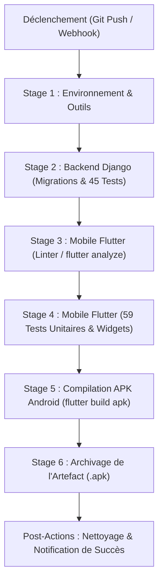

# ShieldNet — Pipeline d'Intégration & Déploiement Continus (Jenkins CI/CD)

> **Projet de Synthèse en Informatique** — Université du Québec en Outaouais (UQO)  
> **Composant** : Automatisation DevOps, Validation Qualité & Compilation Automatisée  
> **Auteur** : Équipe ShieldNet  
> **Date** : 2026

---

## 1. Vue d'Ensemble & Objectifs DevOps

Dans le cadre du projet de synthèse ShieldNet, la mise en place d'une chaîne d'intégration continue (**CI/CD**) avec **Jenkins** répond à trois impératifs d'ingénierie logicielle :

1. **Non-régression systématique** : Vérifier automatiquement l'intégrité des 104 tests automatisés (45 tests Django backend et 59 tests Flutter mobile) à chaque commit ou proposition de fusion (*Pull Request*).
2. **Conformité des schémas de données** : Valider l'absence de migrations Django orphelines ou incohérentes (`makemigrations --check`).
3. **Livraison d'artefacts automatisée** : Compiler l'application mobile Android (`.apk`) et l'archiver directement sur le serveur Jenkins pour téléchargement immédiat par les testeurs ou les évaluateurs.

---

## 2. Architecture du Pipeline Déclaratif

Le pipeline est défini sous forme de code (*Pipeline as Code*) dans le fichier [`Jenkinsfile`](file:///C:/Projet/Projet%20synthese/Jenkinsfile) situé à la racine du dépôt :



---

## 3. Détail des Étapes du Pipeline

| Étape | Outil / Commande | Objectif Qualité |
|---|---|---|
| **1. Environnement & Outils** | `python --version`, `flutter --version` | Détection dynamique de l'agent (Linux/macOS via `sh` ou Windows via `bat`) et validation des versions des runtimes. |
| **2. Backend Django** | `makemigrations --check --dry-run` + `python manage.py test shield_api` | Validation de l'ORM, des endpoints REST, du hachage HMAC-SHA256 et des 45 tests unitaires backend. |
| **3. Flutter Linter** | `flutter analyze --no-fatal-infos` | Analyse statique rigoureuse du code Dart pour garantir 0 erreur et 0 avertissement de syntaxe. |
| **4. Flutter Tests** | `flutter test` | Exécution des 59 tests unitaires et composants widgets (cartes de score, détection de phishing, cryptographie). |
| **5. Build Android** | `flutter build apk --debug` | Compilation du binaire Android autonome prêt à être déployé sur un appareil physique ou émulateur. |
| **6. Archivage** | `archiveArtifacts` | Sauvegarde de l'APK compilé dans l'espace de stockage Jenkins pour téléchargement en un clic. |

---

## 4. Démarrage Rapide de Jenkins en Local (Docker)

Un fichier de composition dédié [`docker-compose.jenkins.yml`](file:///C:/Projet/Projet%20synthese/docker-compose.jenkins.yml) est inclus à la racine pour démarrer un serveur Jenkins en quelques secondes :

### Étape 1 : Lancer le conteneur Jenkins
```bash
docker compose -f docker-compose.jenkins.yml up -d
```

### Étape 2 : Récupérer le mot de passe administrateur initial
```bash
docker exec shieldnet_jenkins cat /var/jenkins_home/secrets/initialAdminPassword
```

### Étape 3 : Accéder à l'interface Web
* Ouvrez votre navigateur sur : **`http://localhost:8080`**
* Collez le mot de passe administrateur initial.
* Sélectionnez **"Install suggested plugins"** (installe Git, Pipeline, Timestamper, etc.).
* Créez votre compte administrateur.

### Étape 4 : Créer le Job Pipeline ShieldNet
1. Sur le tableau de bord Jenkins, cliquez sur **"Nouveau projet"** (New Item).
2. Entrez le nom : `ShieldNet-CI-Pipeline`.
3. Sélectionnez **"Pipeline"**, puis cliquez sur **OK**.
4. Dans la section **Pipeline** (au bas de la page de configuration) :
   * Définition : `Pipeline script from SCM`.
   * SCM : `Git`.
   * Repository URL : l'URL de votre dépôt Git local ou GitHub/GitLab.
   * Script Path : `Jenkinsfile`.
5. Cliquez sur **Sauvegarder**, puis sur **"Lancer un build"** (Build Now).

---

## 5. Présentation du CI/CD lors de la Soutenance (Jury UQO)

Lors de votre présentation devant le jury, vous pouvez mettre en avant les arguments suivants :

1. **Rigueur d'Ingénierie Logicielle** :
   > *"Pour garantir qu'aucune régression ne s'infiltre dans le code, nous avons automatisé notre intégration continue avec un Jenkinsfile déclaratif. Chaque modification déclenche l'exécution des 104 tests (Django et Flutter) avant toute fusion."*

2. **Cross-Platform & Pipeline as Code** :
   > *"Le pipeline est rédigé de façon déclarative et cross-platform (`isUnix()`), ce qui lui permet de tourner indifféremment sur des agents Linux Docker, Kubernetes ou sur une machine de développement locale."*

3. **Livraison Continue d'Artefacts** :
   > *"Le binaire mobile APK est compilé et archivé automatiquement à chaque livraison réussie, permettant aux testeurs d'installer directement la dernière version stable sans configuration manuelle."*
