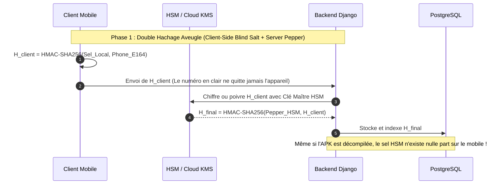

# ShieldNet — Modèle de Menace, Analyse Cryptographique & Architecture de Sécurité

> **Document de Référence Technique & Académique**  
> **Projet de Synthèse en Informatique** — Université du Québec en Outaouais (UQO)  
> **Auteur** : Équipe ShieldNet  
> **Date** : 2026

---

## 1. Contexte & Problématique de Confidentialité

Les solutions traditionnelles de filtrage d'appels (ex: Truecaller, Hiya) reposent historiquement sur la centralisation d'annuaires inversés et le téléversement des répertoires de contacts personnels des utilisateurs sur des serveurs tiers. Cette approche pose de graves enjeux éthiques et juridiques au regard de la **Loi 25 du Québec** (*Loi modernisant des dispositions législatives en matière de protection des renseignements personnels*), de la **LPRPDE** canadienne (*Loi sur la protection des renseignements personnels et les documents électroniques*), et du **RGPD** européen.

**ShieldNet** adopte le paradigme de la **Confidentialité Dès la Conception (*Privacy by Design*)** :
1. Aucun carnet de contacts n'est jamais aspiré ni transmis.
2. Aucun numéro de téléphone en clair n'est stocké en base de données centrale ni transmis sur le réseau lors des signalements et vérifications.
3. Le filtrage local s'exécute de manière autonome sur l'appareil mobile, garantissant une interception même hors-ligne.

Pour atteindre ces objectifs, le système utilise un mécanisme de pseudonymisation à la source par **HMAC-SHA256**. Cependant, l'application de primitives cryptographiques aux numéros de téléphone soulève des contraintes théoriques strictes liées à l'entropie de l'espace de recherche.

---

## 2. L'Analyse d'Entropie du Plan NANP (+1)

### 2.1. Calcul Combinatoire de l'Espace de Recherche

Le Plan de numérotation nord-américain (**NANP - North American Numbering Plan**) régit les numéros de téléphone au Canada, aux États-Unis et dans plusieurs territoires des Caraïbes sous l'indicatif de zone internationale `+1`.

La structure d'un numéro NANP conforme à la recommandation UIT-T E.164 est :
$$\text{+1 } [N_1 X_1 X_2] - [N_2 X_3 X_4] - [X_5 X_6 X_7 X_8]$$
Où :
* $N_1, N_2 \in \{2, 3, 4, 5, 6, 7, 8, 9\}$ (les chiffres 0 et 1 sont interdits comme premier chiffre d'indicatif régional ou de bureau central).
* $X_i \in \{0, 1, 2, 3, 4, 5, 6, 7, 8, 9\}$.

Le nombre maximal théorique de numéros s'élève à :
$$N_{\text{théorique}} = 8 \times 10 \times 10 \times 8 \times 10 \times 10 \times 10^4 = 6.4 \times 10^9 \text{ combinaisons}$$

En pratique, l'Alliance des solutions de l'industrie des télécommunications (ATIS) et la CRTC imposent des restrictions supplémentaires :
* Exclusion des indicatifs de service $N11$ ($911, 411, 811, 211, 311, 711$).
* Réservation de plages techniques (ex: $555-0100$ à $555-0199$).
* Indicatifs régionaux non attribués ou réservés aux secours.

L'espace effectif réel de numéros assignables dans le NANP est estimé à environ :
$$N_{\text{effectif}} \approx 7.8 \times 10^8 \text{ numéros (soit environ 780 millions)}$$

### 2.2. Entropie d'Information et Vulnérabilité aux Tables Précalculées

L'entropie d'information de Shannon maximale d'un numéro NANP est donc de :
$$H = \log_2(7.8 \times 10^8) \approx 29.54 \text{ bits}$$

> [!WARNING] **Constat Cryptographique Fondamental**
> Une entropie d'environ **30 bits** est extrêmement faible face aux capacités de calcul modernes.  
> Un processeur graphique haut de gamme actuel (ex. NVIDIA GeForce RTX 4090) calcule plus de **25 milliards d'itérations HMAC-SHA256 par seconde** via des outils comme *Hashcat*.  
> 
> **Temps de calcul pour énumérer l'intégralité du réseau téléphonique nord-américain :**
> $$T_{\text{exhaustif}} = \frac{7.8 \times 10^8}{25 \times 10^9 \text{ hachages/sec}} \approx 0.031 \text{ seconde (31 millisecondes !)}$$
> 
> Par conséquent, si un attaquant parvient à extraire la clé secrète du HMAC (le sel partagé) depuis l'application cliente ou le binaire de l'APK décompilée, il lui est trivial de générer une table inversée complète (*rainbow table*) et de désanonymiser instantanément n'importe quelle empreinte présente dans la base de données.

---

## 3. Modèle de Menace Formel (STRIDE)

Pour évaluer la robustesse de l'architecture ShieldNet, le modèle de menace suit la méthodologie **STRIDE** :

```mermaid
flowchart TD
    subgraph Client ["Client Mobile (Non fiable / Environnement hostile)"]
        User["Utilisateur"]
        App["App Flutter / Kotlin"]
        LocalDB[("SQLite Chiffré / Non chiffré")]
    end

    subgraph Channel ["Canal de Communication (Public)"]
        Transit["TLS 1.3 / REST API"]
    end

    subgraph Cloud ["Infrastructure Backend (Zone de Confiance)"]
        Gateway["Nginx / WAF / Rate Limiter"]
        Django["API Django REST (Auth JWT / X-API-Key)"]
        Postgres[("Base PostgreSQL (Empreintes HMAC)")"]
        Audit[("Journal d'Audit Immuable")]
    end

    User -->|Saisie / Appel entrant| App
    App -->|Lecture < 5ms| LocalDB
    App -->|Sync & Signalement| Transit
    Transit --> Gateway
    Gateway --> Django
    Django --> Postgres
    Django --> Audit

    Attacker1(("Attaquant Externe<br>(Écoute / MITM)")) -.->|Bloqué par TLS 1.3| Transit
    Attacker2(("Attaquant Client<br>(Reverse Engineering APK)")) -.->|Tente extraction sel| App
    Attacker3(("Attaquant Malveillant<br>(Attaque Sybil / Spam)")) -.->|Tentative d'empoisonnement| Gateway
```

| Menace (STRIDE) | Vecteur d'Attaque | Impact Potentiel | Défense Implémentée dans ShieldNet |
| :--- | :--- | :--- | :--- |
| **Spoofing** (Usurpation) | Faux signalements de numéros légitimes par un acteur malveillant pour nuire à un concurrent. | Blacklistage injustifié (déni de service téléphonique pour une entreprise légitime). | **Consensus dynamique anti-Sybil** (`FalsePositiveConsensusService`) : seuil de quorum strict (3+ votes sûrs), pondération de réputation, confirmation administrative et blocage des signalements multiples par utilisateur. |
| **Tampering** (Altération) | Modification des scores de risque ou des listes d'exclusion en transit. | Empoisonnement des règles de filtrage mobile. | **Chiffrement de transport TLS 1.3**, validation stricte des schémas Pydantic/DRF et vérification de conformité des hashes (SHA-256 de 64 caractères hexadécimaux). |
| **Repudiation** (Répudiation) | Un administrateur ou modérateur nie avoir blanchi ou banni un numéro. | Rupture de la traçabilité légale et administrative. | **Modèle d'audit dédié (`AuditLog`)** traçant systématiquement l'adresse IP, l'horodatage UTC, l'auteur (`admin@shieldnet.app`), et l'état avant/après chaque action. |
| **Information Disclosure** (Divulgation) | Extraction d'empreintes HMAC depuis la base de données ou interception réseau. | Désanonymisation ciblée des appelants. | **Normalisation E.164 stricte**, transmission exclusive d'empreintes HMAC, masquage applicatif (`+1 819 *** **99`) et isolation des clés dans l'environnement (`.env`). |
| **Denial of Service** (Déni de Service) | Scraping massif de l'API de vérification `/api/v1/blacklist/check/` pour énumérer la liste noire. | Épuisement des ressources serveur et fuite de l'annuaire de réputation. | **Rate-limiting IP adaptatif**, pagination stricte, synchronisation delta incrémentale (`since=timestamp`) et en-tête `X-API-Key`. |
| **Elevation of Privilege** (Élévation de privilèges) | Un utilisateur standard tente d'accéder aux fonctions de blanchiment/bannissement. | Corruption non autorisée de la liste noire certifiée. | **Contrôle d'accès basé sur les rôles (RBAC)** : vérification stricte `is_staff` / `is_superuser` sur l'ensemble des endpoints d'administration et console dédiée. |

---

## 4. Justification des Compromis d'Ingénierie : Performance vs. Complexité

Face à la contrainte d'entropie du NANP, pourquoi ShieldNet n'utilise-t-il pas une fonction de dérivation de clé à coût mémoire élevé comme **Argon2id** ou **PBKDF2** sur le client mobile ?

### 4.1. Le Budget Temporel Critique du `CallScreeningService` Android

L'interception d'appel téléphonique sur Android est régie par un contrat de service temps réel strict :
1. Le système d'exploitation notifie `CallScreeningService.onScreenCall(Call.Details)`.
2. L'application dispose d'une fenêtre temporelle de **moins de 100 à 200 millisecondes** pour répondre via `respondToCall(CallResponse)` (autoriser, rejeter, ou silencier).
3. Si ce délai est dépassé, le système d'exploitation abandonne l'interception et fait sonner l'appareil pour ne pas bloquer les communications d'urgence.

```text
Chronogramme d'une Interception en Temps Réel :
0 ms                15 ms              20 ms                                 100 ms
|-------------------|------------------|---------------------------------------|
[Événement Télécom] [Calcul Hash HMAC] [Recherche Cache SQLite] [Réponse OS : Rejeter]
                     (0.15 ms)          (1.8 ms)
```

* **HMAC-SHA256** : S'exécute en **0.15 milliseconde** sur un microprocesseur ARM mobile moderne. L'interception globale prend moins de 5 ms (hachage + recherche SQLite indexée).
* **Argon2id (Recommandation OWASP standard)** : Configuré avec 64 Mo de RAM et 3 itérations, le calcul nécessite **350 à 900 ms** sur un appareil mobile milieu de gamme. Ce temps d'attente provoquerait un retard audible inacceptable et un timeout systématique du service de filtrage Android.

**Conclusion d'ingénierie** : HMAC-SHA256 représente le point de fonctionnement optimal entre sécurité cryptographique et déterminisme temps réel pour une interception sur appareil.

---

## 5. Mesures Compensatoires & Roadmap de Durcissement (Architecture Cible)

Pour compenser la limitation intrinsèque de l'espace NANP en production de grande échelle, ShieldNet formalise une feuille de route de durcissement multicouche :



### 5.1. Double Sel Asymétrique (Client Blind Salt + Server Pepper KMS)
* Le client applique un premier sel pour masquer le numéro en clair avant toute transmission.
* Le backend applique un second sel (**pepper**) stocké exclusivement dans un module de sécurité matériel (**HSM** ou AWS/GCP Cloud KMS).
* **Bénéfice** : Même si un attaquant extrait le sel de l'APK cliente, il lui est impossible de générer la table inversée des hashes de la base de données backend sans compromettre le KMS sécurisé du serveur.

### 5.2. Attestation Matérielle (Google Play Integrity API / Apple DeviceCheck)
* Remplacement de l'en-tête statique `X-API-Key` par un jeton d'attestation éphémère délivré par le matériel sécurisé (TEE / Secure Enclave).
* L'accès aux endpoints de signalement et de vérification est refusé aux appareils rootés, émulés, ou aux binaires modifiés/décompilés.

### 5.3. Défense Active contre l'Énumération (Leaky Bucket Throttling)
* L'endpoint de vérification unitaire est bridé à 30 requêtes par minute par empreinte IP/Device.
* À ce rythme, énumérer les 780 millions de numéros NANP via l'API nécessiterait **plus de 49 ans**, rendant l'attaque par énumération distante économiquement et techniquement infaisable.

### 5.4. Filtres de Bloom Décentralisés pour la Synchronisation Hors-Ligne
* Au lieu de distribuer une liste exhaustive d'empreintes HMAC, le serveur génère un **Filtre de Bloom** compact (vecteur binaire de quelques mégaoctets).
* Le mobile vérifie l'appartenance à la liste de blocage en mémoire vive sans stocker les empreintes individuelles, réduisant à néant le risque d'extraction de données à partir du cache SQLite local.

---

## 6. Synthèse de Conformité Réglementaire

| Cadre Légal / Norme | Exigence Principale | Implémentation ShieldNet |
| :--- | :--- | :--- |
| **Loi 25 du Québec (art. 21.4)** | Pseudonymisation technique et protection dès la conception. | Transformation irréversible à la source via HMAC-SHA256 normalisé E.164. |
| **LPRPDE (Canada)** | Principe de minimisation de la collecte de renseignements personnels. | Aucun carnet de contact n'est collecté ; seules les métadonnées de réputation sont conservées. |
| **Droit à l'effacement** | Capacité de purger les données obsolètes ou demandées. | Commande de maintenance automatisée (`database_purge`) purgeant les entrées inactives selon une politique de rétention paramétrable (TTL 24h à 90 jours). |
| **Auditabilité & Gouvernance** | Traçabilité des décisions algorithmiques et administratives. | Console de modération dédiée avec journalisation immuable (`AuditLog`) et mécanisme de consensus démocratique pour les faux positifs. |

---

*Ce document fait partie intégrante du dossier technique de synthèse présenté au jury d'évaluation du Département d'informatique et d'ingénierie de l'UQO.*
