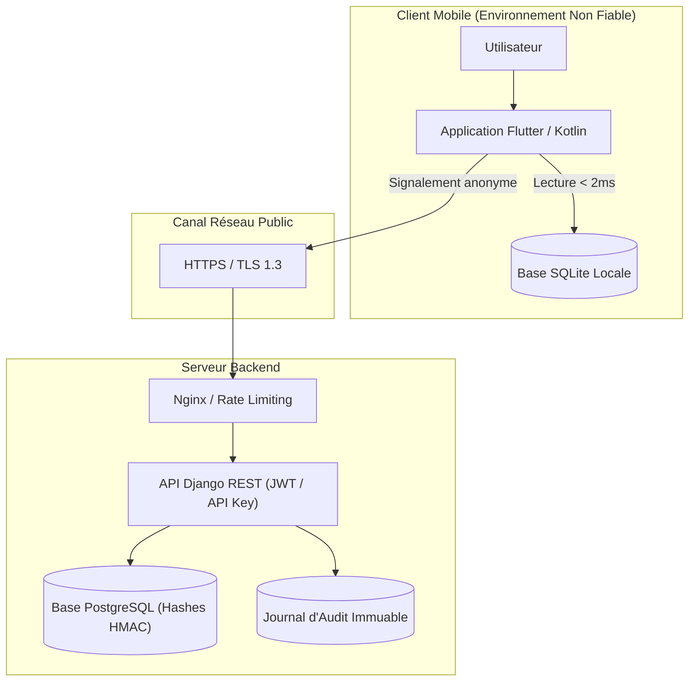

# Modèle de Menace, Analyse Cryptographique & Sécurité — ShieldNet

**Projet de Synthèse en Informatique** — Université du Québec en Outaouais (UQO)  
**Auteurs** : Équipe étudiante ShieldNet  
**Session** : 2026  

---

## 1. Contexte & Problématique de Confidentialité

La grande majorité des applications de filtrage d'appels grand public (comme Truecaller ou Hiya) reposent sur un modèle controversé : pour fonctionner, elles demandent à l'utilisateur l'accès complet à son carnet d'adresses et le téléversent sur leurs serveurs. 

Ce modèle pose des enjeux majeurs :
* **Sur le plan légal** : Au Québec, la **Loi 25** (*Loi modernisant des dispositions législatives en matière de protection des renseignements personnels*) impose des principes stricts de minimisation de la collecte et de confidentialité dès la conception (*Privacy by Design*). Au niveau fédéral canadien, la **LPRPDE** va dans le même sens.
* **Sur le plan éthique** : Téléverser le carnet d'adresses d'une personne expose les numéros de ses proches, collègues et médecins, sans que ces tiers n'aient jamais donné leur consentement.

Dès le premier jour de conception de **ShieldNet**, nous avons choisi de prendre le contre-pied exact de ce modèle :
1. **Zéro contact téléversé** : Le carnet d'adresses personnel reste confiné sur l'appareil.
2. **Zéro numéro en clair stocké côté serveur** : Même lors d'un signalement de spam ou d'une contestation, seul un hachage cryptographique **HMAC-SHA256** est transmis.
3. **Filtrage autonome sur l'appareil** : L'interception est exécutée par le téléphone lui-même via une base locale SQLite.

Cependant, appliquer la cryptographie à des numéros de téléphone soulève un défi théorique majeur lié à l'espace de recherche restreint du plan téléphonique.

---

## 2. Analyse d'Entropie du Plan Nord-Américain (NANP +1)

### 2.1. Calcul combinatoire de l'espace de numéros

Le plan de numérotation nord-américain (**NANP - North American Numbering Plan**) régit les numéros du Canada, des États-Unis et des Caraïbes sous l'indicatif international `+1`.

Un numéro conforme à la norme UIT-T E.164 s'écrit sous la forme :
$$\text{+1 } [N_1 X_1 X_2] - [N_2 X_3 X_4] - [X_5 X_6 X_7 X_8]$$

Avec les contraintes du standard télécom :
* $N_1, N_2 \in \{2, 3, 4, 5, 6, 7, 8, 9\}$ (les chiffres 0 et 1 sont interdits en début d'indicatif régional ou de central téléphonique).
* $X_i \in \{0, 1, 2, 3, 4, 5, 6, 7, 8, 9\}$.

Le nombre théorique maximal de combinaisons est de :
$$N_{\text{théorique}} = 8 \times 10 \times 10 \times 8 \times 10 \times 10 \times 10^4 = 6.4 \times 10^9 \text{ combinaisons}$$

En pratique, le Conseil de la radiodiffusion et des télécommunications canadiennes (CRTC) et l'ATIS réservent des plages :
* Les indicatifs de service $N11$ ($911, 811, 988, 411, 211, 311, 711$).
* Les plages de test et de fiction ($555-0100$ à $555-0199$).
* Les indicatifs régionaux non attribués.

L'espace réel de numéros assignables dans le plan NANP est donc d'environ :
$$N_{\text{effectif}} \approx 7.8 \times 10^8 \text{ numéros (environ 780 millions)}$$

---

### 2.2. L'entropie d'information et ses conséquences

L'entropie de Shannon maximale d'un numéro nord-américain est donc :
$$H = \log_2(7.8 \times 10^8) \approx 29.54 \text{ bits}$$

> **Le constat cryptographique :**  
> Une entropie d'environ **30 bits** est très faible face à la puissance de calcul actuelle. Une carte graphique moderne pour particulier (ex: NVIDIA RTX 4090) calcule plus de **25 milliards d'itérations HMAC-SHA256 par seconde** avec des outils d'audit comme *Hashcat*.  
> 
> **Temps théorique pour calculer les hachages de TOUT le continent nord-américain :**
> $$T = \frac{7.8 \times 10^8}{25 \times 10^9 \text{ hachages/sec}} \approx 0.031 \text{ seconde (31 millisecondes)}$$
> 
> Si un attaquant parvenait à extraire la clé secrète du HMAC (le sel partagé) depuis l'application mobile décompilée, il pourrait précalculer une table inversée (*rainbow table*) en quelques secondes.

---

## 3. Pourquoi avoir choisi HMAC-SHA256 malgré tout ?

Face à ce constat, une question légitime se pose : *pourquoi n'avons-nous pas utilisé une fonction de hachage à mémoire dure comme Argon2id ou PBKDF2 sur le téléphone ?*

La réponse réside dans une contrainte matérielle et logicielle imposée par le système d'exploitation Android :

```text
Budget temporel imposé par Android Telecom (CallScreeningService) :
0 ms                15 ms              20 ms                                 100 ms
|-------------------|------------------|---------------------------------------|
[Appel Entrant]     [Hachage HMAC]     [Requête SQLite WAL]  [Réponse : Bloquer]
                    (0.15 ms)          (1.5 ms)
```

1. **Le contrat temps réel d'Android** : Lorsque Android reçoit un appel, il déclenche `CallScreeningService.onScreenCall()`. L'application dispose de moins de 100 à 200 millisecondes pour répondre. Si ce délai est dépassé, Android considère que l'application ne répond pas et laisse sonner le téléphone pour ne pas risquer de bloquer un appel légitime ou urgent.
2. **La réalité des calculs sur smartphone** :
   * **HMAC-SHA256** s'exécute en **0.15 ms** sur processeur mobile ARM. L'interception totale (hachage + recherche indexée dans SQLite) prend moins de 2 ms.
   * **Argon2id** (configuré avec les recommandations minimales de sécurité, ex: 64 Mo de RAM et 3 itérations) nécessite entre **350 et 800 ms** sur un téléphone milieu de gamme. Ce temps d'attente provoquerait un délai audible très désagréable pour l'appelant et un abandon systématique par Android.

**Notre décision d'ingénierie** : HMAC-SHA256 représente le seul compromis viable permettant d'assurer un filtrage en temps réel sur l'appareil tout en évitant d'envoyer les numéros en clair sur le réseau.

---

## 4. Modèle de Menace (STRIDE)

Pour analyser la sécurité de l'architecture, nous avons appliqué la méthode **STRIDE** :


```mermaid
flowchart TD
    subgraph Client ["Client Mobile (Environnement Non Fiable)"]
        User["Utilisateur"]
        App["Application Flutter / Kotlin"]
        LocalDB[("Base SQLite Locale")]
    end

    subgraph Reseau ["Canal Réseau Public"]
        Transit["HTTPS / TLS 1.3"]
    end

    subgraph Serveur ["Serveur Backend"]
        Gateway["Nginx / Rate Limiting"]
        Django["API Django REST (JWT / API Key)"]
        Postgres[("Base PostgreSQL (Hashes HMAC)")]
        Audit[("Journal d'Audit Immuable")]
    end

    User --> App
    App -->|Lecture < 2ms| LocalDB
    App -->|Signalement anonyme| Transit
    Transit --> Gateway
    Gateway --> Django
    Django --> Postgres
    Django --> Audit
```

| Menace (STRIDE) | Scénario d'attaque | Défense mise en place dans ShieldNet |
|---|---|---|
| **Spoofing (Usurpation)** | Un acteur malveillant inonde l'API de faux signalements pour faire bloquer le numéro d'une entreprise rivale. | **Consensus démocratique anti-Sybil** : seuil de quorum (plusieurs utilisateurs distincts nécessaires), un seul vote par utilisateur par numéro, prise en compte des contestations citoyennes et arbitrage sémantique. |
| **Tampering (Altération)** | Modification des scores de risque ou des réponses en cours de route. | **Chiffrement systématique TLS 1.3**, validation stricte des formats (longueur exacte de 64 caractères hexadécimaux pour le SHA-256). |
| **Repudiation (Répudiation)** | Un administrateur bloque ou débloque un numéro puis nie en être l'auteur. | **Journal d'audit immuable (`AuditLog`)** : enregistre l'auteur (`admin@shieldnet.app`), l'adresse IP, l'horodatage UTC et le détail avant/après. |
| **Information Disclosure (Fuite)** | Récupération de numéros de téléphone via une fuite de la base de données. | **Seules les empreintes HMAC sont stockées**. Aucun numéro en clair n'existe en base centrale. Masquage applicatif dans l'interface (`+1 819 *** **99`). |
| **Denial of Service (DDoS)** | Bombardement de requêtes sur l'API de vérification pour saturer le serveur. | **Limitation de débit (*Rate Limiting*)** par IP, synchronisation incrémentale (*Delta sync*) pour minimiser les échanges de données, et requêtes SQL `IN` groupées. |
| **Elevation of Privilege (Élévation)** | Un utilisateur tente d'accéder aux actions de modération réservées au staff. | **Contrôle d'accès basé sur les rôles (RBAC)** : vérification stricte de `is_staff` / `is_superuser` sur l'ensemble des endpoints sensibles. |

---

## 5. Pistes d'Amélioration pour une Mise en Production Industrielle

Dans le cadre d'un déploiement commercial à très grande échelle, voici les mécanismes complémentaires que nous recommandons :

1. **Double Hachage Asymétrique (Sel Client + Pepper Serveur HSM)** :
   * Le téléphone applique un premier hachage local pour que le numéro ne quitte jamais l'appareil.
   * Le backend applique ensuite un second sel (**pepper**) conservé dans un module de sécurité matériel (**HSM** ou Cloud KMS).
   * Même si un attaquant décompile l'APK et trouve le sel client, il ne peut pas calculer les empreintes finales sans la clé secrète du serveur.
2. **Attestation Matérielle (Play Integrity API)** :
   * Remplacer la clé d'API statique par un jeton d'attestation délivré par la puce de sécurité du téléphone (TEE). Cela permet de refuser l'accès aux téléphones rootés ou aux émulateurs automatisés.
3. **Filtres de Bloom Décentralisés** :
   * Au lieu de distribuer une liste d'empreintes HMAC sur le téléphone, le serveur générerait un **Filtre de Bloom** compact (vecteur binaire de quelques mégaoctets). Cela rendrait l'extraction de numéros depuis le cache local totalement impossible.

---

## 6. Conformité à la Loi 25 du Québec

| Exigence de la Loi 25 | Comment ShieldNet y répond concrètement |
|---|---|
| **Protection dès la conception (Art. 21.4)** | Pseudonymisation irréversible à la source avec HMAC-SHA256. |
| **Minimisation de la collecte** | Aucun carnet d'adresses personnel n'est collecté. Seules les données de réputation sont conservées. |
| **Droit à l'effacement** | Commande de purge automatisée (`purge_stale_reports`) supprimant les signalements inactifs après 90 jours. |
| **Gouvernance et auditabilité** | Journalisation inaltérable de chaque décision dans `AuditLog` et mécanisme de réhabilitation pour les citoyens. |
