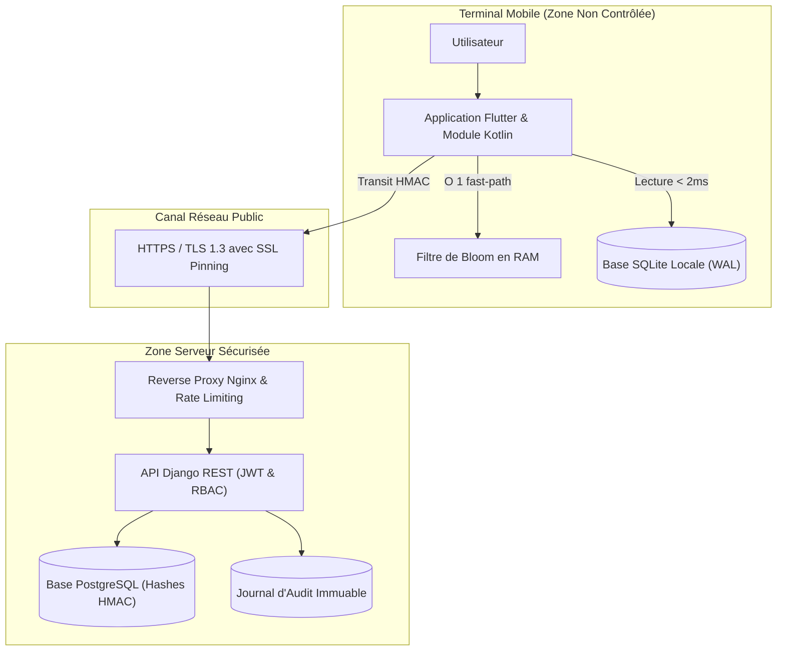

# Modèle de Menace, Analyse Cryptographique & Sécurité — ShieldNet

Spécification de sécurité, évaluation formelle des risques selon la méthodologie **STRIDE**, analyse d'entropie combinatoire du plan de numérotation nord-américain et conformité aux cadres réglementaires de protection de la vie privée (**Loi 25 du Québec** et **LPRPDE fédérale canadienne**).

---

## 1. Contexte Réglementaire & Principes de Confidentialité

Les architectures classiques d'anti-spam téléphonique exfiltrent les carnets d'adresses complets des utilisateurs vers des bases de données centralisées. Ce mode de fonctionnement entre en conflit direct avec les standards modernes de protection des renseignements personnels :

* **Loi 25 du Québec** : Impose la protection des renseignements personnels dès la conception (*Privacy by Design*), la limitation stricte de la collecte aux données indispensables et la transparence sur les traitements algorithmiques.
* **LPRPDE (Canada)** : Principe de consentement explicite et interdiction de la collecte détournée de coordonnées de tiers sans autorisation préalable.

### Postulat Architectural de ShieldNet :
1. **Confinement Local Intégral** : Aucun contact du carnet d'adresses n'est lu, extrait ou transmis par l'application.
2. **Absence de Numéros en Clair Côté Serveur** : Toutes les transactions de signalement et de consultation opèrent sur des empreintes cryptographiques **HMAC-SHA256**.
3. **Interception Locale Déterministe** : Le filtrage est exécuté directement sur le terminal via une base SQLite embarquée, sans dépendance d'interrogation réseau au moment de l'appel.

---

## 2. Analyse Combinatoire & Entropie du Plan Téléphonique (NANP +1)

### 2.1. Espace Combinatoire du Plan Nord-Américain

Le plan de numérotation nord-américain (**NANP - North American Numbering Plan**) régit les télécommunications au Canada, aux États-Unis et dans plusieurs territoires des Caraïbes sous l'indicatif international `+1`.

Un numéro conforme à la recommandation UIT-T E.164 s'exprime selon le format :
$$\text{+1 } [N_1 X_1 X_2] - [N_2 X_3 X_4] - [X_5 X_6 X_7 X_8]$$

Sous les contraintes de normalisation de l'ATIS et du CRTC :
* $N_1, N_2 \in \{2, 3, 4, 5, 6, 7, 8, 9\}$ (les chiffres 0 et 1 sont proscrits comme premier chiffre de l'indicatif régional ou du central téléphonique).
* $X_i \in \{0, 1, 2, 3, 4, 5, 6, 7, 8, 9\}$.

Le volume théorique d'adresses téléphoniques est de :
$$N_{\text{théorique}} = 8 \times 10^2 \times 8 \times 10^2 \times 10^4 = 6.4 \times 10^9 \text{ combinaisons}$$

En excluant les indicatifs de service ($N11$ : 911, 811, 988, etc.), les tranches réservées de test et fiction ($555-0100$ à $555-0199$) et les indicatifs non attribués, l'espace réel de numéros exploitables est estimé à :
$$N_{\text{effectif}} \approx 7.8 \times 10^8 \text{ numéros (environ 780 millions)}$$

### 2.2. Entropie d'Information & Vulnérabilité aux Attaques par Dictionnaire

L'entropie de Shannon maximale associée à un numéro dans cet espace est :
$$H = \log_2(7.8 \times 10^8) \approx 29.54 \text{ bits}$$

Une entropie de ~30 bits est techniquement faible au regard des capacités actuelles de calcul parallèle. Une station d'évaluation équipée d'un GPU standard calcule plus de 25 milliards d'itérations HMAC-SHA256 par seconde.

Le calcul d'une table inversée (*rainbow table*) pour l'intégralité du plan nord-américain requerrait :
$$T = \frac{7.8 \times 10^8}{25 \times 10^9 \text{ hashes/sec}} \approx 31 \text{ millisecondes}$$

Par conséquent, **le simple hachage SHA-256 sans sel est formellement proscrit**. L'application d'un sel cryptographique secret d'infrastructure (**HMAC-SHA256**) est obligatoire pour empêcher la génération de dictionnaires pré-calculés universels.

---

## 3. Justification du Choix HMAC-SHA256 vs Fonctions à Mémoire Dure

La sélection de la primitive cryptographique est gouvernée par le budget temporel imposé par l'API Android `CallScreeningService` :

```text
Budget Temporel Android Telecom Framework :
0 ms                  0.2 ms             1.7 ms                                100 ms
|---------------------|------------------|---------------------------------------|
[Appel Détecté]       [HMAC-SHA256]      [Requête SQLite WAL]  [Décision Télécom]
                      (0.15 ms)          (1.5 ms)
```

1. **Contrat Système Temps Réel** : L'OS alloue une fenêtre maximale de 100 à 200 ms pour qualifier un appel. Tout dépassement entraîne l'abandon du filtrage et le déclenchement de la sonnerie normale pour préserver la disponibilité du service téléphonique.
2. **Mesures de Latence sur Processeur Mobile (ARMv8 / ARMv9)** :
   - **HMAC-SHA256** : Temps d'exécution de **~0.15 ms**. La chaîne complète (normalisation E.164, hachage, contrôle d'urgence et requête SQLite WAL) s'exécute en **< 2 ms**.
   - **Argon2id** (paramètres minimaux recommandés : 64 Mo RAM, 3 itérations) : Temps d'exécution de **350 à 800 ms** sur smartphone milieu de gamme. Ce délai est incompatible avec les exigences du système d'exploitation et conduirait à l'échec systématique de l'interception.

---

## 4. Modèle de Menace STRIDE & Contre-Mesures

L'analyse STRIDE structure les défenses appliquées à chaque niveau de l'architecture :


```mermaid
flowchart TD
    subgraph Client ["Terminal Mobile (Zone Non Contrôlée)"]
        User["Utilisateur"]
        App["Application Flutter & Module Kotlin"]
        Bloom["Filtre de Bloom en RAM"]
        LocalDB[("Base SQLite Locale (WAL)")]
    end

    subgraph Reseau ["Canal Réseau Public"]
        Transit["HTTPS / TLS 1.3 avec SSL Pinning"]
    end

    subgraph Serveur ["Zone Serveur Sécurisée"]
        Gateway["Reverse Proxy Nginx & Rate Limiting"]
        Django["API Django REST (JWT & RBAC)"]
        Postgres[("Base PostgreSQL (Hashes HMAC)")]
        Audit[("Journal d'Audit Immuable")]
    end

    User --> App
    App -->|O 1 fast-path| Bloom
    App -->|Lecture < 2ms| LocalDB
    App -->|Transit HMAC| Transit
    Transit --> Gateway
    Gateway --> Django
    Django --> Postgres
    Django --> Audit
```

| Menace (STRIDE) | Scénario d'Attaque | Contre-Mesure Implémentée |
|---|---|---|
| **Spoofing (Usurpation)** | Injection massive de faux signalements pour nuire à un numéro légitime (attaque Sybil). | **Moteur de Consensus & Quorum** : Exigence de 3 signalements provenant d'utilisateurs distincts, prise en compte des attestations télécom STIR/SHAKEN et pondération lexicale des contestations citoyennes. |
| **Tampering (Altération)** | Falsification des scores de réputation ou interception en transit (attaque MitM). | **TLS 1.3 avec SSL/TLS Pinning** sur le client Dio mobile, validation de conformité stricte du format hexadécimal 64 caractères des hashes SHA-256. |
| **Repudiation (Répudiation)** | Modification non documentée de la liste de blocage par un opérateur. | **Journal d'Audit Immuable (`AuditLog`)** traçant l'identité de l'opérateur, l'adresse IP source, l'horodatage UTC et l'état avant/après de chaque entité modifiée. |
| **Information Disclosure (Fuite)** | Compromission de la base de données centrale exposant des coordonnées téléphoniques. | **Stockage Exclusif d'Empreintes HMAC** : Aucun numéro de téléphone en clair n'est présent dans les tables PostgreSQL. Masquage systématique à l'affichage (`+1 819 *** **99`). |
| **Denial of Service (DDoS)** | Saturation de l'API de vérification par requêtes répétitives. | **Limitation de Débit (Rate Limiting via Redis)**, requêtes de vérification groupées (`POST /api/v1/check/batch/`) et synchronisation incrémentale par delta (`GET /api/v1/sync/delta`). |
| **Elevation of Privilege (Élévation)** | Tentative d'accès aux fonctions d'administration ou de purge par un compte non habilité. | **Architecture RBAC Découplée** : Contrôle strict des permissions `is_staff` / `is_superuser`, interdiction formelle d'authentification OAuth sur les comptes à privilèges élevés. |

---

## 5. Défense en Profondeur & Composants Avancés

### 5.1. Fast-Path via Filtre de Bloom Décentralisé
Pour optimiser les performances de consultation et réduire la charge d'E/S sur le stockage flash des terminaux mobiles :
- Un **Filtre de Bloom** compact est généré et compressé côté serveur à partir des empreintes de réputation.
- Le client évalue en mémoire vive (O(1), latence < 0.02 ms) la présence potentielle du numéro.
- En cas d'absence certaine (propriété mathématique sans faux négatifs), l'appel est immédiatement autorisé sans sollicitation du disque SQLite.

### 5.2. Comparaison à Temps Constant
La validation des clés partagées d'API et des jetons d'authentification utilise systématiquement la méthode `hmac.compare_digest` en Python, neutralisant tout risque d'attaque temporelle par canal auxiliaire (*timing attack*, CWE-208).

### 5.3. Détection d'Altération Matérielle (Root Check)
L'application mobile vérifie au démarrage l'intégrité de son environnement d'exécution (recherche des binaires `su`, vérification des permissions de répertoires système) pour avertir l'utilisateur des risques d'interception de secrets sur un terminal altéré.

---

## 6. Matrice de Conformité à la Loi 25 du Québec

| Disposition Légale (Loi 25) | Implémentation Concrète dans ShieldNet |
|---|---|
| **Protection dès la conception (Art. 21.4)** | Traitement exclusif d'empreintes pseudonymisées irréversibles (HMAC-SHA256) dès la saisie sur le terminal. |
| **Minimisation de la collecte (Art. 4)** | Confinement strict du carnet d'adresses personnel sur l'appareil. Aucune extraction de métadonnées non indispensables. |
| **Droit à l'effacement & Rétention limitée** | Mécanisme de purge automatisé (`purge_stale_reports`) éliminant les données de signalement inactives au-delà de 90 jours. |
| **Transparence & Droit de Rectification** | Mécanisme de contestation citoyenne permettant à tout détenteur de numéro légitime de soumettre une demande de réhabilitation arbitrée par consensus. |
| **Gouvernance & Imputabilité** | Journalisation inaltérable de l'ensemble des opérations administratives dans `AuditLog`. |